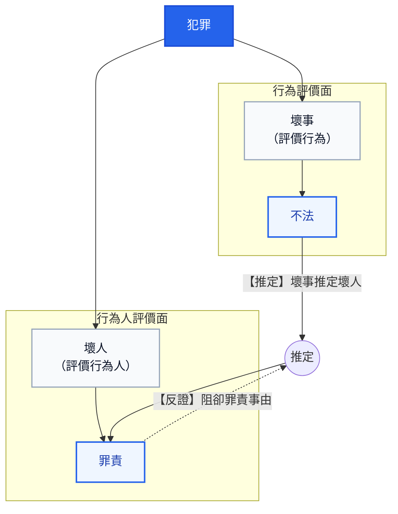
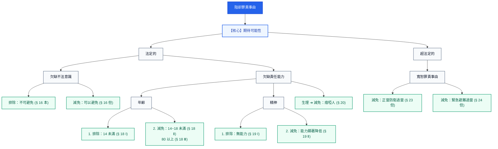
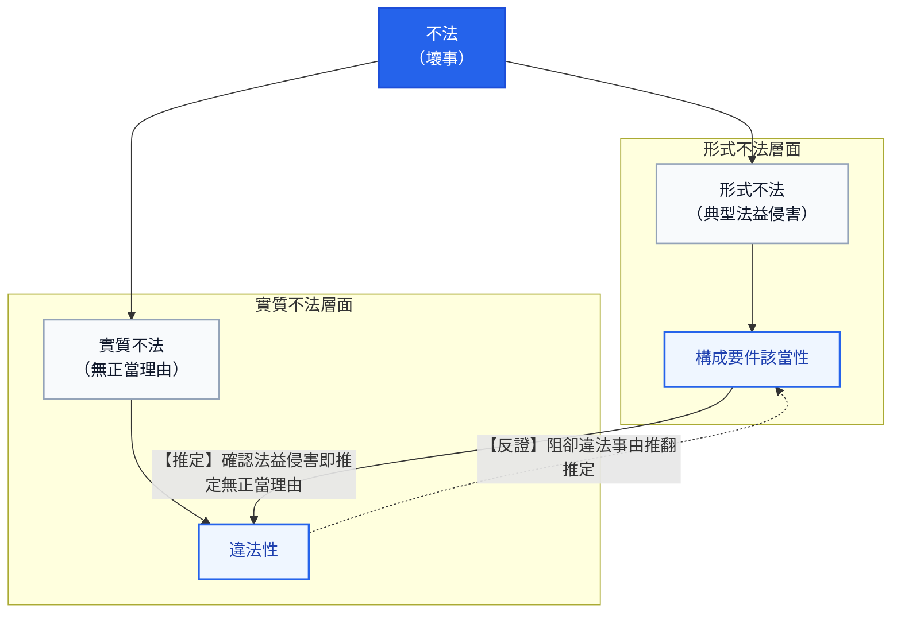

# 導論 犯罪概念與論罪結構

### 本篇導讀 (Conducted Read)
*(教材第 XVIII-1 頁)*

> 本篇是對刑法的初步鳥瞰。首先介紹犯罪概念與通說採取的三階層體系論，再快速瀏覽刑法的論罪結構。期望帶領讀者建立一個穩固又直觀的思維流程，畢竟法律不該是象牙塔裡的學問，而是人類生活經驗的縮影與結晶。

---

## 第一章 犯罪的概念
*(教材第 1-1 ～ 1-5 頁)*

### 一、犯罪的直觀本質：「一個壞人做了一件壞事」

刑法是一部處理犯罪的法律，至於如何謂犯罪？簡單說，**「一個壞人」做了「一件壞事」就是犯罪**。

經驗告訴我們判斷誰是壞人非常困難，但判斷一件壞事卻比較容易，因此我們決定：
1. **先判斷「是否有一件壞事發生」**（評價行為）
2. **再判斷「做這件壞事的人是不是一個壞人」**（評價行為人）

基於經驗的累積，會做壞事的人絕大多數（不是百分之百！）都是壞人，所以確定一件壞事的發生，就先**「推定」**做這件壞事的人是一個壞人，這就是**「壞事推定壞人」**原則。

有鑑於這只是一個經驗上的直覺假設，而人類經驗卻不完全可靠，使用**「推定」**這個法律概念，為我們保留**反證推翻假設**的機會。我們將壞事以**「不法」**代稱，壞人以**「罪責」**代稱，前述的推定模式就是**「不法推定罪責」**原則，而推翻罪責推定的理由稱為**「阻卻罪責事由」**。

---

### 二、不法推定罪責原則 (架構圖解)

---

### 三、反證推翻的機會與法定例示（案例 1-1 ～ 1-5）

承上，當行為人做了一件壞事而被推定為一個壞人，法律將賦予行為人反證推翻的機會，亦即行為人可以主張一些有利於自己的理由，證明自己並非是一個壞人。

這些反證推翻的理由，立法者很貼心的在刑法當中加以例示：

#### 案例 1-1
- **被告答辯**：「這是一件壞事嗎？怎麼會？我以為這是ok的耶，對不起嘛。」
- **【問題導引】**：主張**「欠缺不法意識」**的抗辯（§ 16）。亦即不知道法律對其行為有所禁止，**因而雖做壞事，但卻不是壞人**。
> 📌 **【2026 現行法規查核狀態】**：**條文無更動（維持現行法）**。  
> - **現行法條文（刑法 § 16）**：「除有正當理由而無法避免者外，不得因不知法律而免除刑事責任。但按其情節，得減輕其刑。」  
> - **法理現況**：本條自民國 94 年 2 月 2 日修正公布、95 年 7 月 1 日施行至今無文字更動，採責任理論，非有不可避免之正當理由不得免責。  
> - **資料來源**：[全國法規資料庫 - 中華民國刑法第 16 條](https://law.moj.gov.tw/LawClass/LawSingle.aspx?pcode=C0000001&flno=16)

#### 案例 1-2
- **被告答辯**：「雖然我做了一件壞事，但那是因為我年紀小而不懂事，原諒我好不好。」
- **【問題導引】**：主張**「欠缺責任能力：年齡」**的抗辯（§ 18）。會做壞事是由於不懂事，**因而雖做壞事，但卻不是壞人**。
> 📌 **【2026 現行法規查核狀態】**：**條文無更動（維持現行法）**。  
> - **現行法條文（刑法 § 18）**：第 1 項「未滿十四歲人之行為，不罰。」；第 2 項「十四歲以上未滿十八歲人之行為，得減輕其刑。」；第 3 項「滿八十歲人之行為，得減輕其刑。」  
> - **相關法規連動更動備註**：民法第 12 條成年年齡已於民國 112 年 1 月 1 日正式下修為 18 歲，與刑法第 18 條第 2 項滿 18 歲具完全責任能力達成一致；少年事件處理法第 27 條仍專門規範 14～18 歲觸法少年之司法處遇。刑法第 18 條本身文字無更動。  
> - **資料來源**：[全國法規資料庫 - 中華民國刑法第 18 條](https://law.moj.gov.tw/LawClass/LawSingle.aspx?pcode=C0000001&flno=18)、[民法第 12 條](https://law.moj.gov.tw/LawClass/LawSingle.aspx?pcode=B0000001&flno=12)

#### 案例 1-3
- **被告答辯**：「吾乃伏虎羅漢降世，奉殺九世惡人乃替天行道！律師：我的當事人病得不輕，他根本不知道自己在幹嘛。」
- **【問題導引】**：主張**「欠缺責任能力：精神」**的抗辯（§ 19）。行為人根本不知道或沒辦法控制自己的行為，**因而雖做壞事，但卻不是壞人**。
> 📌 **【2026 現行法規查核狀態】**：**條文文字無更動，但適用受到憲法法庭判決實質拘束**。  
> - **現行法條文（刑法 § 19）**：第 1 項「行為時因精神障礙或其他心智缺陷，致不能辨識其行為違法或欠缺依其辨識而行為之能力者，不罰。」；第 2 項「行為時因前項之原因，致其辨識行為違法或依其辨識而行為之能力，顯著減低者，得減輕其刑。」；第 3 項為「原因自由行為」之除外規定。  
> - **重大司法更動備註**：  
>   1. **憲法法庭 113 年憲判字第 8 號判決（113.09.20）**：宣告刑法第 19 條第 2 項情形（行為時精神障礙顯著減低者）**不得科處死刑**；受判決人於審判或執行時有精神障礙者，**亦不得執行死刑**。  
>   2. **保安處分關聯修正（刑法 § 87 監護處分，111.02.18 修正公布）**：因應第 19 條第 1 項判決不罰之被告，修法延長監護處分期間（每次延長不逾 3 年、無次數限制，由法院每年定期評估必要性），並建立銜接分級處遇。  
> - **資料來源**：[全國法規資料庫 - 中華民國刑法第 19 條](https://law.moj.gov.tw/LawClass/LawSingle.aspx?pcode=C0000001&flno=19)、[司法院憲法法庭 113 年憲判字第 8 號判決](https://cons.judicial.gov.tw/)、[刑法第 87 條](https://law.moj.gov.tw/LawClass/LawSingle.aspx?pcode=C0000001&flno=87)

#### 案例 1-4
- **被告答辯**：「……（比手畫腳）。律師：我的當事人既聾且啞，知識水平較差，會犯下此等愚行實屬情有可原。」
- **【問題導引】**：主張**「欠缺責任能力：生理」**的抗辯（§ 20）。瘖啞人較一般人不知事，**因而雖做壞事，但卻不是壞人**。
> 📌 **【2026 現行法規查核狀態】**：**條文無更動（維持現行法）**。  
> - **現行法條文（刑法 § 20）**：「瘖啞人之行為，得減輕其刑。」  
> - **檢討與法理備註**：聯合國《身心障礙者權利公約》（CRPD）國際審查結論多次建議立法院檢討廢止本條（避免生理特徵標籤化，應回歸個案心智能力評估），立法院曾有修法提案討論，但截至 2026 年現行條文仍有效施行，實務嚴格限於「出生即瘖啞且未受教育者」。  
> - **資料來源**：[全國法規資料庫 - 中華民國刑法第 20 條](https://law.moj.gov.tw/LawClass/LawSingle.aspx?pcode=C0000001&flno=20)、衛生福利部 CRPD 國家報告審查意見

#### 案例 1-5
- **被告答辯**：「是對方先追著我打，情急之下我用手槍斃了他應該不為過吧！」
- **【問題導引】**：主張**「防衛過當、避難過當」**的抗辯（§ 23但、§ 24 1但）。鑑於面臨緊急情況下本就難以控制反擊力道，**因而雖做壞事，但卻不是壞人**。
> 📌 **【2026 現行法規查核狀態】**：**條文無更動（維持現行法）**。  
> - **現行法條文（刑法 § 23 但書）**：「……但防衛行為過當者，得減輕或免除其刑。」  
> - **現行法條文（刑法 § 24 第 1 項但書）**：「……但避難行為過當者，得減輕或免除其刑。」  
> - **法理現況**：過當行為雖具備不法（仍成立違法侵害），但法官享有「得減輕或免除其刑」之寬廣罪責裁量權。  
> - **資料來源**：[全國法規資料庫 - 刑法第 23 條](https://law.moj.gov.tw/LawClass/LawSingle.aspx?pcode=C0000001&flno=23)、[刑法第 24 條](https://law.moj.gov.tw/LawClass/LawSingle.aspx?pcode=C0000001&flno=24)

---

### 四、超法定阻卻罪責事由與「期待可能性」核心（案例 1-6）

當然立法雖密仍有一疏，若是在刑法典中找不到反證推翻理由，也允許找尋刑法典外的理由，亦即**「超法定阻卻罪責事由」**。

現今犯罪體系以**「行為人有無（不做壞事的）期待可能性？」**作為罪責的實質非難核心，若行為人可被期待不做壞事便是具備罪責，既然**期待可能性是罪責的核心**，那麼法定或超法定阻卻罪責事由都必須依循期待可能性來詮釋。

#### 案例 1-6
- **被告答辯**：「我當時在燙衣服，但因為幼兒從床上跌落而血流不止，我太慌亂了，急忙將幼兒送醫而忘了拔掉插頭，才會釀成火災。」
- **【問題導引】**：主張**「無期待可能性（或低度期待可能性）」**的超法定抗辯。作父母的在幼兒受傷的情況下必然手足無措，對於這種處境特別艱難的行為人，社會難以期待其冷靜地拔掉插頭以避免火災發生，**因而雖做壞事，但卻不是壞人**。
> 📌 **【2026 現行法規查核狀態】**：**未增訂為成文法規，維持超法定法理地位**。  
> - **實務法理狀態**：刑法總則截至 2026 年未明文訂立「期待可能性」概括條款，司法實務（最高法院判例、判決）與學說通說一致承認其為阻卻罪責之超法定事由，於極端特殊案件中由法官實質審查行為人有無可非難性。  
> - **資料來源**：司法院裁判書整合查詢系統、最高法院 30 年上字第 2240 號判例及實務見解

---

### 五、阻卻罪責事由之體系展開 (架構圖解)
*(教材第 1-4 頁)*

在理解了案例 1-1 至 1-6 的各項抗辯後，我們將所有「阻卻罪責事由」統整成一幅清晰的體系樹狀圖。其最高指導核心即為**「期待可能性」**：

---

### 六、壞事（＝不法）該如何判斷？
*(教材第 1-4 頁)*

接著我們來看壞事該如何判斷。

所謂壞事（＝不法）就是**「無緣無故做出令人覺得不舒服的行為」**，可以簡單拆解成兩個指標：
1. **法益侵害（做出令人覺得不舒服的行為）**：重要生活利益受到破壞。
2. **無正當理由（無緣無故）**：附加說明此破壞有違整體法律秩序而並不正當。

#### 💡 直覺式觀察：巴掌比喻
其實這是種直覺式觀察：
- 試想有個陌生人突然衝過來賞你一巴掌，臉龐的紅腫刺痛會是**第一個感受**，這代表重要生活利益（身體法益）遭受破壞。
- 接踵而來的疑惑與氣憤是**第二個感受**，這代表剛才對方的行為是莫名其妙的（無正當理由）。

因此壞事乃**「法益侵害 ＋ 無正當理由」**的組合，且依感受的順序，**先判斷法益侵害，再判斷無正當理由**。

#### 🏛️ 法律術語的對應與轉換
- **法益侵害**：既然是一種公認不舒服的行為，立法者便將這種行為的特徵歸納後寫在刑法中，形成刑法分則的各個罪名（如殺人罪、傷害罪、強制性交罪、強盜罪等等），往後只要出現符合分則條文描述的舉動就是法益侵害。轉換成法律用語，即**「構成要件該當性」（形式不法）**。
- **無正當理由**：至於正當理由的判斷，人們發現自古以來令人不舒服的行為鮮少是有正當理由的，基於便利，確認法益侵害便直接**「推定」**該行為無正當理由。又為了避免便宜行事可能造成的誤判，依舊賦予反證推翻機制。轉換成法律用語，即**「違法性」（實質不法）**。
- 前述的推定模式即是**「構成要件該當推定違法性」原則**，推翻違法推定的理由稱為**「阻卻違法事由」**。

---

### 七、構成要件該當性推定違法性原則 (架構圖解)
*(教材第 1-5 頁)*

---

### 八、阻卻違法事由之反證推翻與法定例示（案例 1-7 ～ 1-8）
*(教材第 1-5 頁)*

當行為因該當構成要件而被推定為無正當理由後，法律將賦予行為人反證推翻的機會，亦即可以主張一些有利於自己的理由，證明法益侵害是正常的。

這些反證推翻的理由，立法者也有在刑法當中加以例示：

#### 案例 1-7
- **被告答辯**：「我的確有為他人墮胎，但卻是在符合優生保健法 § 9 的情況下。」
- **【問題導引】**：主張**「依法令之行為」**的抗辯（§ 21 Ⅰ）。由於這是法規所允許的墮胎行為，縱使的確造成法益侵害（胎兒生命），但卻因為有正當理由而並非壞事。
> 📌 **【2026 現行法規查核狀態】**：**條文無更動（維持現行法），關聯法規持續檢討維護**。  
> - **現行法條文（刑法 § 21 第 1 項）**：「依法令之行為，不罰。」  
> - **關聯法規現況（優生保健法 § 9）**：醫師依法律許可之醫學或優生事由施行人工流產，合於法令阻卻違法。近年行政主管機關正推動《優生保健法》更名為《生育保健法》草案，重點在於維護懷孕婦女之身體自主決定權（擬取消配偶同意權限制）；但不論修法進度如何，只要符合法定醫療程序，均屬依法令之行為而不罰。  
> - **資料來源**：[全國法規資料庫 - 刑法第 21 條](https://law.moj.gov.tw/LawClass/LawSingle.aspx?pcode=C0000001&flno=21)、[優生保健法第 9 條](https://law.moj.gov.tw/LawClass/LawSingle.aspx?pcode=L0070001&flno=9)

#### 案例 1-8
- **被告答辯**：「我有拿別人的東西，但卻是因為上級的命令我才這麼做。」
- **【問題導引】**：主張**「依命令之行為」**的抗辯（§ 21 Ⅱ）。由於有合法的上級公務員命令存在，縱使的確造成法益侵害（所有權），但卻因為有正當理由而並非壞事。
> 📌 **【2026 現行法規查核狀態】**：**條文無更動（維持現行法）**。  
> - **現行法條文（刑法 § 21 第 2 項）**：「依所屬上級公務員命令之職務上行為，不罰。但明知命令違法者，不在此限。」  
> - **法理現況要件**：  
>   1. 行為人與發令人皆具備合法公務員身分且具職務隸屬關係；  
>   2. 該命令形式上屬於該長官監督權限並具合法形式要件；  
>   3. **但書限制**：採「相對服從說」，若公務員「明知命令違法」仍盲目執行，則不得主張阻卻違法，仍應負刑事責任。  
> - **資料來源**：[全國法規資料庫 - 刑法第 21 條](https://law.moj.gov.tw/LawClass/LawSingle.aspx?pcode=C0000001&flno=21)

*(教材第 1-5 頁完，續接後續頁面)*

---

## 第二章 刑法的論罪結構
*(等待您提供第二章書本內文...)*
