# 📚《刑法總則【圖說系列】》研讀筆記

> - **書籍名稱**：刑法總則【圖說系列】（Strafrecht）
> - **編著者**：陳奕廷 (易律師) 編著
> - **系列別**：律師／司法三等／法研所
> - **出版社**：高點文化
> - **出版日期**：2022／10／31
> - **國際標準書號 (ISBN)**：9786263342880 (代碼 L602210)
> - **編排方針**：概念圖示・清晰易懂 ｜ 重點彙整・深入淺出 ｜ 例題研究・必勝關鍵

---

# 導論 犯罪概念與論罪結構

### 本篇導讀 (Conducted Read)
*(教材第 XVIII-1 頁)*

> 本篇是對刑法的初步鳥瞰。首先介紹犯罪概念與通說採取的三階層體系論，再快速瀏覽刑法的論罪結構。期望帶領讀者建立一個穩固又直觀的思維流程，畢竟法律不該是象牙塔裡的學問，而是人類生活經驗的縮影與結晶。

---

## 第一章 犯罪的概念
*(教材第 1-1 ～ 1-11 頁)*

### 一、犯罪的直觀本質：「一個壞人做了一件壞事」

刑法是一部處理犯罪的法律，至於如何謂犯罪？簡單說，**「一個壞人」做了「一件壞事」就是犯罪**。

經驗告訴我們判斷誰是壞人非常困難，但判斷一件壞事卻比較容易，因此我們決定：
1. **先判斷「是否有一件壞事發生」**（評價行為）
2. **再判斷「做這件壞事的人是不是一個壞人」**（評價行為人）

基於經驗的累積，會做壞事的人絕大多數（不是百分之百！）都是壞人，所以確定一件壞事的發生，就先**「推定」**做這件壞事的人是一個壞人，這就是**「壞事推定壞人」**原則。

有鑑於這只是一個經驗上的直覺假設，而人類經驗卻不完全可靠，使用**「推定」**這個法律概念，為我們保留**反證推翻假設**的機會。我們將壞事以**「不法」**代稱，壞人以**「罪責」**代稱，前述的推定模式就是**「不法推定罪責」**原則，而推翻罪責推定的理由稱為**「阻卻罪責事由」**。

---

### 二、不法推定罪責原則 (架構圖解)

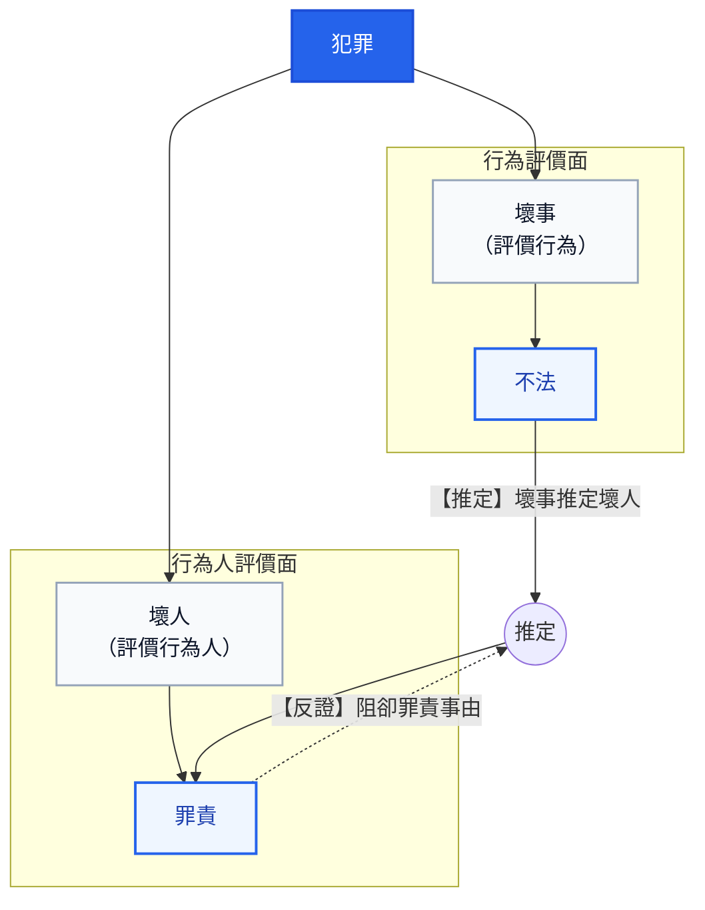

---

### 三、反證推翻的機會與法定例示（案例 1-1 ～ 1-5）

承上，當行為人做了一件壞事而被推定為一個壞人，法律將賦予行為人反證推翻的機會，亦即行為人可以主張一些有利於自己的理由，證明自己並非是一個壞人。

這些反證推翻的理由，立法者很貼心的在刑法當中加以例示：

#### 案例 1-1
- **被告答辯**：「這是一件壞事嗎？怎麼會？我以為這是ok的耶，對不起嘛。」
- **【問題導引】**：主張**「欠缺不法意識」**的抗辯（§ 16）。亦即不知道法律對其行為有所禁止，**因而雖做壞事，但卻不是壞人**。
> 📌 **【2026 現行法規查核狀態】**：**條文無更動（維持現行法）**。  
> - **現行法條文（刑法 § 16）**：「除有正當理由而無法避免者外，不得因不知法律而免除刑事責任。但按其情節，得減輕其刑。」  
> - **法理現況**：本條自民國 94 年 2 月 2 日修正公布、95 年 7 月 1 日施行至今無文字更動，採責任理論，非有不可避免之正當理由不得免責。  
> - **資料來源**：[全國法規資料庫 - 中華民國刑法第 16 條](https://law.moj.gov.tw/LawClass/LawSingle.aspx?pcode=C0000001&flno=16)

#### 案例 1-2
- **被告答辯**：「雖然我做了一件壞事，但那是因為我年紀小而不懂事，原諒我好不好。」
- **【問題導引】**：主張**「欠缺責任能力：年齡」**的抗辯（§ 18）。會做壞事是由於不懂事，**因而雖做壞事，但卻不是壞人**。
> 📌 **【2026 現行法規查核狀態】**：**條文無更動（維持現行法）**。  
> - **現行法條文（刑法 § 18）**：第 1 項「未滿十四歲人之行為，不罰。」；第 2 項「十四歲以上未滿十八歲人之行為，得減輕其刑。」；第 3 項「滿八十歲人之行為，得減輕其刑。」  
> - **相關法規連動更動備註**：民法第 12 條成年年齡已於民國 112 年 1 月 1 日正式下修為 18 歲，與刑法第 18 條第 2 項滿 18 歲具完全責任能力達成一致；少年事件處理法第 27 條仍專門規範 14～18 歲觸法少年之司法處遇。刑法第 18 條本身文字無更動。  
> - **資料來源**：[全國法規資料庫 - 中華民國刑法第 18 條](https://law.moj.gov.tw/LawClass/LawSingle.aspx?pcode=C0000001&flno=18)、[民法第 12 條](https://law.moj.gov.tw/LawClass/LawSingle.aspx?pcode=B0000001&flno=12)

#### 案例 1-3
- **被告答辯**：「吾乃伏虎羅漢降世，奉殺九世惡人乃替天行道！律師：我的當事人病得不輕，他根本不知道自己在幹嘛。」
- **【問題導引】**：主張**「欠缺責任能力：精神」**的抗辯（§ 19）。行為人根本不知道或沒辦法控制自己的行為，**因而雖做壞事，但卻不是壞人**。
> 📌 **【2026 現行法規查核狀態】**：**條文文字無更動，但適用受到憲法法庭判決實質拘束**。  
> - **現行法條文（刑法 § 19）**：第 1 項「行為時因精神障礙或其他心智缺陷，致不能辨識其行為違法或欠缺依其辨識而行為之能力者，不罰。」；第 2 項「行為時因前項之原因，致其辨識行為違法或依其辨識而行為之能力，顯著減低者，得減輕其刑。」；第 3 項為「原因自由行為」之除外規定。  
> - **重大司法更動備註**：  
>   1. **憲法法庭 113 年憲判字第 8 號判決（113.09.20）**：宣告刑法第 19 條第 2 項情形（行為時精神障礙顯著減低者）**不得科處死刑**；受判決人於審判或執行時有精神障礙者，**亦不得執行死刑**。  
>   2. **保安處分關聯修正（刑法 § 87 監護處分，111.02.18 修正公布）**：因應第 19 條第 1 項判決不罰之被告，修法延長監護處分期間（每次延長不逾 3 年、無次數限制，由法院每年定期評估必要性），並建立銜接分級處遇。  
> - **資料來源**：[全國法規資料庫 - 中華民國刑法第 19 條](https://law.moj.gov.tw/LawClass/LawSingle.aspx?pcode=C0000001&flno=19)、[司法院憲法法庭 113 年憲判字第 8 號判決](https://cons.judicial.gov.tw/)、[刑法第 87 條](https://law.moj.gov.tw/LawClass/LawSingle.aspx?pcode=C0000001&flno=87)

#### 案例 1-4
- **被告答辯**：「……（比手畫腳）。律師：我的當事人既聾且啞，知識水平較差，會犯下此等愚行實屬情有可原。」
- **【問題導引】**：主張**「欠缺責任能力：生理」**的抗辯（§ 20）。瘖啞人較一般人不知事，**因而雖做壞事，但卻不是壞人**。
> 📌 **【2026 現行法規查核狀態】**：**條文無更動（維持現行法）**。  
> - **現行法條文（刑法 § 20）**：「瘖啞人之行為，得減輕其刑。」  
> - **檢討與法理備註**：聯合國《身心障礙者權利公約》（CRPD）國際審查結論多次建議立法院檢討廢止本條（避免生理特徵標籤化，應回歸個案心智能力評估），立法院曾有修法提案討論，但截至 2026 年現行條文仍有效施行，實務嚴格限於「出生即瘖啞且未受教育者」。  
> - **資料來源**：[全國法規資料庫 - 中華民國刑法第 20 條](https://law.moj.gov.tw/LawClass/LawSingle.aspx?pcode=C0000001&flno=20)、衛生福利部 CRPD 國家報告審查意見

#### 案例 1-5
- **被告答辯**：「是對方先追著我打，情急之下我用手槍斃了他應該不為過吧！」
- **【問題導引】**：主張**「防衛過當、避難過當」**的抗辯（§ 23但、§ 24 1但）。鑑於面臨緊急情況下本就難以控制反擊力道，**因而雖做壞事，但卻不是壞人**。
> 📌 **【2026 現行法規查核狀態】**：**條文無更動（維持現行法）**。  
> - **現行法條文（刑法 § 23 但書）**：「……但防衛行為過當者，得減輕或免除其刑。」  
> - **現行法條文（刑法 § 24 第 1 項但書）**：「……但避難行為過當者，得減輕或免除其刑。」  
> - **法理現況**：過當行為雖具備不法（仍成立違法侵害），但法官享有「得減輕或免除其刑」之寬廣罪責裁量權。  
> - **資料來源**：[全國法規資料庫 - 刑法第 23 條](https://law.moj.gov.tw/LawClass/LawSingle.aspx?pcode=C0000001&flno=23)、[刑法第 24 條](https://law.moj.gov.tw/LawClass/LawSingle.aspx?pcode=C0000001&flno=24)

---

### 四、超法定阻卻罪責事由與「期待可能性」核心（案例 1-6）

當然立法雖密仍有一疏，若是在刑法典中找不到反證推翻理由，也允許找尋刑法典外的理由，亦即**「超法定阻卻罪責事由」**。

現今犯罪體系以**「行為人有無（不做壞事的）期待可能性？」**作為罪責的實質非難核心，若行為人可被期待不做壞事便是具備罪責，既然**期待可能性是罪責的核心**，那麼法定或超法定阻卻罪責事由都必須依循期待可能性來詮釋。

#### 案例 1-6
- **被告答辯**：「我當時在燙衣服，但因為幼兒從床上跌落而血流不止，我太慌亂了，急忙將幼兒送醫而忘了拔掉插頭，才會釀成火災。」
- **【問題導引】**：主張**「無期待可能性（或低度期待可能性）」**的超法定抗辯。作父母的在幼兒受傷的情況下必然手足無措，對於這種處境特別艱難的行為人，社會難以期待其冷靜地拔掉插頭以避免火災發生，**因而雖做壞事，但卻不是壞人**。
> 📌 **【2026 現行法規查核狀態】**：**未增訂為成文法規，維持超法定法理地位**。  
> - **實務法理狀態**：刑法總則截至 2026 年未明文訂立「期待可能性」概括條款，司法實務（最高法院判例、判決）與學說通說一致承認其為阻卻罪責之超法定事由，於極端特殊案件中由法官實質審查行為人有無可非難性。  
> - **資料來源**：司法院裁判書整合查詢系統、最高法院 30 年上字第 2240 號判例及實務見解

---

### 五、阻卻罪責事由之體系展開 (架構圖解)
*(教材第 1-4 頁)*

在理解了案例 1-1 至 1-6 的各項抗辯後，我們將所有「阻卻罪責事由」統整成一幅清晰的體系樹狀圖。其最高指導核心即為**「期待可能性」**：

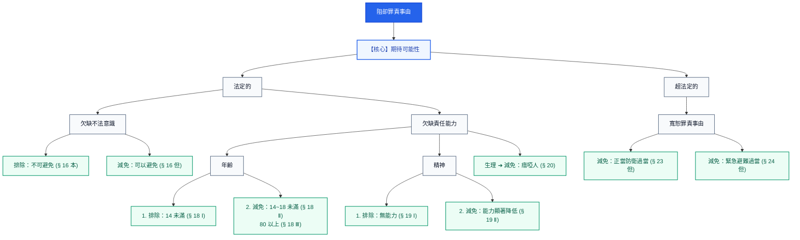

---

### 六、壞事（＝不法）該如何判斷？
*(教材第 1-4 頁)*

接著我們來看壞事該如何判斷。

所謂壞事（＝不法）就是**「無緣無故做出令人覺得不舒服的行為」**，可以簡單拆解成兩個指標：
1. **法益侵害（做出令人覺得不舒服的行為）**：重要生活利益受到破壞。
2. **無正當理由（無緣無故）**：附加說明此破壞有違整體法律秩序而並不正當。

#### 💡 直覺式觀察：巴掌比喻
其實這是種直覺式觀察：
- 試想有個陌生人突然衝過來賞你一巴掌，臉龐的紅腫刺痛會是**第一個感受**，這代表重要生活利益（身體法益）遭受破壞。
- 接踵而來的疑惑與氣憤是**第二個感受**，這代表剛才對方的行為是莫名其妙的（無正當理由）。

因此壞事乃**「法益侵害 ＋ 無正當理由」**的組合，且依感受的順序，**先判斷法益侵害，再判斷無正當理由**。

#### 🏛️ 法律術語的對應與轉換
- **法益侵害**：既然是一種公認不舒服的行為，立法者便將這種行為的特徵歸納後寫在刑法中，形成刑法分則的各個罪名（如殺人罪、傷害罪、強制性交罪、強盜罪等等），往後只要出現符合分則條文描述的舉動就是法益侵害。轉換成法律用語，即**「構成要件該當性」（形式不法）**。
- **無正當理由**：至於正當理由的判斷，人們發現自古以來令人不舒服的行為鮮少是有正當理由的，基於便利，確認法益侵害便直接**「推定」**該行為無正當理由。又為了避免便宜行事可能造成的誤判，依舊賦予反證推翻機制。轉換成法律用語，即**「違法性」（實質不法）**。
- 前述的推定模式即是**「構成要件該當推定違法性」原則**，推翻違法推定的理由稱為**「阻卻違法事由」**。

---

### 七、構成要件該當性推定違法性原則 (架構圖解)
*(教材第 1-5 頁)*

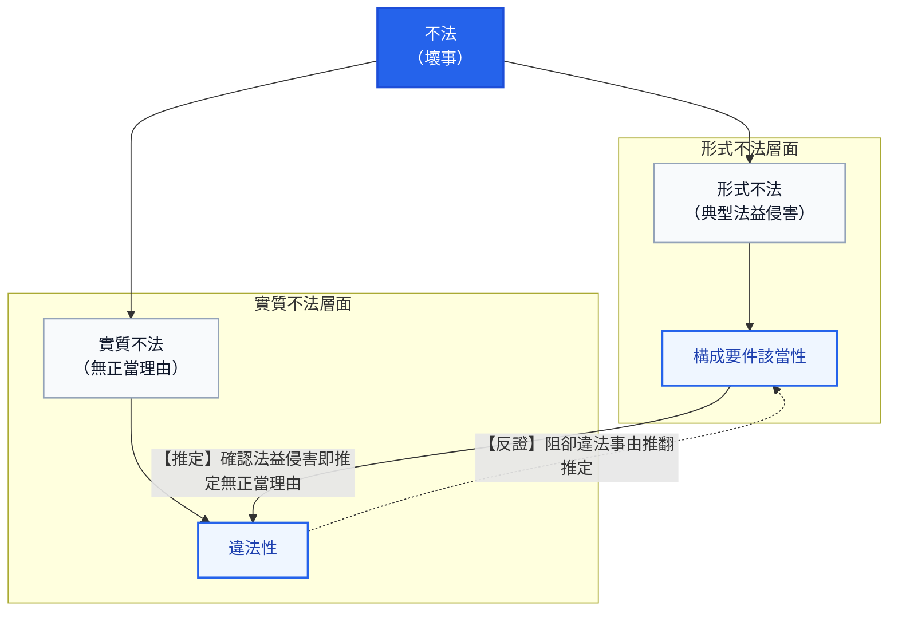

---

### 八、阻卻違法事由之法定例示（案例 1-7 ～ 1-11）
*(教材第 1-5 ～ 1-6 頁)*

當行為因該當構成要件而被推定為無正當理由後，法律將賦予行為人反證推翻的機會，亦即可以主張一些有利於自己的理由，證明法益侵害是正常的。

這些反證推翻的理由，立法者在刑法第 21 條至第 24 條當中加以例示：

#### 案例 1-7
- **被告答辯**：「我的確有為他人墮胎，但卻是在符合優生保健法 § 9 的情況下。」
- **【問題導引】**：主張**「依法令之行為」**的抗辯（§ 21 Ⅰ）。由於這是法規所允許的墮胎行為，縱使的確造成法益侵害（胎兒生命），但卻因為有正當理由而並非壞事。
> 📌 **【2026 現行法規查核狀態】**：**條文無更動（維持現行法），關聯法規持續檢討維護**。  
> - **現行法條文（刑法 § 21 第 1 項）**：「依法令之行為，不罰。」  
> - **關聯法規現況（優生保健法 § 9）**：醫師依法律許可之醫學或優生事由施行人工流產，合於法令阻卻違法。近年行政主管機關正推動《優生保健法》更名為《生育保健法》草案，重點在於維護懷孕婦女之身體自主決定權（擬取消配偶同意權限制）；但不論修法進度如何，只要符合法定醫療程序，均屬依法令之行為而不罰。  
> - **資料來源**：[全國法規資料庫 - 刑法第 21 條](https://law.moj.gov.tw/LawClass/LawSingle.aspx?pcode=C0000001&flno=21)、[優生保健法第 9 條](https://law.moj.gov.tw/LawClass/LawSingle.aspx?pcode=L0070001&flno=9)

#### 案例 1-8
- **被告答辯**：「我有拿別人的東西，但卻是因為上級的命令我才這麼做。」
- **【問題導引】**：主張**「依命令之行為」**的抗辯（§ 21 Ⅱ）。由於有合法的上級公務員命令存在，縱使的確造成法益侵害（所有權），但卻因為有正當理由而並非壞事。
> 📌 **【2026 現行法規查核狀態】**：**條文無更動（維持現行法）**。  
> - **現行法條文（刑法 § 21 第 2 項）**：「依所屬上級公務員命令之職務上行為，不罰。但明知命令違法者，不在此限。」  
> - **法理現況要件**：  
>   1. 行為人與發令人皆具備合法公務員身分且具職務隸屬關係；  
>   2. 該命令形式上屬於該長官監督權限並具合法形式要件；  
>   3. **但書限制**：採「相對服從說」，若公務員「明知命令違法」仍盲目執行，則不得主張阻卻違法，仍應負刑事責任。  
> - **資料來源**：[全國法規資料庫 - 刑法第 21 條](https://law.moj.gov.tw/LawClass/LawSingle.aspx?pcode=C0000001&flno=21)

#### 案例 1-9
*(教材第 1-6 頁)*
- **被告答辯**：「我幫人作結紮手術縱使該當重傷罪之構成要件，但我可是醫生耶！」
- **【問題導引】**：主張**「業務上正當行為」**的抗辯（§ 22）。正當的業務執行乃社會分工所必需，縱使的確造成法益侵害（重大身體），但卻因為有正當理由而並非壞事。
> 📌 **【2026 現行法規查核狀態】**：**條文無更動（維持現行法）**。  
> - **現行法條文（刑法 § 22）**：「業務上之正當行為，不罰。」  
> - **法理現況與連動法規**：正當醫療處遇（如合法結紮、截肢、切除病灶等外科手術）雖客觀上該當傷害或重傷罪構成要件，但只要出於醫療目的、合乎醫療常規，並依《醫療法》第 63 條、第 64 條踐行告知並取得病人或家屬同意，即屬業務上之正當行為而阻卻違法。  
> - **資料來源**：[全國法規資料庫 - 刑法第 22 條](https://law.moj.gov.tw/LawClass/LawSingle.aspx?pcode=C0000001&flno=22)、[醫療法第 63 條](https://law.moj.gov.tw/LawClass/LawSingle.aspx?pcode=L0020021&flno=63)

#### 案例 1-10
*(教材第 1-6 頁)*
- **被告答辯**：「我莫名其妙被人進攻，是為了保護自己才將對方打傷。」
- **【問題導引】**：主張**「正當防衛」**的抗辯（§ 23）。本於「自我保護」以及「正者毋須向不正者低頭」的社會共識，面臨現在不法侵害時應有反擊的權利，縱使的確造成法益侵害（身體），但卻因為有正當理由而並非壞事。
> 📌 **【2026 現行法規查核狀態】**：**條文無更動（維持現行法）**。  
> - **現行法條文（刑法 § 23）**：「對於現在不法之侵害，出自防衛自己或他人權利之行為，不罰。但防衛行為過當者，得減輕或免除其刑。」  
> - **法理現況要件**：核心基礎為「正者毋須向不正者低頭」與「自我保護」。要件包含：(1) 現在不法侵害；(2) 出於防衛意思；(3) 防衛手段具適當性與必要性（有效且侵害最小）。若手段過當，則落入但書之防衛過當（阻卻罪責寬恕事由，得減免其刑）。  
> - **資料來源**：[全國法規資料庫 - 刑法第 23 條](https://law.moj.gov.tw/LawClass/LawSingle.aspx?pcode=C0000001&flno=23)

#### 案例 1-11
*(教材第 1-6 頁)*
- **被告答辯**：「我是因為被野狗追趕，在避無可避之下才會闖入民宅。」
- **【問題導引】**：主張**「緊急避難」**的抗辯（§ 24）。本於「社會連帶性原則」以及「自主原則」的社會共識，面臨緊急危難時應有轉嫁的權利，縱使的確造成法益侵害（居住自由），但卻因為有正當理由而並非壞事。
> 📌 **【2026 現行法規查核狀態】**：**條文無更動（維持現行法）**。  
> - **現行法條文（刑法 § 24）**：第 1 項「因避免自己或他人生命、身體、自由、財產之緊急危難出自不得已之行為，不罰。但避難行為過當者，得減輕或免除其刑。」；第 2 項「前項關於避免自己危難之規定，於公務上或業務上有特別義務者，不適用之。」  
> - **法理現況要件**：緊急避難係將危難「轉嫁」給無辜第三人，故其合法門檻高於正當防衛。要件包含：面臨緊急危難（包含自然災害或動物襲擊）、不得已之行為（最後手段性）、且保全利益須顯著大於犧牲利益（利益衡量）。  
> - **資料來源**：[全國法規資料庫 - 刑法第 24 條](https://law.moj.gov.tw/LawClass/LawSingle.aspx?pcode=C0000001&flno=24)

---

### 九、超法定阻卻違法事由與利益衡量原則（案例 1-12 ～ 1-15）
*(教材第 1-6 ～ 1-7 頁)*

#### ⚖️ 超法定阻卻違法之引言與思考核心
*(教材第 1-6 頁底)*

> 通說見解肯定在法律未規定的情況下，可以尋求**「超法定阻卻違法事由」**來推翻推定，現今犯罪體系自**「是否合於利益衡量？」**思考違法性，並綜合**結果**與**行為**來觀察：
> 1. **就結果層面而言**：若**犧牲利益大於保全利益**，可以肯定違法性；
> 2. **就行為層面而言**：若**為達目的而不擇手段**，亦肯定違法性。

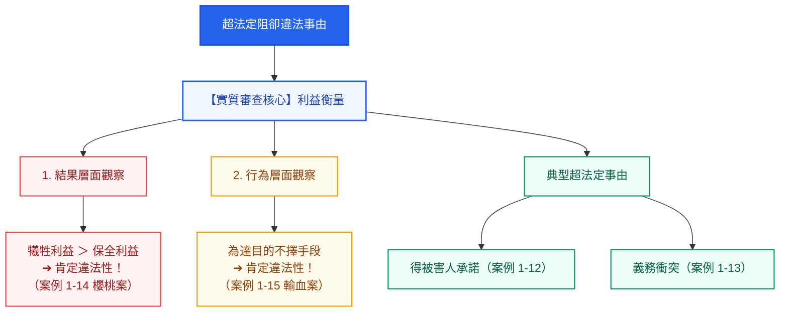

#### 案例 1-12
*(教材第 1-7 頁)*
- **被告答辯**：「我的確有打對方一巴掌，不過那是因為我們正在玩黑白猜啦！」
- **【問題導引】**：主張**「得被害人承諾」**的超法定抗辯。因為被害人在自由意志下自行放棄對法益的保護，縱使的確造成法益侵害（身體），但卻因為有正當理由而並非壞事。
> 📌 **【2026 現行法規查核狀態】**：**未增訂為成文法規，維持超法定阻卻違法地位**。  
> - **法理現況與處分界限**：被害人得處分其個人法益（如財產權、輕微身體法益如遊戲拍打或穿耳洞），此時阻卻違法；但對於生命與重大身體健康法益，個人無處分權，刑法特設第 275 條（加工自殺罪）與第 282 條（受囑託或得承諾傷害罪）處罰，不得主張得承諾免責。  
> - **資料來源**：司法院裁判書查詢系統、刑法第 275 條、第 282 條

#### 案例 1-13
*(教材第 1-7 頁)*
- **被告答辯**：「當時我的兩個小孩都深陷火海，但我能力有限，最多只能救起一個。」
- **【問題導引】**：主張**「義務衝突」**的超法定抗辯。此時行為人已經盡其所能地履行義務，縱使的確造成法益侵害（生命），但卻因為有正當理由而並非壞事。
> 📌 **【2026 現行法規查核狀態】**：**未增訂為成文法規，維持超法定阻卻違法地位**。  
> - **法理現況與履行義務要件**：行為人面臨數個法律上同等價值之作為義務，客觀上無法同時履行全部義務時，行為人履行其一而未履行他義務，因欠缺客觀履行可能性且已盡其所能，法秩序不科以刑責，阻卻違法。  
> - **資料來源**：最高法院判決要旨及學說通說

#### 案例 1-14 ───【櫻桃案】
*(教材第 1-7 頁)*
- **案例內文**：患有小兒麻痺而必須以輪椅代步的櫻桃園主人，在面臨小學生偷偷進入其所屬櫻桃園偷採櫻桃的不法侵害時，只能選擇用開槍的方法加以制止，雖然保全了一顆櫻桃不被偷走，卻造成了小學生的死亡。
- **【問題導引】**：在本案例中，由於**犧牲利益（生命）遠大於保全利益（一顆櫻桃）**，由結果的層面觀察相差過於懸殊，違反整體法秩序而無正當理由，無法阻卻違法。
> 📌 **【2026 現行法規查核狀態】**：**法理檢驗：正當防衛之權利濫用禁止**。  
> - **法理現況與利益衡量**：正當防衛原則上雖不要求利益衡量（「正不必向不正讓步」），但受極端比例性之限制，亦即「禁止權利濫用原則」。以消滅他人生命來保全微不足道之財產法益（一顆櫻桃），結果相差懸殊，構成權利濫用，行為仍具違法性，成立殺人罪或傷害致死罪。  
> - **資料來源**：最高法院裁判實務見解、德日刑法防衛權限制共通法理

#### 案例 1-15 ───【輸血案】
*(教材第 1-7 ～ 1-8 頁)*
- **案例內文**：甲因為車禍重傷而送至醫院急救，生命垂危而有大量輸血的需要，但醫院正好缺乏稀有的同型血液，醫師乙知悉醫院義工丙與甲的血型相同，要求助於丙，但遭丙拒絕，乙為救助甲的生命，便使用強制力抽取丙的血液用於甲的醫療，最終救活了甲。
- **【問題導引】**：縱使保全利益（生命）大於犧牲利益（自由），但乙所使用之手段嚴重違反人性尊嚴（將丙當成輸血機），自行為層面觀察並非達成目的的合理手段。違反整體法秩序而無正當理由，無法阻卻違法。
> 📌 **【2026 現行法規查核狀態】**：**法理檢驗：利益衡量之行為手段正當性與人性尊嚴保障**。  
> - **法理現況要旨**：縱使保全生命法益在客觀衡量上至高無上，但行為手段若屬「為達目的不擇手段」（強行強制抽取拒絕之第三人血液，將人工具化作為輸血機器），嚴重侵害憲法第 22 條所保障之身體自主決定權與人性尊嚴核心，自行為手段層面即被肯定具備違法性，無正當理由，無法依緊急避難阻卻違法。  
> - **資料來源**：司法院憲法法庭人性尊嚴裁判法理、刑法第 24 條緊急避難手段社會相當性

---

### 十、阻卻違法事由之體系展開 (架構圖解)
*(教材第 1-8 頁)*

在理解了各項阻卻違法事由與利益衡量原則後，我們將所有「阻卻違法事由」統整成一幅清晰的體系架構圖。其審查的最高指導核心即為**「合乎整體法秩序」**：

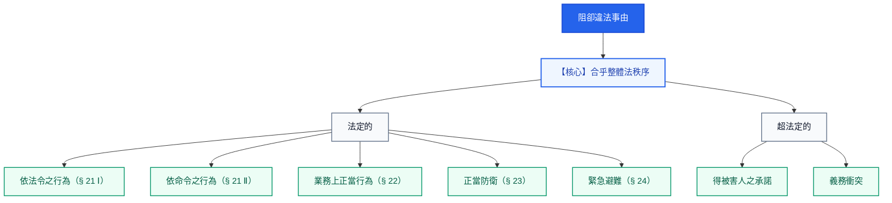

---

### 十一、犯罪三階層體系論（簡稱三階論）之統整
*(教材第 1-8 頁)*

我們來作個統整。

1. **構成要件該當性階層（TB）**：首先判斷行為人的所作所為是否符合分則條文的描述。
2. **違法性階層（R）**：再來構成要件該當將推定違法性，因此必須尋有無阻卻違法事由。
3. **罪責階層（S）**：最後不法將推定罪責，所以必須找尋有無阻卻罪責事由。

當行為人的罪責終局地被確認後，即可宣告犯罪成立。

> 💡 **學說定名**：學說將這種**「構成要件該當性（TB）➔ 違法性（R）➔ 罪責（S）」**的三階段判斷模式，稱為**「犯罪三階層體系論（簡稱三階論）」**。

---

### 十二、犯罪三階層體系論（雛形）架構圖解
*(教材第 1-9 頁)*

犯罪三階層體系論的雛形，正是由「行為評價（不法）」與「行為人評價（罪責）」經由兩道「推定」機制交織而成：

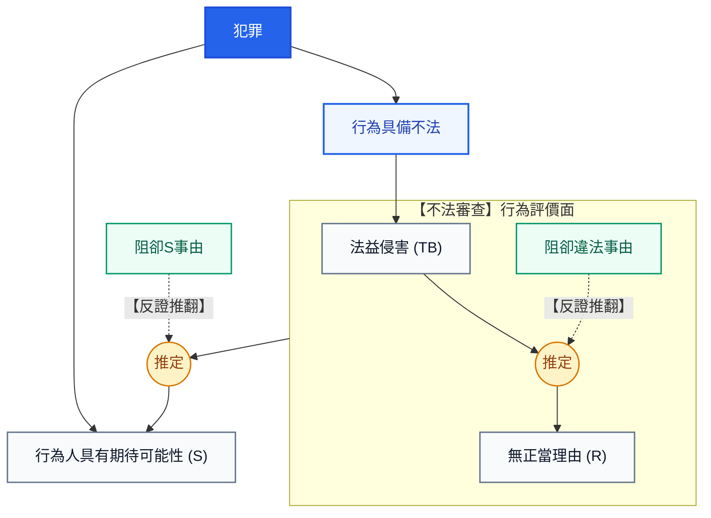

---

### 十三、目的犯罪體系與客觀／主觀要件之開展
*(教材第 1-9 頁)*

基於三階論，我們再為他添加些內涵：

#### 1. 學說發展脈絡演變
- **早期學說（古典犯罪體系）**：
  - 認為不法是壞事的外在判斷，罪責是壞人的內在判斷。
  - 因而主張**不法是純客觀的**，**罪責則是純主觀的**。
- **現今學說（目的犯罪體系）**：
  - 受**目的行為理論**影響，認為**目的乃判斷不法的重要基礎**。
  - 因此不法不是純客觀的，而是**客、主觀的綜合評價（目的犯罪體系）**。

#### 2. 三階論搭配目的犯罪體系之要件開展
三階論搭配目的犯罪體系，與不法有關的階層都有客、主觀要件之別：
- **構成要件該當性（TB）**：
  - **客觀構成要件**（外在行為、結果、因果關係等）
  - **主觀構成要件**（故意、過失、意圖等）
- **違法性（R）**：
  - **客觀阻卻違法要件**（防衛情狀、防衛手段等客觀事實）
  - **主觀阻卻違法要件**（防衛意思、避難意思等主觀心態）

#### 3. ⚠️ 違法性推定之推翻法則
此外，構成要件該當發生推定效力後，要想推翻違法性推定：
> **必須阻卻違法事由「客、主觀要件均該當」**！
> 否則推定效力將繼續維持，只能進入罪責審查。

---

### 十四、犯罪三階層體系（完整）與推翻違法性之實例檢驗
*(教材第 1-10 頁 原文圖解、案例 1-16、1-17)*

#### 1. 犯罪三階層體系（完整）架構圖

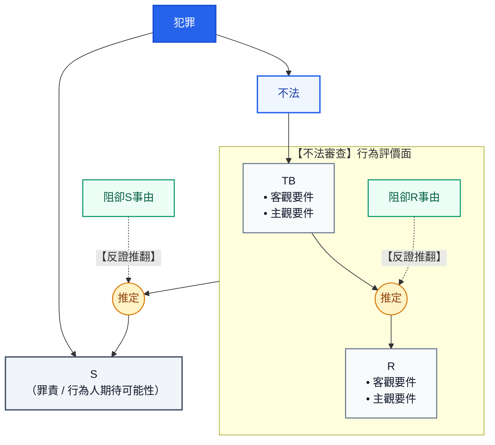

#### 2. 教材經典案例檢驗（推翻違法性之嚴格標準）

在第 1-9 頁中確立的法則：**「要想推翻違法性推定，必須阻卻違法事由『客、主觀要件均該當』！」**
教材於第 1-10 頁至第 1-11 頁透過兩大經典案例進行精準對比：

---

##### ◆ 案例 1-16 ◆
> 由於乙天生一副兇神惡煞貌，致使甲誤以為前來問路的乙對自己不懷好意，因此本於保護自己的意思先發制人，將乙打成輕傷。

**【問題導引】**
> 甲該當傷害罪的構成要件（§ 277），由於僅能滿足正當防衛的主觀要件（防衛意思），欠缺客觀上的防衛情狀，不生推翻違法的效力，必須繼續進行罪責的審查。

**【法理分析與學說定位】**
- **學理定性**：此即刑法經典之**「誤想防衛」**（容許構成要件錯誤 / 阻卻違法事由之主客觀不一致）。
- **審查結論**：甲客觀上並無「現在不法侵害」存在，僅有主觀防衛意思，未能「客、主觀要件均該當」，故**無法推翻違法性之推定**，甲之行為仍具備不法，必須進入第三階層審查其罪責非難性。
- **2026 現行法規查核**：
  - **適用法條**：刑法 § 277 第 1 項（傷害罪）：「傷害人之身體或健康者，處五年以下有期徒刑、拘役或五十萬元以下罰金。」（108 年修正提高罰金刑）。
  - **現行實務處理**：多數實務採「限制法律效果之罪責理論」，行為人不具罪責故意，僅得依過失犯論處或減免其刑。
  - *來源：[全國法規資料庫 刑法 § 277](https://law.moj.gov.tw/LawClass/LawSingle.aspx?pcode=C0000001&flno=277)*

---

##### ◆ 案例 1-17 ◆
> 角頭老大甲某日在路邊某巷道時，發現對向走來的乃是新興幫派的老大乙，甲心想先下手為強而掏槍將乙射殺。殊不知在此之前，乙放在口袋內的手也正用手槍瞄準甲，想致甲於死地。

**【問題導引】**
> 甲該當殺人罪的構成要件（§ 271），由於僅能滿足正當防衛的客觀要件（防衛情狀與防衛行為），欠缺主觀上的防衛意思，仍不發生推翻違法的效力，必須繼續進行罪責的審查。

**【法理分析與學說定位】**
- **學理定性**：此即刑法經典之**「偶然防衛」**（客觀上有防衛情狀，但主觀欠缺防衛意思）。
- **審查結論**：甲客觀上雖然巧遇乙之掏槍瞄準（具備現在不法侵害之防衛情狀），但甲主觀上純粹出於先下手為強的殺人惡念（欠缺防衛意思），不符合「客、主觀要件均該當」之推翻鐵律，故**不生推翻違法的效力**，行為仍具備違法性，必須繼續進行罪責審查。
- **2026 現行法規查核**：
  - **適用法條**：刑法 § 271 第 1 項（普通殺人罪）：「殺人者，處死刑、無期徒刑或十年以上有期徒刑。」
  - **憲法法庭判決拘束**：受 **113 年憲判字第 8 號判決** 強烈拘束，死刑合憲但僅限於「個案犯罪情節最嚴重且踐行最嚴格之正當法律程序」方得科處。
  - **現行實務處理**：實務與通說認行為人欠缺主觀防衛意思，不成立正當防衛（不阻卻違法）；效果上依「既遂說」論以殺人既遂，或依「未遂規整說」類推適用殺人未遂處罰。
  - *來源：[全國法規資料庫 刑法 § 271](https://law.moj.gov.tw/LawClass/LawSingle.aspx?pcode=C0000001&flno=271)、[憲法法庭 113 年憲判字第 8 號](https://cons.judicial.gov.tw/)*

---

### 十五、犯罪二階層體系論（簡稱二階論）與「四塊拼圖說」
*(教材第 1-11 頁 原文圖解)*

學理上另有主張「犯罪二階層體系論（簡稱二階論）」，與通說最大差異在建構不法的方式。

#### 1. 二階論常見天大誤解之澄清
很多人以為二階論不區分 TB 與 R，這是個天大誤解！
實際上二階論所有不法組成要件都與三階論完全相同，只是排列組合不同罷了：
- **三階論**：是由「**構成要件該當性（TB）與違法性（R）**」出發建構不法（橫向階層式切分）。
- **二階論**：則是由「**客觀要件與主觀要件**」出發建構不法（縱向要件式切分）。
  - **客觀不法** 係「客觀構成要件該當 且 無客觀阻卻違法要件」
  - **主觀不法** 係「主觀構成要件該當 且 無主觀阻卻違法要件」

> **換言之**：構成要件該當推定違法性原則將各自在客觀不法與主觀不法中產生作用，這是與三階論的最大不同。

---

#### 2. 核心精妙比喻：四塊拼圖說
簡單說，不法是由以下「四塊拼圖」所組成：
1. 🧩 **客觀構成要件**
2. 🧩 **主觀構成要件**
3. 🧩 **客觀阻卻違法要件**
4. 🧩 **主觀阻卻違法要件**

三階論與二階論，僅僅是這四塊拼圖的**不同排列組合**：

| 體系比較 | 三階層體系論（通說） | 二階層體系論（二階論） |
| :--- | :--- | :--- |
| **切分維度** | **橫向切分（階層階段推進）** | **縱向切分（客觀／主觀平行推進）** |
| **第 1 步審查** | **構成要件該當性 (TB)**：客觀構成要件 ＋ 主觀構成要件 | **客觀不法**：客觀構成要件該當 ＋ 無客觀阻卻違法要件 |
| **第 2 步審查** | **違法性 (R)**：客觀阻卻違法要件 ＋ 主觀阻卻違法要件 | **主觀不法**：主觀構成要件該當 ＋ 無主觀阻卻違法要件 |
| **推定機制作用點** | TB 該當 ➔ 推定整體 R 違法性 | 客觀 TB ➔ 推定客觀 R；主觀 TB ➔ 推定主觀 R |
| **結論一致性** | **四塊拼圖相同，因此兩種體系在大多數案件中會得出相同結論。** | **四塊拼圖相同，因此兩種體系在大多數案件中會得出相同結論。** |

---

#### 3. 犯罪二階層體系論 原文結構圖解

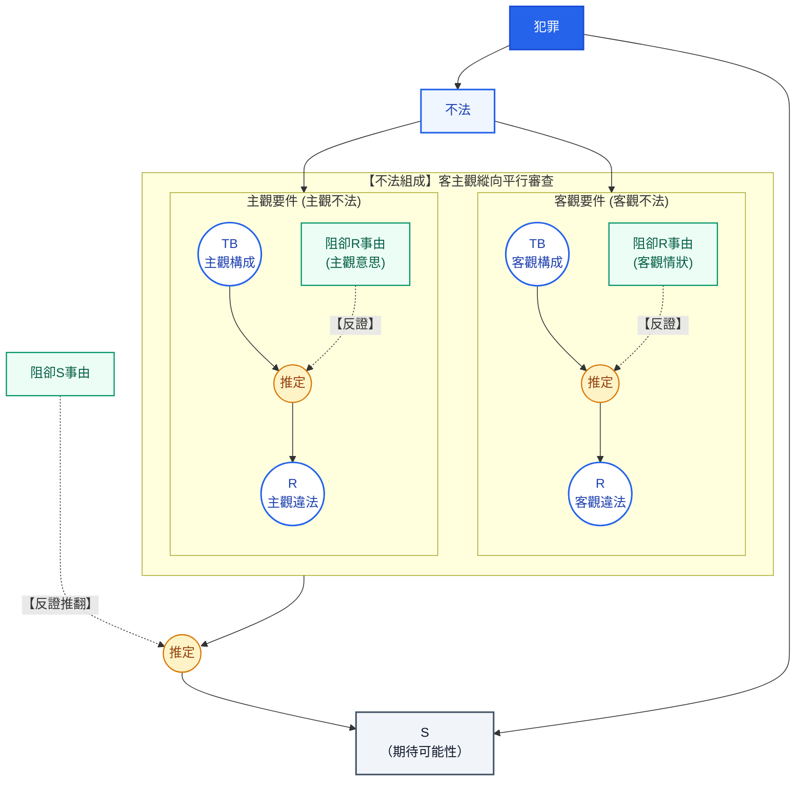

---

### 十六、刑法核心爭點超級對照矩陣（Mega Comparison Matrix）

彙整第一章全體核心概念，橫向深度比對國考三大高頻易混淆爭點：

#### ⚔️ 矩陣 A：【阻卻違法】 vs 【阻卻罪責】（本質體系大對決）

| 對照維度 | 🛡️ 阻卻違法事由（Justifications） | ⚖️ 阻卻罪責事由（Excuses） |
| :--- | :--- | :--- |
| **評價客體** | **評價「行為本身」**（實質不法性排除） | **評價「行為人本身」**（非難可能性排除） |
| **法律代稱** | 「不法」（Unlawful / 壞事推翻） | 「罪責」（Culpability / 壞人推翻） |
| **核心金句口訣** | **「縱使造成法益侵害，但因有正當理由而並非壞事！」** | **「因而雖做壞事，但卻不是壞人！」** |
| **共犯從屬性原則** | **連帶從屬**（限制從屬性：正犯不法，共犯始具不法；正犯阻卻違法，共犯連帶不罰） | **個別獨立**（正犯阻卻罪責，幕後教唆犯/幫助犯仍具完全罪責而論罪） |
| **民事侵權連動責任** | **不負賠償責任**（民法 § 149 正當防衛、§ 150 緊急避難） | **仍可能負賠償責任**（行為仍屬不法，依民法 § 187 與法定代理人連帶賠償） |
| **典型事由與條文** | § 21 依法令/命令、§ 22 業務、§ 23 前段正當防衛、§ 24 Ⅰ 前段緊急避難、超法定得承諾/義務衝突 | § 16 不知法律、§ 18 責任年齡、§ 19 精神障礙、§ 20 瘖啞、§ 23/24 但書防衛/避難過當、超法定期待可能性 |
| **對應教材案例** | 案例 1-7 至 1-15、案例 1-16、1-17 | 案例 1-1 至 1-6 |

---

#### ⚖️ 矩陣 B：【正當防衛】 vs 【緊急避難】 vs 【義務衝突】（防衛、避難與衡平大縱橫）

| 審查維度 | 🗡️ 正當防衛 (§ 23) | 🛡️ 緊急避難 (§ 24) | ⚖️ 義務衝突（超法定） | ⚠️ 極端例外案例（否定阻卻） |
| :--- | :--- | :--- | :--- | :--- |
| **法理哲學基礎** | **「正不必向不正低頭」**＋自我保護 | **「社會連帶與避險轉嫁」** | **「法不強人所難」**（客觀履行上限） | • 櫻桃案：**禁止權利濫用原則** • 輸血案：**人性尊嚴不可侵犯**（憲法 § 22） |
| **危難起因來源** | 嚴格限於**「現在不法之人為侵害」** | **一切緊急危難**（天災、野獸、急病） | 數法律義務同時發生，無法兼顧履行 | • 櫻桃案：偷摘櫻桃之侵害 • 輸血案：傷患瀕死休克危難 |
| **利益衡量要求** | **原則不要求利益衡量！**（正者無庸退讓） | **嚴格要求利益衡量！**（保全顯著大於犧牲） | 義務彼此等值或履行較高者 | **肯定違法性！** • 櫻桃案：生命 ＞＞ 櫻桃（結果懸殊違法） • 輸血案：縱生命＞自由，手段仍不法！ |
| **手段門檻要求** | **必要性原則**（有效且侵害最小，不必逃跑） | **最後手段性（不得已）**（能逃跑絕不可轉嫁） | 行為人客觀上限於能力只能履行其一 | • 櫻桃案：不得開槍射殺以保全櫻桃！ • 輸血案：強抽拒絕者血液當輸血機！ |
| **行為施加對象** | **僅限不法侵害者本人** | **無辜第三人之法益** | 於數受救助人中擇一履行 | 侵害者本人 / 無辜第三人 |
| **法律審查效果** | 合法不罰；過當依 § 23 但減免 | 合法不罰；過當依 § 24 但減免 | 超法定阻卻違法（不罰） | **肯定違法性！**（殺人罪/傷害致死罪/強制罪） |
| **經典教材案例** | 案例 1-10 正當防衛 | 案例 1-11 野狗闖民宅 | 案例 1-13 火海救兩子 | 案例 1-14 櫻桃案、案例 1-15 輸血案 |

---

#### 🤝 矩陣 C：【被害人同意】 vs 【得被害人承諾】 vs 【推定承諾】（處分界限大對決）

| 審查層面 | 🚪 被害人同意 (Einverständnis) | 📜 得被害人承諾 (Einwilligung) | 🔥 推定承諾 (Mutmaßliche Einwilligung) |
| :--- | :--- | :--- | :--- |
| **審查階層位階** | **第一階：阻卻構成要件！**（自始不該當） | **第二階：阻卻違法性！**（該當要件但非壞事） | **第二階：超法定阻卻違法！** |
| **適用法益範疇** | 文義含「無故、未得同意、違反意願」之罪（§ 306 侵入住宅、§ 320 竊盜） | 個人得自由處分之**個人法益**（財產、輕微身體自由健全） | 為被害人**保全更重大法益**之必要緊急處分 |
| **生命與重大身體限制** | 無法以同意使殺人構成要件不該當 | <strong style="color:red;">生命絕對不得承諾！</strong> 受囑託仍犯 § 275 加工自殺罪；重傷仍犯 § 282 承諾傷害罪！ | **不得違背明示反對意志**（如拒絕輸血、預立醫療決定） |
| **主觀表示與生效要件** | 具自然理解意思，明示或默示均可 | 須具承諾能力，行為前本於自由意志發出 | 事急無法及時徵詢＋客觀假定其若知悉必同意 |
| **經典實務例證** | 屋主同意訪客留宿、車主同意借車駕駛 | 案例 1-12 黑白猜打巴掌、美容穿耳洞、藝術刺青 | 鄰宅失火破門撲滅、昏迷病患無親屬時緊急截肢手術 |

---

---

## 第二章 刑法的論罪結構
*(教材第 1-13 ～ 1-16 頁，註：第 1-12 頁為空白頁)*

### 一、構成要件的本質與「故意＋既遂」處罰原則

構成要件是經驗累積的產物，能夠被編寫成犯罪構成要件之所作所為，必然都是最典型的非法，也可以說只要是身為人類都無法忍受的犯行。
例如英美法中所謂的「重罪」（Felony），包括：
- **謀殺**
- **強制性交**
- **強盜**
- **夜間侵入住宅**
- **惡意傷害**
- **放火** 等等

這些都是毫無疑問的處罰典型，其中最無爭議的就是**殺人罪**。

#### 1. 構成要件該當性之客觀與主觀分野
構成要件該當性有客觀與主觀之別，以殺人罪為例，立法者經驗上所設想的係**「出於殺人故意而殺死他人之行為」**，亦即客觀與主觀完全該當之情形：
- **客觀該當**：學理上稱為**「既遂」**。
- **主觀該當**：學理上稱為**「故意」**。

#### 2. 立法者的處罰原則
> **「故意＋既遂」是立法者最想掌握的處罰原則。**

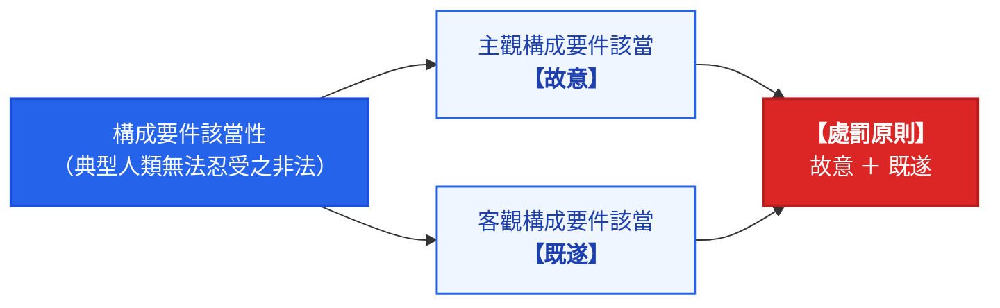

---

### 二、例外擴張處罰與觀念辨正（重要公式）

若構成要件未能完全該當，學理上的定性與公式如下：
1. **客觀構成要件未該當 ➔「非既遂（≠ 未遂）」**
2. **主觀構成要件未該當 ➔「非故意（≠ 過失）」**

> [!IMPORTANT]
> **「非既遂」與「非故意」原則上都不足以建構行為的可罰性！**
> 若要想例外地擴張處罰，除要有**法律的明示處罰規定**外（罪刑法定原則），還必須**滿足其他犯罪成立要件**。

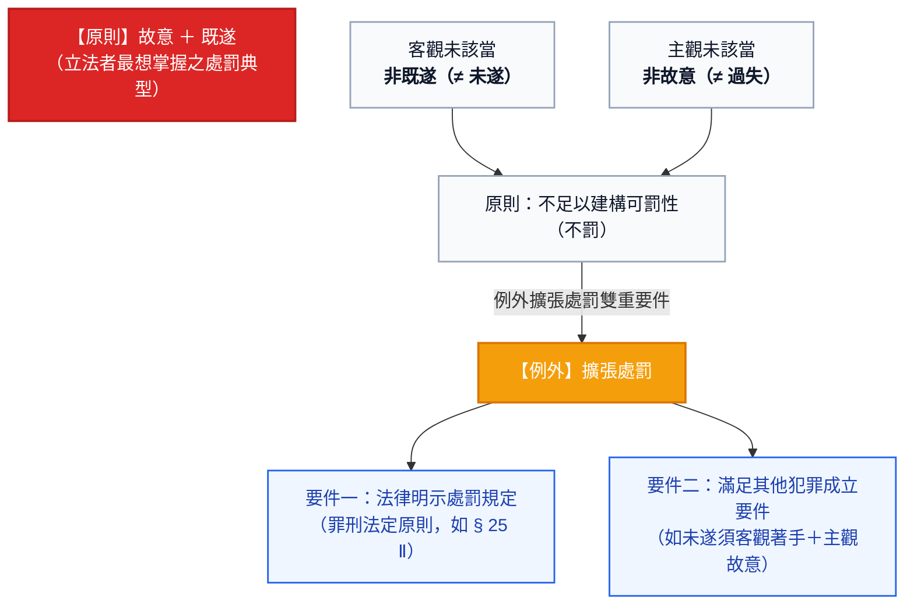

---

### 三、案例 2-1 西瓜刀砍人案與未遂犯審查（教材第 1-13 頁）

#### 案例事實
> 甲手持西瓜刀，耍了一套西瓜刀法想要砍死乙，不料乙施展凌波微步閃過。

#### 【問題導引】分析
甲客觀上並未殺死乙，客觀構成要件未該當，並非處罰原則。
若要例外處罰：
1. **除要有法律的明示處罰依據外（§ 25 Ⅱ ➔ § 271 Ⅱ）**；
2. **還必須滿足其他的犯罪成立要件（客觀上有著手＋主觀上有故意）**，
3. 從而論以**未遂犯**。

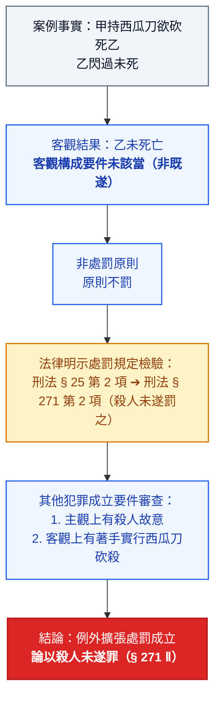

#### 2026 現行法規狀態查核
- **刑法第 25 條（未遂犯之定義與處罰）**：
  - **條文內容**：第 1 項：「已著手於犯罪行為之實行而不遂者，為未遂犯。」；第 2 項：「未遂犯之處罰，以有特別規定者為限，並得按既遂犯之刑減輕之。」
  - **現行狀態**：**條文無更動（維持現行法）**。貫徹罪刑法定主義，分則無特別規定者不罰未遂。
  - **出處**：[全國法規資料庫 刑法第 25 條](https://law.moj.gov.tw/LawClass/LawSingle.aspx?pcode=C0000001&flno=25)
- **刑法第 271 條（普通殺人罪）**：
  - **條文內容**：第 1 項：「殺人者，處死刑、無期徒刑或十年以上有期徒刑。」；第 2 項：「前項之未遂犯罰之。」
  - **現行狀態**：**條文文字未動・受憲法法庭裁判拘束**。
  - **周邊裁判連動**：依憲法法庭 113 年憲判字第 8 號判決意旨，死刑僅適用於個案情節最嚴重之既遂犯罪；未遂犯依第 25 條第 2 項得減輕其刑，實務上量處無期徒刑或有期徒刑。
  - **出處**：[全國法規資料庫 刑法第 271 條](https://law.moj.gov.tw/LawClass/LawSingle.aspx?pcode=C0000001&flno=271)、[憲法法庭 113 年憲判字第 8 號判決](https://cons.judicial.gov.tw/)

---

### 四、案例 2-2 西瓜刀練刀致死案與過失犯審查（教材第 1-14 頁）

#### 案例事實
> 甲手持西瓜刀，想要練練生疏已久的西瓜刀法，不料乙施展凌波微步路過時竟中刀死亡。

#### 【問題導引】分析
甲主觀上並未想殺死乙，主觀構成要件未該當，非是處罰原則。
若要例外處罰：
1. **除要有法律的明示處罰規定外（§ 12 Ⅱ ➔ § 276 Ⅰ）**；
2. **還必須滿足其他的犯罪成立要件（客觀上有達既遂＋主觀上有預見可能性）**，
3. 從而論以**過失犯**（過失致死罪）。

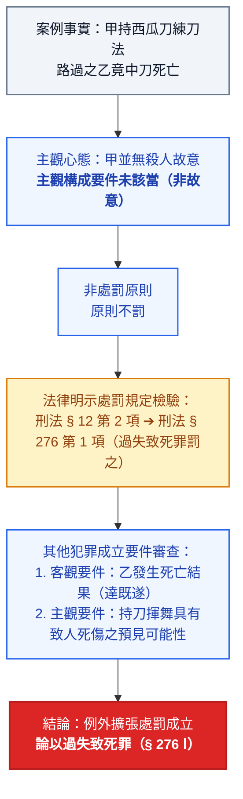

#### 2026 現行法規狀態查核
- **刑法第 12 條（故意與過失之處罰原則）**：
  - **條文內容**：第 1 項：「行為非出於故意或過失者，不罰。」；第 2 項：「過失行為之處罰，以有特別規定者為限。」
  - **現行狀態**：**條文無更動（維持現行法）**。貫徹罪刑法定主義，分則未明定罰過失者不罰。
  - **出處**：[全國法規資料庫 刑法第 12 條](https://law.moj.gov.tw/LawClass/LawSingle.aspx?pcode=C0000001&flno=12)
- **刑法第 276 條（過失致死罪）**：
  - **條文內容**：第 1 項：「因過失致人於死者，處五年以下有期徒刑、拘役或五十萬元以下罰金。」
  - **現行狀態**：**條文無更動（維持現行法）**。108 年修正廢除業務過失致死罪，全面回歸第 1 項處罰。
  - **出處**：[全國法規資料庫 刑法第 276 條](https://law.moj.gov.tw/LawClass/LawSingle.aspx?pcode=C0000001&flno=276)

---

### 五、【解題提示】直覺誤區辨正與 § 12 之法條邏輯證明（教材第 1-14 頁）

> [!CAUTION]
> **千萬別直覺地認為「客觀構成要件未完全該當即為未遂」，或「主觀構成要件未完全該當就是過失」！**
> 這是非常嚴重的錯誤觀念：
> 1. 將導致未遂犯中漏未審查**「著手」**；
> 2. 過失犯中忽略**「預見可能性」**。
> 若因此建構可罰性，將嚴重背離**罪刑法定原則**。

#### 刑法法條邏輯上的鐵證
我們也可以在法條中找到邏輯上的依據。例如 **刑法 § 12 Ⅰ** 規定：
> **「行為非出於故意或過失者，不罰。」**

若肯定「非故意 ＝ 過失」的話，那法律上根本不存在「行為非出於故意或過失（＝無過失）」的情況了！
一個簡單的小概念，其實隱藏了許多既基本卻又常常被忽略的重要理念，學習法律的人不可不慎！

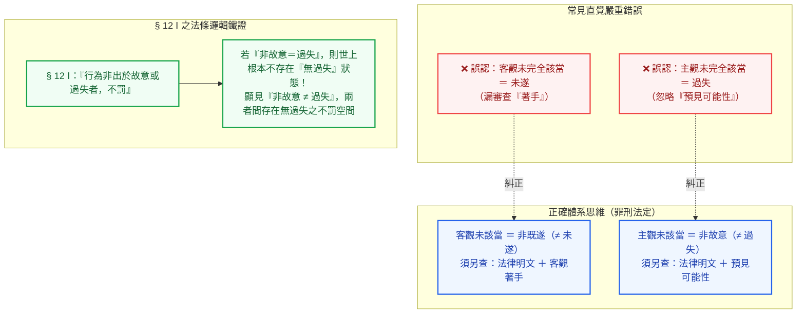

---

### 六、阻卻違法之例外排除與案例 2-3（意圖式挑唆防衛，教材第 1-14 ～ 1-15 頁）

#### 阻卻事由之例外排除通則
至於違法性以及罪責階層，都是反面找尋有無阻卻違法事由或阻卻罪責事由，雖然刑法對這些事由有提供例示，但並不以此為限。
要注意的是，各該阻卻事由中尚有某些特殊情況是**無法發生推翻效力而必須接受刑法處罰的**。

#### 案例 2-3 案例事實
> 甲為知名大學法律系學生，深知刑法上有所謂「正當防衛」之權利，遂心生一計，想要藉機修理情敵乙。某日甲在學校走廊上堵乙，並用盡各種言語嘲諷，當乙怒不可遏而準備朝甲飽以老拳之際，甲順手拿起傘桶內之雨傘朝乙猛擊，造成乙身體多處瘀傷。甲主張正當防衛而不成立犯罪，試問有無理由？

#### 【問題導引】分析
1. **構成要件**：甲該當傷害罪的構成要件（§ 277）。
2. **違法性檢驗**：甲客觀上面臨現在不法之侵害而反擊，主觀上出於防衛意思，看似可依正當防衛阻卻違法。
3. **例外排除（權利濫用）**：惟甲有**「利用正當防衛來侵害乙之意圖」在先**，此種**「意圖式挑唆防衛」乃權利濫用，例外無法阻卻違法**。
4. **關聯阻卻違法例外**：先前曾經提過的**【櫻桃案】**（利益絕對失衡）以及**【輸血案】**（違反人性尊嚴），也是阻卻違法的例外。

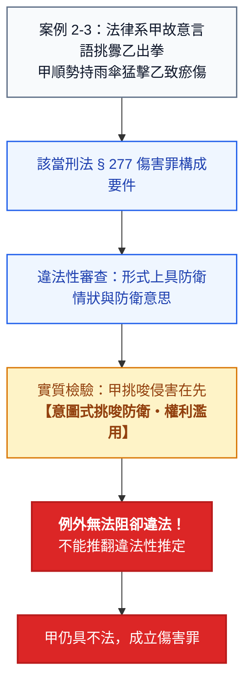

#### 2026 現行法規狀態查核
- **刑法第 277 條（普通傷害罪）**：
  - **條文內容**：第 1 項：「傷害人之身體或健康者，處五年以下有期徒刑、拘役或五十萬元以下罰金。」
  - **現行狀態**：**條文無更動（維持現行法）**。108 年提高罰金刑。
  - **出處**：[全國法規資料庫 刑法第 277 條](https://law.moj.gov.tw/LawClass/LawSingle.aspx?pcode=C0000001&flno=277)

---

### 七、阻卻罪責之例外排除與案例 2-4（原因自由行為，教材第 1-15 頁）

#### 案例 2-4 案例事實
> 甲想殺乙已久，但苦於乙身形高大而沒有勇氣下手。某日甲吃了半斤蛇膽下了心，將自己灌醉後勇氣大增，於無責任能力的狀態下殺死乙。

#### 【問題導引】分析
1. **構成要件與違法性**：甲該當殺人罪的構成要件，且無任何阻卻違法事由。
2. **罪責檢驗**：甲殺人時欠缺責任能力，看似阻卻罪責。
3. **例外排除（原因自由行為）**：惟甲**「故意自陷無責任能力狀態」在先**，此種**「原因自由行為（§ 19 Ⅲ）」例外無法阻卻罪責**。

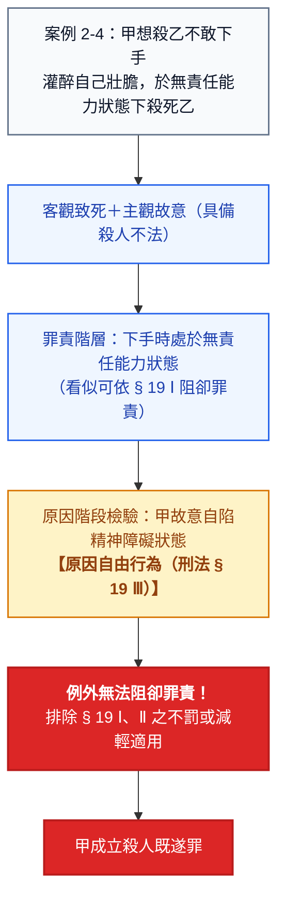

#### 2026 現行法規狀態查核
- **刑法第 19 條第 3 項（原因自由行為）**：
  - **條文內容**：第 3 項：「前二項規定，於因故意或過失自行招致者，不適用之。」
  - **現行狀態**：**條文無更動（維持現行法）**。明文排除因故意或過失自陷精神障礙者之阻卻罪責與減免利益。
  - **出處**：[全國法規資料庫 刑法第 19 條](https://law.moj.gov.tw/LawClass/LawSingle.aspx?pcode=C0000001&flno=19)

---

### 八、刑法處罰光譜總整理與「其他刑罰要件」補充（教材第 1-15 頁）

#### 1. 綜上所述：刑法處罰之原則與例外藍本
綜上所述，我們可以這麼說：
- **【處罰原則】**：係（無法阻卻違法與阻卻罪責下）故意的、既遂的犯罪，簡稱**故意既遂犯**。**所有分則條文的設計都是以故意既遂犯為藍本。**
- **【處罰例外】**：
  - **未遂犯（§ 25 Ⅱ）** 與 **過失犯（§ 12 Ⅱ）**。
  - 正因為是處罰例外，其可罰性必須有**法律的明文宣示**：

| 犯罪類型 | 故意既遂（處罰原則・分則藍本） | 未遂犯（§ 25 Ⅱ 例外處罰） | 過失犯（§ 12 Ⅱ 例外處罰） |
| :--- | :--- | :--- | :--- |
| **殺人罪** | 有（刑法 § 271 第 1 項） | **有處罰**（刑法 § 271 第 2 項） | **有處罰**（刑法 § 276 第 1 項） |
| **傷害罪** | 有（刑法 § 277 第 1 項） | **不處罰**（普通傷害無未遂規定） | **僅處罰過失犯**（刑法 § 284 第 1 項） |
| **竊盜罪** | 有（刑法 § 320 第 1 項） | **僅處罰未遂犯**（刑法 § 320 第 3 項） | **不處罰**（無過失竊盜罪） |

#### 2. 違法性與罪責層次之不得主張阻卻事由特殊例外總結
- **違法性階層之例外排除**：
  - 明知命令違法（§ 21 Ⅱ 但書）
  - 特別義務關係（§ 24 Ⅱ 本文不適用緊急避難）
  - 意圖式挑唆防衛（權利濫用）
  - 利益絕對失衡（【櫻桃案】）
  - 違反人性尊嚴（【輸血案】）
- **罪責階層之例外排除**：
  - 原因自由行為（§ 19 Ⅲ）

#### 3. 【其他刑罰要件】之補充
最後要補充的是，犯罪成立後還可能因**刑事政策上的理由**而阻卻刑罰發動，學理上稱為**其他刑罰要件**：
1. **客觀處罰條件**（如第 185-3 條以外特定行政刑法、破產罪要件等）。
2. **（自始性的）個人排除或減免刑罰事由**（如親屬間犯竊盜罪得免除其刑 § 324）。
3. **（嗣後性的）個人解除或免除刑罰事由**（例如中止犯 § 27、自首 § 62）。

免刑事由、（嗣後性的）個人解除或減免刑罰事由均屬之。我們可以用下圖表達犯罪的基本審查流程。

---

### 九、犯罪基本審查流程（教材第 1-16 頁 原文體系圖解）

> **免刑事由、（嗣後性的）個人解除或減免刑罰事由均屬之。我們可以用下圖表達犯罪的基本審查流程。**

#### 犯罪基本審查流程表（教材第 1-16 頁 原文對齊表格）

| 階層 | 核心提問與功能分流 | | |
| :---: | :--- | :--- | :--- |
| **行為** | **刑法意義之行為？** • **確認功能**：確認所欲討論的行為 • **過濾功能**：排除非刑法意義之行為 • **分類功能**：作為、純正不作為、不純正不作為（§ 15） | | |
| ⬇️ | | | |
| **TB** | **法益侵害形式為何？** | | |
| | **【原則】** 故意既遂犯（§ 13） | **【例外】** 未遂犯（§ 25） | **【例外】** 過失（§ 12、§ 14、§ 17） |
| ⬇️ | | | |
| **R** | **有無阻卻違法事由？** | | |
| | **可以阻卻違法**（§ 21 ～ § 24） | **不能阻卻違法**（§ 21 Ⅱ、§ 24 Ⅱ、其他法理） | |
| ⬇️ | | | |
| **S** | **有無阻卻罪責事由？** | | |
| | **可以阻卻罪責**（§ 16、§ 18 ～ § 20、§ 23 但、§ 24 Ⅰ 但） | **不能阻卻罪責**（§ 16、§ 19 Ⅲ、其他法理） | |
| ⬇️ | | | |
| **其他** | **有無其他刑罰要件？** | | |
| | **可以阻卻刑罰**（§ 26、§ 27、客觀處罰條件） | **不能阻卻刑罰** | |
| ⬇️ | | | |
| **結論** | **成立○○犯罪的** | • **故意既遂犯** • **未遂犯** • **過失犯** | |

#### 犯罪基本審查流程 Mermaid 架構圖

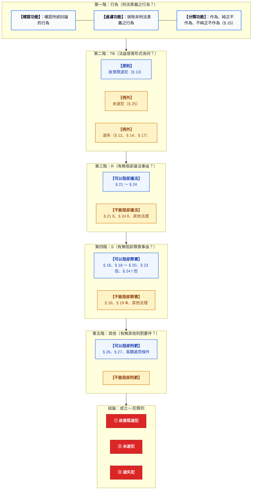

#### 2026 現行法規狀態實質查核

- **刑法第 15 條（不作為犯之保證人地位與防止義務）**：
  - **條文內容**：第 1 項：「對於一定結果之發生，法律上有防止之義務，能防止而不防止者，與因積極行為發生結果者同。」；第 2 項：「因自己行為致有發生一定結果之危險者，負防止其發生之義務。」
  - **現行狀態**：**條文無更動（維持現行法）**。明確區分不真正不作為犯之法規範基礎。
  - **出處**：[全國法規資料庫 刑法第 15 條](https://law.moj.gov.tw/LawClass/LawSingle.aspx?pcode=C0000001&flno=15)

- **刑法第 17 條（加重結果犯之成立要件）**：
  - **條文內容**：「因犯罪致發生一定之結果，而有加重其刑之規定者，如行為人不能預見其發生時，不適用之。」
  - **現行狀態**：**條文無更動（維持現行法）**。加重結果之成立以客觀具備「預見可能性」為限。
  - **出處**：[全國法規資料庫 刑法第 17 條](https://law.moj.gov.tw/LawClass/LawSingle.aspx?pcode=C0000001&flno=17)

- **刑法第 26 條（不能未遂不罰）**：
  - **條文內容**：「行為不能發生犯罪之結果，又無危險者，不罰。」
  - **現行狀態**：**條文無更動（維持現行法）**。民國 94 年修正公布將舊法之「得減輕或免除其刑」徹底修正為「不罰」，改採重大無知與客觀未遂論。
  - **出處**：[全國法規資料庫 刑法第 26 條](https://law.moj.gov.tw/LawClass/LawSingle.aspx?pcode=C0000001&flno=26)

- **刑法第 27 條（中止犯）**：
  - **條文內容**：第 1 項：「已著手於犯罪行為之實行，而因己意中止或防止其結果之發生者，減輕或免除其刑。結果之不發生，非防止行為所致，而行為人已盡力為防止行為者，亦同。」
  - **現行狀態**：**條文無更動（維持現行法）**。明定因己意中止者享有法律上「必減免」之個人解除刑罰寬典。
  - **出處**：[全國法規資料庫 刑法第 27 條](https://law.moj.gov.tw/LawClass/LawSingle.aspx?pcode=C0000001&flno=27)

---

# 第零篇 刑法的運作、操作原理與法律效果

### 本篇導讀 (Conducted read)
*(教材第 0-1 頁)*

> **本篇導讀原文**：  
> 「本篇是正式踏入刑法學習前的暖身，介紹影響刑法運作的四大支柱，以及刑法操作的前理解（諸如刑法的適用效力、解釋方法）。至於刑法的法律效果，這個通常被教科書或參考書放在最尾巴說明的刑罰理論，筆者挪移到本篇提前整理，旨在提醒大家「謹思慎刑」的核心理念，也與刑法最後手段性原則接軌。」  
> *(陳奕廷(易律師) 編著・《刑法總則【圖說系列】》)*

---

### 一、刑法操作的前理解 (Pre-understanding)
在正式進入具體罪名成立要件審查前，必須先掌握刑法適用之範疇與解釋工具：
1. **刑法的適用效力 (Geltungsbereich)**：
   - **時之效力（刑法 § 1、§ 2）**：行為時特別要件、罪刑法定與從舊從輕原則。
   - **地之效力（刑法 § 3 ～ § 8）**：屬地原則為核心，輔以旗國原則、保護原則與世界原則。
   - **人之效力**：憲法上特權豁免（總統刑事豁免權 § 52、立法委員言論免責權 § 73）。
2. **刑法的解釋方法 (Auslegungsmethoden)**：
   - **文義解釋**：文字可能文義為解釋之邊界。
   - **體系、歷史、目的解釋**：探求客觀法益保護目的。
   - **類推適用禁止原則（§ 1）**：罪刑法定之核心派生原則，嚴禁對行為人不利之類推適用。

---

### 二、影響刑法運作的四大支柱
刑法大廈之四座承重結構：
1. **構成要件該當性 (Tatbestand, TB)**：法益侵害行為之外觀該當性（故意既遂、未遂、過失）。
2. **違法性 (Rechtswidrigkeit, R)**：整體法規範之實質不法性與阻卻違法事由（§ 21～§ 24）。
3. **罪責 (Schuld, S)**：行為人之非難可能性與阻卻罪責事由（責任能力、不法意識、期待可能性）。
4. **法律效果 (Rechtsfolge)**：國家刑罰權之具體實現（刑罰與保安處分之雙軌體系）。

---

### 三、法律效果提前整理之體系深意：謹思慎刑
- **傳統教科書編排**：通常將刑罰論置於全書最後，容易使學習者將犯罪論視為脫離現實後果的純邏輯符號推演。
- **易律師之體系創新**：將刑罰理論提前於第零篇整理，旨在喚起法律人**「謹思慎刑」**之敬畏之心。刑罰具備剝奪生命、人身自由與財產之不可逆性，論罪下筆應當戒慎恐懼。

---

### 四、刑法最後手段性原則（Ultima Ratio）與憲法接軌
1. **最後手段性原則（謙抑性原則）**：
   刑法具有片段性與後盾性特質。唯有民事、行政手段窮盡且不足以保護法益時，始得動用刑罰。
2. **刑罰目的三大理論**：
   - **絕對理論（應報論）**：因犯罪而受罰，以實現罪責衡平之正義。
   - **相對理論（預防論）**：為防止犯罪而受罰（一般預防與特別預防）。
   - **綜合理論（折衷說）**：我國實務與通說立場（以應報為責任上限，兼顧預防目的）。
3. **2026 現行憲法規範查核**：
   - **憲法第 23 條（比例原則）**：動用刑罰必須具備必要性（侵害最小性）。
   - **司法院釋字第 551 號解釋**：刑罰手段須合乎比例原則，不得過度侵害人民自由。
   - **憲法法庭 112 年憲判字第 13 號判決**：重申罪刑相符與最後手段性之憲法拘束力。

---

### 五、第零篇導讀全景思維圖解

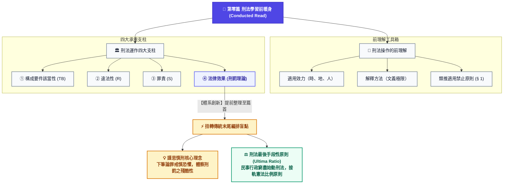

---

## 第一章 刑法的運作原理
*(教材第 2-1 頁)*

### 篇章前言：刑法目的、刑罰手段與四大支柱之推導

> **教材第 2-1 頁 原文前言**：  
> 「刑法的目的除了對過往犯罪加以制裁外（應報思想），更展望未來希望減少犯罪發生（預防思想）。其實無論根據何種思想，刑法的最終目的都是保護「人類極為重要生活利益」，簡稱法益保護。刑法基於法益保護的目的，允許使用較為嚴厲的手段，這種手段就是刑罰。刑罰的嚴厲性可以從法律效果窺見一二，生命的剝奪或自由的喪失，無疑是各種法律之最，然刑罰施加必須與目的追求成正比，若不慎得動用刑罰便應節制，縱使不得不發，也應遵循下列準則：基於應報，刑罰不允許超出行為人的責任範圍，亦即小罪不能大罰；基於預防，刑罰的依據必須明確，不能有任何含糊使人民無所安其手足。」  
>   
> 「刑法的目的在保護重要的人類生活利益，即法益保護原則；而刑罰作為手段，必須與所追求的目的成比例，逼不得已才動用刑罰，這是最後手段性原則（—謙抑性思想）。即使動用刑罰，由使人民安措其手足導出罪刑法定原則，再由小罪不能大罰帶出罪責原則。這四大原則呈現出刑法的四大支柱，一切的刑法問題看似棘手了，也必須終歸於這四大支柱。以下分別介紹法益保護原則（第一節）、罪刑法定原則（第二節）以及罪責原則（第三節），至於最後手段性原則與罪刑法定、罪責原則乃互為光影，故一併納入第二、三節中。」  
> *(陳奕廷(易律師) 編著・《刑法總則【圖說系列】》)*

#### 1. 刑法兩大目的思想與終極交會

| 思想流派 | 觀察維度 | 核心意涵 | 推導出的憲法／刑法準則 |
| :--- | :--- | :--- | :--- |
| **應報思想 (Retribution)** | **回顧過往** | 對過往已發生之犯罪行為加以嚴厲制裁，著眼於責任非難與回復正義。 | **小罪不能大罰**：刑罰不得超出行為人責任範圍 ➔ **【罪責原則】** |
| **預防思想 (Prevention)** | **展望未來** | 展望未來社會秩序之維持，藉由法律威嚇以減少犯罪發生（一般預防與特別預防）。 | **使人民安措其手足**：刑罰依據必須成文且明確 ➔ **【罪刑法定原則】** |
| **終極目的交會** | **法益保護** | **無論根據何種思想，刑法的最終目的均為保護「人類極為重要生活利益」**。 | **法益保護原則**（刑法的目的）＋ **最後手段性原則**（手段的節制） |

#### 2. 刑罰手段之嚴厲性與謙抑性（最後手段性）
- **極致嚴厲性**：刑罰手段伴隨生命剝奪（死刑）或自由喪失（徒刑、拘役），係國家公權力中最嚴厲之利刃。
- **比例原則與節制**：刑罰手段之動用必須與追求目的成正比，非逼不得已絕不輕易動用，此即**最後手段性原則（謙抑性思想，Ultima Ratio）**。

#### 3. 刑法四大支柱推導體系 (架構圖解)

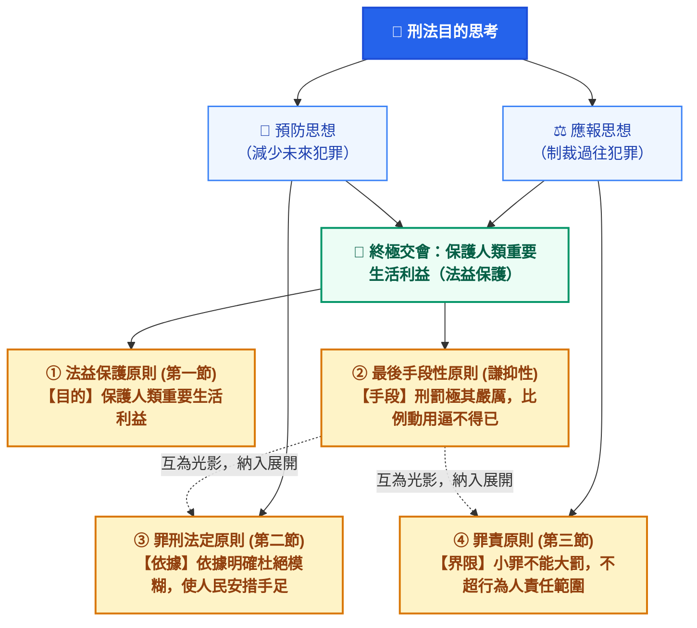

---

### 第一節 法益保護原則——何謂法益？
*(教材第 2-1 頁)*

#### 一、法益之核心法定定義

> **教材第 2-1 頁 原文定義**：  
> **「凡是以法律手段而加以保護之重要生活利益，即稱為法益。」**

法益是整個刑法理論與論罪體系之大基石。刑法之所以具備動用嚴厲刑罰之正當性，根本前提在於行為人的舉動實質侵害或威脅了這項「重要生活利益」。

#### 二、法益之三大本質與源起特徵

1. **社會倫理價值觀念（源起之母體）**：
   - 法益絕非立法者於辦公室內閉門造車或憑空捏造，而是植根於整體社會社群長期演進凝聚形成之倫理價值觀念與文明生活共同體秩序。
2. **先於法律規範而存在（實質先在性）**：
   - 人類的生命、身體健康、人身自由、名譽及財產等基本生活利益，在成文刑法條文制定之前即已客觀存在。
   - **法律規範係因應保護現實需求而制定，絕非「先有成文法律才有法益」**。
3. **法律制度發展後確認保護（實證化擔保）**：
   - 隨著現代立憲民主與法治國之建立，國家以成文法律（特別是刑法）的形式將這些重要生活利益予以明文化確認，並賦予最強力之法律效果給予實質保護。

#### 三、法益之雙重機能與界限

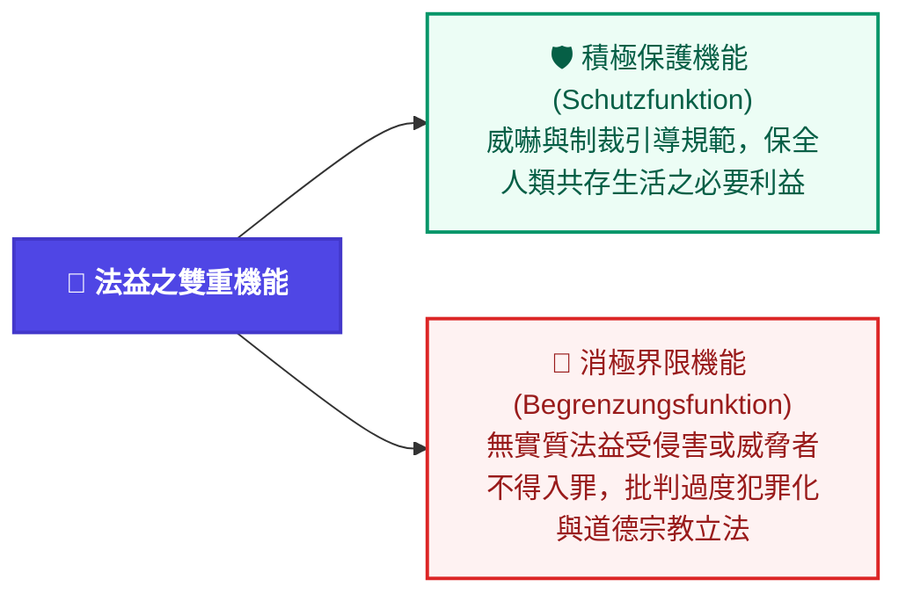

> 📌 **教材進度說明**：  
> 教材第 2-1 頁 第一節開篇（定義、本質與三大特徵）已完整收錄。後續「法益之種類區分（個人法益、社會法益、國家法益）」與第二節「罪刑法定原則」待後續教材頁面（第 2-2 頁起）提供後即時同步增補。

