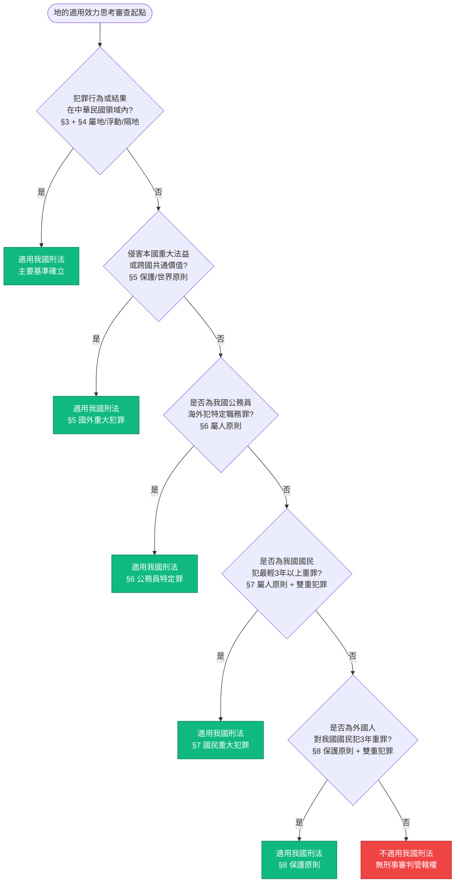
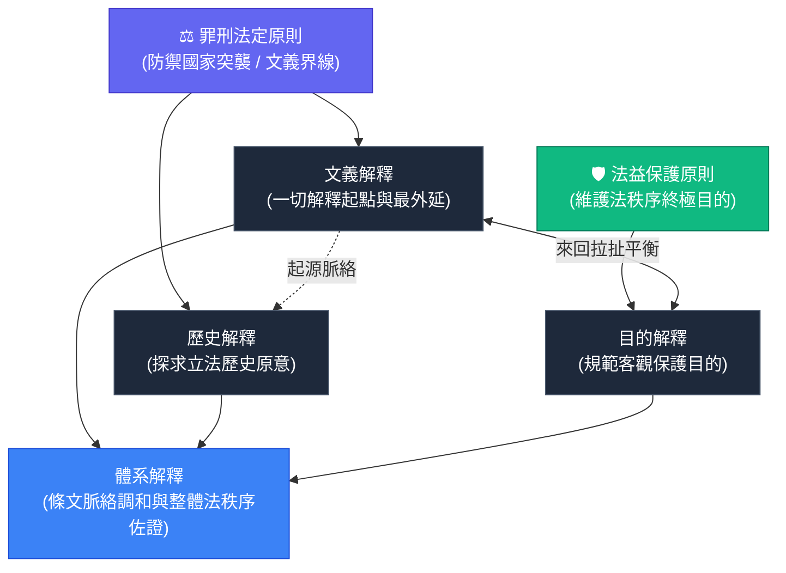
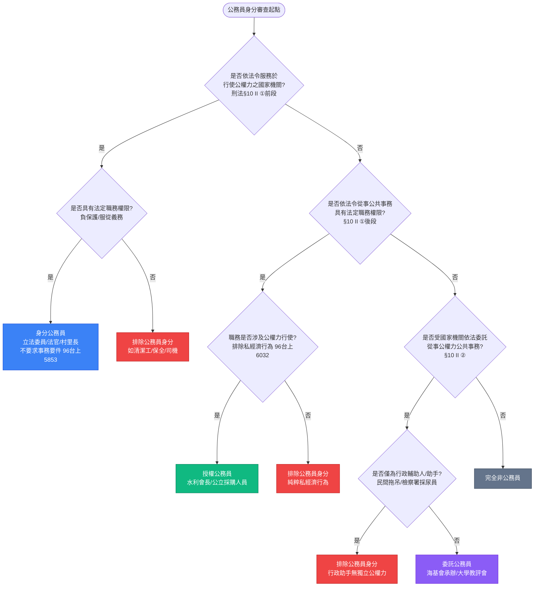
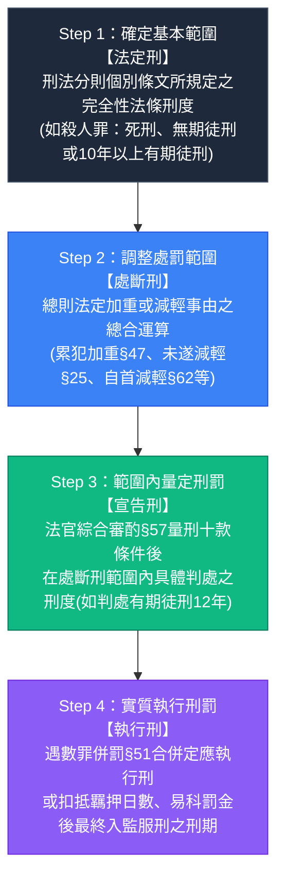

# 刑法導論・犯罪概念與論罪結構完整研讀手冊

> **體系定位**：【第零篇】刑法的運作原理與操作原理 ➔ 【第一章】犯罪概念與三階體系 ➔ 【第二章】刑法的論罪結構 ➔ 2026 法規對照  
> **核心思維**：以生活常理直觀拆解「一個壞人做了壞事」之論罪邏輯，採行「雙重推定與反證推翻」架構，結合 2026 最新法制與憲法裁判。

---

## 目錄

- [【第零篇】刑法的運作原理與操作原理（前導體系）](#第零篇刑法的運作原理與操作原理前導體系)
  - [第一章 刑法的運作原理](#第零篇第一章-刑法的運作原理)
    - [一、刑法的目的：應報思想 vs 預防思想](#一刑法的目的應報思想-vs-預防思想)
    - [二、刑罰嚴厲性與最後手段性原則（謙抑性）](#二刑罰嚴厲性與最後手段性原則謙抑性)
    - [三、刑法四大支柱體系總整](#三刑法四大支柱體系總整)
    - [四、第一節 法益保護原則——何謂法益？](#四第一節-法益保護原則何謂法益)
      - [1. 法益的本質與二元論單相異說](#1-法益的本質與二元論單相異說)
      - [2. 刑法分則體系完整架構圖](#2-刑法分則體系完整架構圖)
      - [3. 法益之三大核心功能](#3-法益之三大核心功能)
      - [4. 法益實務經典案例精析](#4-法益實務經典案例精析)
        - [案例 0-1：長髮剪除案（傷害罪保護法益）](#案例-0-1長髮剪除案傷害罪保護法益)
        - [案例 0-2：偷小偷皮夾案（竊盜罪保護法益）](#案例-0-2偷小偷皮夾案竊盜罪保護法益)
        - [案例 0-3：肇事逃逸罪（§ 185-4）保護法益三大說](#案例-0-3肇事逃逸罪-185-4保護法益三大說)
    - [五、第二節 罪刑法定原則——付出代價的根據何在？](#五第二節-罪刑法定原則付出代價的根據何在)
      - [1. 憲法基礎與核心定義（釋字 384、§ 1）](#1-憲法基礎與核心定義釋字-384-1)
      - [2. 罪刑法定四大派生子原則](#2-罪刑法定四大派生子原則)
        - [子原則一：習慣法禁止原則（案例 0-4：早期習慣法處罰原因自由行為案）](#子原則一習慣法禁止原則案例-0-4早期習慣法處罰原因自由行為案)
        - [子原則二：類推適用禁止原則（案例 0-5：偷電能與偷接第四台訊號案）](#子原則二類推適用禁止原則案例-0-5偷電能與偷接第四台訊號案)
        - [子原則三：罪刑明確性原則（案例 0-6：絕對不定期刑 vs 相對不定期刑案）](#子原則三罪刑明確性原則案例-0-6絕對不定期刑-vs-相對不定期刑案)
        - [子原則四：法不溯及既往原則（案例 0-7：小三條款溯及既往案）](#子原則四法不溯及既往原則案例-0-7小三條款溯及既往案)
      - [3. 公法（憲法）視角對照（依法行政、明確性、法安定性）](#3-公法憲法視角對照依法行政明確性法安定性)
    - [六、第三節 罪責原則——付出代價的極限何在？](#六第三節-罪責原則付出代價的極限何在)
      - [1. 罪刑相當原則與憲法依據（釋字 630）](#1-罪刑相當原則與憲法依據釋字-630)
      - [2. 案例 0-8：準強盜罪（§ 329）強暴脅迫之門檻](#案例-0-8準強盜罪-329強暴脅迫之門檻)
      - [3. 【解題提示】節制刑罰發動 vs 有利人民之類推/溯及/援用容許性](#3-解題提示節制刑罰發動-vs-有利人民之類推溯及援用容許性)
  - [第二章 刑法的操作原理](#第零篇第二章-刑法的操作原理)
    - [第一節 刑法的適用效力（時、地、人）](#第一節-刑法的適用效力時地人)
      - [一、時的適用效力：從舊從輕原則（§ 2）](#一時的適用效力從舊從輕原則-2)
        - [案例 2-1：私行拘禁跨越新舊法加重案（繼續犯之適用效力）](#案例-2-1私行拘禁跨越新舊法加重案繼續犯之適用效力)
        - [案例 2-2：限時法與動員戡亂時期國家安全法案（76 年刑庭總會決議）](#案例-2-2限時法與動員戡亂時期國家安全法案76-年刑庭總會決議)
        - [保安處分之時之效力：拘束人身自由 vs 非拘束人身自由](#保安處分之時之效力拘束人身自由-vs-非拘束人身自由)
      - [二、地的適用效力：屬地、屬人、保護、世界原則（§ 3 ～ § 9）](#二地的適用效力屬地屬人保護世界原則-3--9)
        - [主要基準：屬地原則與浮動領土（§ 3）＋ 隔地犯（§ 4）](#主要基準屬地原則與浮動領土-3--隔地犯-4)
        - [案例 2-3：跨境電信詐騙案（隔地犯結果地在台）](#案例-2-3跨境電信詐騙案隔地犯結果地在台)
        - [案例 2-4：駐外使領館內犯罪案（國際法慣例與管轄權認定）](#案例-2-4駐外使領館內犯罪案國際法慣例與管轄權認定)
        - [案例 2-5：大陸地區犯罪管轄案（特殊之國內關係與兩岸條例）](#案例-2-5大陸地區犯罪管轄案特殊之國內關係與兩岸條例)
        - [輔助基準：屬人原則、保護原則、世界原則（§ 5 ～ § 8）](#輔助基準屬人原則保護原則世界原則-5--8)
        - [案例 2-6：在美偽造德國公司股票案（保護原則僅限本國法益）](#案例-2-6在美偽造德國公司股票案保護原則僅限本國法益)
        - [【解題提示】審查順序天條：台菲廣大興 28 號案精析](#解題提示審查順序天條台菲廣大興-28-號案精析)
        - [外國裁判之效力：複數原則（§ 9）](#外國裁判之效力複數原則-9)
        - [【圖表 1】地的適用效力思考順序決策樹（流程圖）](#圖表-1地的適用效力思考順序決策樹流程圖)
      - [三、人的適用效力：豁免權與免責權](#三人的適用效力豁免權與免責權)
        - [總統刑事豁免權（憲法 § 52、釋字 627 號）](#總統刑事豁免權憲法-52釋字-627-號)
        - [民意代表言論免責權（憲法 § 73、釋字 165、釋字 435）](#民意代表言論免責權憲法-73釋字-165釋字-435)
        - [外交豁免權（國際法慣例）](#外交豁免權國際法慣例)
        - [【解題提示】總統豁免權（訴訟障礙）vs 民代免責權（實體免責）終極對照表](#解題提示總統豁免權訴訟障礙-vs-民代免責權實體免責終極對照表)
    - [第二節 刑法的解釋方法](#第二節-刑法的解釋方法)
      - [一、司法解釋 vs 立法解釋](#一司法解釋-vs-立法解釋)
      - [二、四大司法解釋方法（文義、歷史、目的、體系）](#二四大司法解釋方法文義歷史目的體系)
      - [【圖表 2】司法解釋相互關係立體架構圖](#圖表-2司法解釋相互關係立體架構圖)
      - [三、解釋方法經典爭議案例精析](#三解釋方法經典爭議案例精析)
        - [案例 2-7：車禍移車蹲路旁冒充目擊者案（「逃逸」文義 vs 目的拉扯）](#案例-2-7車禍移車蹲路旁冒充目擊者案逃逸文義-vs-目的拉扯)
        - [案例 2-8：男同志合意口交通姦案（原 § 239 解釋與作者叮嚀）](#案例-2-8男同志合意口交通姦案原-239-解釋與作者叮嚀)
      - [四、特殊的憲法解釋方法：合憲性解釋 vs 憲法取向解釋](#四特殊的憲法解釋方法合憲性解釋-vs-憲法取向解釋)
        - [合憲性解釋之意涵與兩大審查界線（釋字 509、釋字 585 許宗力意見書）](#合憲性解釋之意涵與兩大審查界線釋字-509釋字-585-許宗力意見書)
        - [憲法取向解釋與救濟：鄧元貞重婚案（釋字 242 號）](#憲法取向解釋與救濟鄧元貞重婚案釋字-242-號)
        - [【作者叮嚀】合憲性與憲法取向解釋係解釋「憲法以外之法律」](#作者叮嚀合憲性與憲法取向解釋係解釋憲法以外之法律)
    - [第三節 刑法第 10 條立法解釋之深化體系](#第三節-刑法第-10-條立法解釋之深化體系)
      - [一、公務員之概念體系（§ 10 II）](#一公務員之概念體系-10-ii)
        - [一般化公務員概念（法定三類型）](#一一般化公務員概念法定三類型)
        - [【表 2】一般化公務員概念的判斷流程（全方位決策對照表）](#表-2一般化公務員概念的判斷流程全方位決策對照表)
        - [個別化公務員概念（有力學說）](#二個別化公務員概念有力學說)
        - [案例 2-9：村長、里長是否為刑法上的公務員？（98台上7191決）](#案例-2-9村長里長是否為刑法上的公務員)
        - [案例 2-10：軍人是否為刑法上的公務員？](#案例-2-10軍人是否為刑法上的公務員)
        - [案例 2-11：公立大學教授以不實單據核銷國科會補助款案（103年第10次決議）](#案例-2-11公立大學教授以不實單據核銷國科會補助款案重要旗艦決議)
      - [二、重傷之嚴格認定體系（§ 10 IV）](#二重傷之嚴格認定體系-10-iv)
        - [列舉規定（§ 10 IV 1~5，毀敗 vs 嚴重減損）](#一列舉規定-10-iv-第-1-款至第-5-款)
        - [概括規定（§ 10 IV 6，重大不治或難治）](#二概括規定-10-iv-第-6-款)
        - [【解題提示】重傷審查天條：列舉壟斷與概括補充原則](#解題提示重傷審查天條列舉壟斷與概括補充原則)
        - [案例 2-12：使他人一顆腎臟破裂案（單腎切除之爭議）](#案例-2-12使他人一顆腎臟破裂案單腎切除之爭議)
        - [案例 2-13：妒火剪斷生殖器僅餘兩公分案（性機能 vs 生殖機能）](#案例-2-13妒火剪斷生殖器僅餘兩公分案生殖機能-vs-性機能)
        - [案例 2-14：手掌斬斷及時手術接回恢復良好案（持續存在要件）](#案例-2-14手掌斬斷及時手術接回恢復良好案持續存在要件)
        - [案例 2-15：小提琴絕世高手右手食指切斷案（客觀一般性標準 vs 個人功能）](#案例-2-15小提琴絕世高手右手食指切斷案客觀一般性標準vs個人功能考量)
      - [三、性交之法定明確定義（§ 10 V）](#三性交之法定明確定義-10-v)
      - [四、期日、公文書與電磁紀錄之立法定義（§ 10 I, III, VI）](#四期日公文書與電磁紀錄之立法定義-10-i-iii-vi)
  - [第三章 刑法的法律效果](#第零篇-第三章-刑法的法律效果)
    - [前言：為什麼要先談刑罰理論？（作者叮嚀）](#前言為什麼要先談刑罰理論)
    - [第一節 刑罰目的之三大理論體系](#第一節-刑罰目的之三大理論體系)
      - [一、懲罰過去的法益侵害行為 ➔ 應報理論（漢摩拉比法典）](#一懲罰過去的法益侵害行為--應報理論絕對刑罰論)
      - [二、預防未來的法益侵害行為 ➔ 預防理論（一般預防與孫武斬美姬、特別預防與飛越杜鵑窩）](#二預防未來的法益侵害行為--預防理論相對刑罰論)
      - [三、現代通說與實務 ➔ 結合理論與雙軌制裁體系（刑罰 vs 保安處分）](#三現代通說與實務--結合理論折衷說)
    - [第二節 刑罰理論的思考步驟（四階段產生過程）](#第二節-刑罰理論的思考步驟四階段產生過程)
      - [【圖表 3】刑罰理論與法律效果思考步驟流程圖](#圖表-3刑罰理論與法律效果思考步驟流程圖)
    - [第三節 刑罰的種類——兼談法定刑（§ 32 ～ § 34）](#第三節-刑罰的種類兼談法定刑-32--34)
      - [一、主刑之三大類型（死刑與 § 63 限制/113憲判8、自由刑、罰金刑）](#一主刑之三大類型-33)
- [【第一章】犯罪的概念與審查體系](#第一章犯罪的概念與審查體系)
  - [一、犯罪的直觀概念：壞人做壞事](#一犯罪的直觀概念壞人做壞事)
  - [二、為什麼採取「先事後人」？](#二為什麼採取先事後人)
  - [三、三階層論罪體系（雛形 ➔ 目的犯罪體系演進）](#三三階層論罪體系雛形--目的犯罪體系演進)
  - [四、阻卻違法事由之體系展開與客主觀雙重該當](#四阻卻違法事由之體系展開與客主觀雙重該當)
  - [五、第一章 17 大經典爭議案例精析實錄](#五第一章-17-大經典爭議案例精析實錄)
    - [案例 1-1：欠缺不法意識 (§ 16)](#案例-1-1欠缺不法意識--16)
    - [案例 1-2：年齡與責任能力 (§ 18)](#案例-1-2年齡與責任能力--18)
    - [案例 1-3：精神障礙與責任能力 (§ 19)](#案例-1-3精神障礙與責任能力--19)
    - [案例 1-4：生理瘖啞與責任能力 (§ 20)](#案例-1-4生理瘖啞與責任能力--20)
    - [案例 1-5：防衛過當與寬恕罪責 (§ 23但、§ 24但)](#案例-1-5防衛過當與寬恕罪責--23但-24但)
    - [案例 1-6：幼兒墜床燙衣失火案（期待可能性）](#案例-1-6幼兒墜床燙衣失火案期待可能性)
    - [案例 1-7：依法令之行為 (§ 21 I)](#案例-1-7依法令之行為--21-i)
    - [案例 1-8：依上級合法命令 (§ 21 II)](#案例-1-8依上級合法命令--21-ii)
    - [案例 1-9：業務上正當行為 (§ 22)](#案例-1-9業務上正當行為--22)
    - [案例 1-10：正當防衛 (§ 23)](#案例-1-10正當防衛--23)
    - [案例 1-11：緊急避難 (§ 24)](#案例-1-11緊急避難--24)
    - [案例 1-12：得被害人承諾（超法定阻卻違法）](#案例-1-12得被害人承諾超法定阻卻違法)
    - [案例 1-13：義務衝突（超法定阻卻違法）](#案例-1-13義務衝突超法定阻卻違法)
    - [案例 1-14：🍒 櫻桃案（利益失衡與權利濫用）](#案例-1-14-櫻桃案利益失衡與權利濫用)
    - [案例 1-15：🩸 輸血案（手段不正與人性尊嚴底線）](#案例-1-15-輸血案手段不正與人性尊嚴底線)
    - [案例 1-16：凶神惡煞問路挨打案（誤想防衛）](#案例-1-16凶神惡煞問路挨打案誤想防衛)
    - [案例 1-17：角頭巷弄先下手為強案（偶然防衛）](#案例-1-17角頭巷弄先下手為強案偶然防衛)
  - [六、犯罪二階層體系論（二階論）破除迷思：四塊拼圖的排列組合](#六犯罪二階層體系論二階論破除迷思四塊拼圖的排列組合)
- [【第二章】刑法的論罪結構](#第二章刑法的論罪結構)
  - [一、構成要件的經驗本質：身為人類無法忍受之典型不法](#一構成要件的經驗本質身為人類無法忍受之典型不法)
  - [二、處罰原則 vs 處罰例外（罪刑法定底線）](#二處罰原則-vs-處罰例外罪刑法定底線)
  - [三、【解題提示】學習大忌：非既遂 ≠ 未遂！非故意 ≠ 過失！](#三解題提示學習大忌非既遂--未遂非故意--過失)
  - [四、第二章 4 大經典實戰案例](#四第二章-4-大經典實戰案例)
    - [案例 2-1：西瓜刀耍帥砍人落空案（未遂犯審查）](#案例-2-1西瓜刀耍帥砍人落空案未遂犯審查)
    - [案例 2-2：西瓜刀練刀誤殺案（過失犯審查）](#案例-2-2西瓜刀練刀誤殺案過失犯審查)
    - [案例 2-3：法律系高材生挑唆防衛案（權利濫用不得阻卻違法）](#案例-2-3法律系高材生挑唆防衛案權利濫用不得阻卻違法)
    - [案例 2-4：半斤蛇膽烈酒壯膽殺人案（原因自由行為不得阻卻罪責）](#案例-2-4半斤蛇膽烈酒壯膽殺人案原因自由行為不得阻卻罪責)
  - [五、不得主張阻卻事由之例外體系總覽](#五不得主張阻卻事由之例外體系總覽)
  - [六、其他刑罰要件（刑事政策之阻卻發動）](#六其他刑罰要件刑事政策之阻卻發動)
  - [七、基本論罪全流程六階層總整表](#七基本論罪全流程六階層總整表)
- [【特別企劃】講義涉案條文 2026 最新法律動態與憲法法庭裁判對照表](#特別企劃講義涉案條文-2026-最新法律動態與憲法法庭裁判對照表)
  - [一、講義核心條文 2026 現況對照總表](#一講義核心條文-2026-現況對照總表)
  - [二、重大憲政裁決實質影響（憲法法庭 113 年憲判字第 8 號判決）](#二重大憲政裁決實質影響憲法法庭-113-年憲判字第-8-號判決)
  - [三、特別法對照：《優生保健法》第 9 條 vs 《生育保健法》草案進度](#三特別法對照優生保健法第-9-條-vs-生育保健法草案進度)
  - [四、2024 ～ 2026 年刑法最新公布施行修正條文一覽](#四2024--2026-年刑法最新公布施行修正條文一覽)
- [【總複習矩陣】阻卻違法 vs 阻卻罪責 終極速查對照](#總複習矩陣阻卻違法-vs-阻卻罪責-終極速查對照)

---

## 【第零篇】刑法的運作原理與操作原理（前導體系）

正式踏入刑法具體罪名與構成要件審查前，必須先建立影響整個刑法帝國運作的基礎價值觀與操作方法。

---

### 第零篇 第一章 刑法的運作原理

#### 一、刑法的目的：應報思想 vs 預防思想

刑罰制度的存在目的，自古以來有兩大思想交織激盪：
1. **應報思想（回溯過去）**：
   - 焦點在於對過去已經發生的犯罪行為施加應得的懲罰與痛苦。
   - **核心價值**：**「刑罰不允許超出行為人之責任範圍」**，奠定了「小罪不能大罰」的責任主義底線。
2. **預防思想（展望未來）**：
   - 焦點在於希冀未來能夠減少或遏止犯罪的發生（一般預防與特別預防）。
   - **核心價值**：**「刑罰的依據必須明確」**，使一般國民得以知所依循，不致無所安其手足。

刑法無論採何種思想，其最終目的都是為了保護**「人類極為重要的生活利益」**，簡稱**「法益保護」**。

---

#### 二、刑罰嚴厲性與最後手段性原則（謙抑性）

- 刑罰手段具有極端的嚴厲性：生命刑剝奪性命、自由刑拘束人身、財產刑剝奪資產，無疑是國家公權力對人民權益侵害最劇烈之手段。
- **最後手段性原則（謙抑性思想，Ultima Ratio）**：
  - 刑罰作為解決社會紛爭的手段，必須與所追求的目的成比例（符合比例原則）。
  - **非到萬不得已，絕不輕易動用刑罰**。凡民事侵權賠償、行政管制罰鍰足以有效回復秩序者，刑法即應退居幕後。

---

#### 三、刑法四大支柱體系總整

一切刑法問題的展開與論證，無不發軔於、亦必最終歸結於下列**四大支柱**：

```
                    【刑法四大支柱】
                          │
         ┌────────────────┼────────────────┐
         │                                 │
  【法益保護原則】                  【罪刑法定原則】
（保護重要生活利益）               （明文規定、禁止突襲）
         │                                 │
         └────────────────┬────────────────┘
                          │
         ┌────────────────┴────────────────┐
         │                                 │
  【罪責原則（責任主義）】          【最後手段性原則】
 （個人責任、罪刑相當）             （謙抑性、比例原則）
```

- **四大支柱之相互照應**：
  - 法益保護指明了刑法的**任務與方向**。
  - 最後手段性原則奠定了動用刑罰的**門檻與節制**。
  - 罪刑法定原則建立了國家發動刑罰的**程序與法治國防線**。
  - 罪責原則劃定了處罰個人時**不得逾越的責任極限**。

---

#### 四、第一節 法益保護原則——何謂法益？

##### 1. 法益的本質與二元論單相異說
- **法益定義**：凡是以法律手段加以保護之重要生活利益，即稱為法益。法益並非立法者憑空捏造，而是源於**社會倫理價值觀念**，係**「先於法律規範而存在」**，並在法制發展後獲得法律確認與保護。
- **法益二元論之單相異說（通說）**：
  - 傳統將法益區分為「個人法益」與「超個人法益」。
  - 通說認為兩者**並非本質不同，而是數量的差別**。**超個人法益乃個人法益之集合體**！
  - 兩者的保護方向應屬一致，而非相互對立（例如：保護公共交通安全，實質上等同於同時保護不特定多數人的個人生命與身體）。

##### 2. 刑法分則體系完整架構圖
刑法分則全部條文，均係依據法益歸屬與保護對象層層體系化開展：

```
                              ┌── 專屬性法益（人格法益：生命、身體、自由、名譽、秘密）
        ┌─ 侵害個人法益 ──────┤
        │  （§ 271 以下）     └── 非專屬性法益（財產法益：個別財產法益、整體財產法益）
        │
刑法分則│                      ┌── 社會法益（§ 173 以下：公共安全、職務公正、公共信用、善良風俗）
體系架構│                      │
        └─ 侵害超個人法益 ────┴── 國家法益（§ 100 以下：存立安全、國家公權力、權力作用、司法權）
```

##### 3. 法益之三大核心功能
1. **分則犯罪成立要件設立與體系化的基礎**：立法者藉由劃定法益範疇，將同類或同受保護之犯罪歸納於同章。
2. **競合類型的判準**：一行為侵害單一法益或數法益，作為法條競合、想像競合或實質競合之關鍵區分尺規。
3. **構成要件解釋的指導原則（最重要功能）**：
   - 構成要件該當性本質在於表彰法益侵害。
   - 構成要件的解釋**必須緊扣所保護之法益，絕不能本末倒置**，否則將失卻立法之真正意旨！

##### 4. 法益實務經典案例精析（含 2026 現行法規有無更動備注）

###### 案例 1-1【導論 0-1】：長髮剪除案（傷害罪保護法益）
> **案情**：甲為報復乙女移情別戀，趁乙熟睡時將其一頭烏黑飄逸之及腰長髮全數剪掉。甲是否構成刑法 § 277 普通傷害罪？
- **爭點**：剪除毛髮是否該當「傷害人身體或健康」？
- **學說爭鋒**：
  - **生理機能障礙說（實務早期）**：唯有使人身體之生理機能發生障礙，或使健康狀態導致不良變更者，方屬傷害。毛髮會再生且無機能障礙，恐難構成傷害。
  - **身體完整性侵害說（當前通說）**：從身體法益完整性之角度，凡對人之身體造成外觀物理變化、毀損其外貌完整性者，即為侵害身體法益之行為。剪除長髮嚴重破壞身體外貌完整，**該當傷害罪構成要件**！
- > **⚖️【2026 現行法規有無更動備注】**：
  > - **涉及法條**：刑法第 277 條第 1 項（普通傷害罪）。
  > - **法律狀態**：**【2026條文文字未更動】**。
  > - **歷次更動與依據**：民國 108 年 5 月 29 日總統令修正公布第 277 條第 1 項，將罰金刑由「一千元以下」大幅提高修正為「十萬元以下」；其餘構成要件文字未更動，至 2026 年維持現行。
  > - **實務定論**：司法實務與學界通說維持「身體完整性侵害說」，剪除長髮造成外觀物理破壞仍定性為傷害行為，判準穩定。

###### 案例 1-2【導論 0-2】：偷小偷皮夾案（竊盜罪保護法益）
> **案情**：甲自他人外套口袋中偷走名貴皮夾一個，正當返家於客廳沾沾自喜之際，該皮夾又被另一名竊賊乙偷走。乙對甲是否構成刑法 § 320 竊盜罪？
- **爭點**：竊盜罪保護之法益究竟是「所有權」還是「事實上的持有」？
- **學說爭鋒**：
  - **所有權說（黃榮堅教授等）**：認為竊盜罪不保護單純的持有，而是保護所有權人基於民法規範而實質享有的利益，否則將造成持有人地位凌駕於所有權人之怪象。且持有本身非愉悅利益，所有權才是。本案乙僅侵害甲的持有，不構成竊盜罪。
  - **持有說（甘添貴教授等）**：認為保護財物持有利益本身，並非所有權。現今租賃、借貸多元，所有與持有分離極為普遍，且財物究係買來、租來或偷來難以第一時間查證，為維護社會和平秩序，持有本身即受保護。本案乙構成竊盜罪。
  - **所有權及持有說（當前通說）**：竊盜罪保護之法益兼具物之所有人對物的所有權關係，以及事實上持有人對物之支配管領狀態。因此**「違法的持有亦受到刑法保護」**（避免私力掠奪合法化、防止弱肉強食）。本案乙侵害了甲對該皮夾的事實支配持有，**乙對甲構成竊盜罪**。
- > **⚖️【2026 現行法規有無更動備注】**：
  > - **涉及法條**：刑法第 320 條第 1 項（普通竊盜罪）。
  > - **法律狀態**：**【2026條文文字未更動】**。
  > - **歷次更動與依據**：民國 108 年 5 月 29 日修正公布將罰金刑提高至五十萬元以下；2026 年條文文字維持現行。通說確立「違法持有亦受保護」，定論迄今無變。

###### 案例 1-3【導論 0-3】：肇事逃逸罪（§ 185-4）保護法益三大說
> **案情構想**：
> (一) 甲開車與對向車擦撞烤漆掉落，無人傷亡，甲隨即加速逃逸。試問應如何解讀肇事逃逸罪（§ 185-4）內「致人死傷」之要件？  
> (二) 甲開車完全合規無過失，遭酒駕違規者乙猛撞，乙倒地血流如注，甲自認全無過失逕自駕車離去。試問應如何解讀肇事逃逸罪內「肇事」之要件？  
> (三) 甲不慎撞傷路人乙，乙倒地碎片狼藉，甲將其移置人行道並電召救護車，但在救護車抵達後未留個人資料即離去。試問應如何解讀肇事逃逸罪內「逃逸」之要件？
- **爭點**：刑法 § 185-4 肇事逃逸罪保護之法益為何？構成要件「致人死傷」、「肇事」、「逃逸」該如何定位？
- **三大主流見解**：
  1. **生命身體安全保障說（早期實務）**：
     - 本罪為遺棄罪之特別規定，旨在減少被害人死傷。
     - 「致人死傷」：與法益侵害有關之構成要件要素。
     - 「肇事」：限於前行為威脅人身安全，因而負有救助義務。
     - 「逃逸」：指對他人生命身體處於危險狀態不予救助。
  2. **公共安全保障說（少數說）**：
     - 本罪置於公共危險罪章，旨在防護道路現場不特定用路人之公共安全，避免事故引發後續危險。
     - 「致人死傷」：與保護法益無關，純屬立法贅述。
     - 「肇事」：限於前行為有過失致生公共危險，因而負有控管義務。
     - 「逃逸」：指對事故現場引發之公共危險不為控管。
  3. **確認利益保障說（有力說）**：
     - 旨在解決交通事故民刑責任之釐清。本於社會連帶思想，凡參與事故者，無論自己有無過失，均負有在場協助確認責任歸屬之公法義務。
     - 「致人死傷」：與法益無關，作為限縮刑罰發動的**「客觀處罰條件」**。
     - 「肇事」：不論故意、過失或無過失之交通行為均屬之。
     - 「逃逸」：指逃避責任確認歸屬義務之隱匿離去行為。
- **【解題提示】**：保護法益的確認，是刑法分則構成要件解釋與定性（客觀要素 vs 客觀處罰條件）的絕對前置天條！
- > **⚖️【2026 現行法規有無更動備注】**：
  > - **涉及法條**：刑法第 185 條之 4（肇事逃逸罪）。
  > - **法律狀態**：⚠️ **【有重大法律更動！釋字 777 號違憲宣告 ➔ 110 年全面修法分流處罰】**。
  > - **重大變更精析**：
  >   1. **憲政違憲宣告**：司法院釋字第 777 號解釋（108.05.31 宣示）宣告原條文兩大違憲點：①「肇事」涵蓋無過失違背法律明確性原則；②不論傷亡情節輕重一律處「1 年以上 7 年以下有期徒刑」違反罪刑相當原則與比例原則。
  >   2. **110 年全面修法分流施行**：立法院於 **民國 110 年 5 月 28 日總統令修正公布、5 月 31 日施行**，全面依責任與死傷情節改採**「四級分流法定刑」**：
  >      - **【無過失逃逸】**：致人傷害者，處 **1 年以下有期徒刑、拘役或十萬元以下罰金**；致人重傷或死亡者，處 **3 年以下有期徒刑**。
  >      - **【有過失逃逸】**：致人傷害者，處 **6 月以上 5 年以下有期徒刑**；致人重傷或死亡者，處 **1 年以上 7 年以下有期徒刑**。
  >      - **【增訂情節輕微減免條款】**：第 185-4 條第 2 項明定犯第一項之罪，其情節輕微者，得減輕或免除其刑（徹底解決案情 (三) 已叫救護車但未留資料之嚴苛困局）。
  >   3. **截至 2026 年現況**：自 110 年 5 月 31 日修正施行後，維持現行，至 2026 年未再更動。本案例三大說正是催生 110 年重大修法之法理源頭！

---

#### 五、第二節 罪刑法定原則——付出代價的根據何在？

##### 1. 憲法基礎與核心定義（釋字 384、§ 1）
- **憲法依據**：憲法第 8 條（人身自由保障）、司法院釋字第 384 號解釋理由書（揭櫫罪刑法定原則，同時也是最後手段性原則之體現）。
- **條文依據**：**刑法第 1 條**——「行為之處罰，以行為時之法律有明文規定者為限。拘束人身自由之保安處分，亦同。」
- **核心意旨**：使人民在行為當時具備預測可能性，杜絕國家公權力恣意追溯入人於罪。

##### 2. 罪刑法定四大派生子原則

```
                  ┌── 1. 習慣法禁止原則（處罰必須以成文「法律」明定）
                  ├── 2. 類推適用禁止原則（處罰必須法律「針對該行為」明定，限可能文義）
  罪刑法定四大子原則 ──┤
                  ├── 3. 罪刑明確性原則（構成要件與法律效果必須「明確」）
                  └── 4. 法不溯及既往原則（處罰必須在「行為時」即已規定）
```

###### 案例 1-4【導論 0-4】：早期習慣法處罰原因自由行為案（習慣法禁止原則）
- **內涵**：刑事處罰之依據，必須是由立法院三讀通過、總統公布之形式「成文法律」，不得以社會習慣、慣例或學理法理入人於罪（排斥社會造法）。
- **【案情與爭點】**：早期學理上曾以習慣法為由，處罰自陷泥醉或心神喪失而犯罪之原因自由行為人，是否有違罪刑法定原則？
- **問題解析**：早期未有條文時，逕以「原因自由行為法理（Actio libera in causa）」予以論罪，確有違反罪刑法定原則之重大瑕疵！立法者遂於民國 94 年修正刑法時，正式增訂**第 19 條第 3 項明文**，方徹底補正罪刑法定原則之要求。
- > **⚖️【2026 現行法規有無更動備注】**：
  > - **涉及法條**：刑法第 19 條第 3 項（原因自由行為）。
  > - **法律狀態**：**【條文文字 2026 未更動 / 憲政裁判重大拘束】**。
  > - **歷次更動與依據**：民國 94 年 2 月 2 日總統令修正公布第 19 條，增訂第 3 項成文化；至 2026 年條文文字維持現行未更動。
  > - **最新憲政實質拘束**：**憲法法庭 113 年憲判字第 8 號判決**（2024 年 9 月 20 日宣示），宣告行為時若具備第 19 條第 2 項精神障礙情狀者一律排除死刑；但原因自由行為故意自陷精神障礙者，得否排除死刑之適用，為 2026 最新刑法討論熱點。

###### 案例 1-5【導論 0-5】：偷電能與偷接第四台訊號案（類推適用禁止原則）
- **內涵**：刑法構成要件之文字解釋，必須嚴格限縮在「日常生活的可能文義範圍內」，若超出文義範圍而比附援引者，即屬禁止之類推適用（排斥法官造法）。
- **【案情與爭點】**：竊取電能，是否成立竊盜罪？偷接第四台的影音訊號，可否成立竊盜罪？
- **問題解析**：
  1. **私接電能**：無形之電能無法直接等同於有形之「動產」。若逕以 § 320 竊盜罪處罰，即有違類推適用禁止。正因如此，立法者特於**刑法 § 323** 明訂「電能、熱能及其他能量，關於本章之罪，以動產論」之法律擬制，竊電方得以成立竊盜罪。
  2. **私接第四台影音訊號**：偷接有線電視之影音訊號，在性質上為光電傳導之電磁波訊號，既非動產，亦非具推動力或熱能之能量，無法涵蓋在動產與準動產的日常可能文義範圍內。本於類推適用禁止原則，**無法構成刑法竊盜罪**！（實務同此見解：臺灣高等法院 97 年上易字第 648 號判決）。
- > **⚖️【2026 現行法規有無更動備注】**：
  > - **涉及法條**：刑法第 320 條（竊盜罪）、第 323 條（準動產能量擬制）。
  > - **法律狀態**：**【2026未更動】**。
  > - **現行法與實務定論**：刑法第 323 條制定公布迄今維持「電能、熱能及其他能量」之文字未變；司法實務對於私接有線電視訊號、盜拷 WiFi 訊號等，至 2026 年依然嚴格恪守類推適用禁止，不以刑法竊盜罪論處，回歸《有線廣播電視法》等特別法處理。

###### 案例 1-6【導論 0-6】：絕對不定期刑 vs 相對不定期刑案（罪刑明確性原則）
- **內涵**：刑事處罰必須明確規定。包括成立要件明確（罪之明確性）與法律效果明確（刑之明確性），使人民可得預見。
- **【案情設計比較】**：
  - **處罰方式一（絕對不定期刑）**：「過失致人於死者，必須加以處罰。」（剝奪自由之期間完全不加限制，任由司法者或執行者視行為人是否改過自新而定） ➔ **嚴重違反罪刑明確性原則，違憲無效！**
  - **處罰方式二（相對不定期刑）**：「過失致人於死者，處五年以下有期徒刑、拘役或五十萬元以下罰金。」（定有最高與最低法定刑區間，司法者僅得在該期間內裁量） ➔ **具備預測可能性，符合罪刑明確性原則，合憲合法。**
- > **⚖️【2026 現行法規有無更動備注】**：
  > - **涉及法理**：罪刑明確性、相對法定刑制度。
  > - **法律狀態**：**【2026未更動】**。中華民國刑法自始全面揚棄絕對不定期刑，現行法分則皆採相對法定刑或絕對確定刑（死刑、無期徒刑），2026 年維持未變。

###### 案例 1-7【導論 0-7】：小三條款溯及既往案（法不溯及既往原則）
- **內涵**：刑事處罰必須「行為時」即加以明文規定。法律生效前之行為，不得嗣後立法追溯處罰。
- **【案情設計】**：立法院在民意壓力下制定「小三條款」，規定身處非單身狀態者與伴侶以外之人性交處三年以下有期徒刑，並明定「溯及自民國 99 年 11 月 5 日生效」。
- **問題解析**：縱使小三條款具備道德與立法上的正當性，惟該溯及條款未考量人民行為時之信賴而造成突襲，破壞國家的法安定性，**嚴重違反法不溯及既往原則，屬違憲違法之立法！**
- > **⚖️【2026 現行法規有無更動備注】**：
  > - **涉及法條**：刑法第 1 條、憲法第 8 條。
  > - **法律狀態**：**【2026未更動】**。
  > - **相關法律延伸**：法不溯及既往原則維持不變。另我國刑法原第 239 條通姦罪，已於民國 109 年 5 月 29 日經司法院釋字第 791 號解釋宣告違憲立即失效，婚姻忠誠義務已完全回歸民法侵權賠償，不再以刑法處罰，至 2026 年維持除罪化現狀。

##### 3. 公法（憲法）視角深度對照（依法行政、明確性、法安定性）
【作者叮嚀】：刑法四大子原則與憲法法治國原則層層契合：
- **憲法依法行政之「法律保留原則」➔ 對應「習慣法禁止」與「類推適用禁止」**：
  - 在近代行政法與憲法受**「重要性理論」**指引，並依**「功能最適理論」**，逐步發展出**「層級化法律保留體系」**（由立法與行政兩極展開）。
  - 刑法直接剝奪人民之「生命」與「身體自由」，屬於最高干預強度的**「絕對法律保留（憲法保留 / 國會保留）」**！必須由立法者以形式制定法律之方式發動，**絕對不容許以習慣法（社會造法）或類推適用（法官造法）之方法作為處罰依據！**
- **憲法法治國之「法律明確性原則」➔ 對應「罪刑明確性原則」**：
  - 憲法要求法規範必須使受規範者可得預見、司法者可得審查。刑法相應形成「罪（成立要件）明確性」與「刑（法律效果）明確性」。
- **憲法法治國之「法安定性與信賴保護原則」➔ 對應「法不溯及既往原則」**：
  - 刑罰以人民行為時可得預見為限，禁止以事後法律突襲人民之合法信賴。

---

#### 六、第三節 罪責原則——付出代價的極限何在？

##### 1. 罪刑相當原則與憲法依據（釋字 630）
- **核心定義**：刑事處罰必須以行為人具有罪責為限（無罪責即無刑罰），並與其罪責相當（罪刑相當原則）。
- **憲法位階（釋字 630 號解釋揭櫫，亦為最後手段性原則之體現）**：
  - 罪責作為犯罪成立要件，同時限定刑罰之發動。
  - 在個案中所有施加的刑罰，不得超過罪責之範圍（小罪不得大罰），以落實憲法第 23 條比例原則。

##### 2. 案例 1-8【導論 0-8】：準強盜罪（§ 329）強暴脅迫之門檻（罪刑相當原則）
> **案情**：竊賊甲行竊失風被發現，為防護贓物僅輕輕推了失主一把即轉身脫逃。刑法上準強盜罪（§ 329，以強盜論，起刑 5 年以上）是否必須達到強暴、脅迫「至使不能抗拒」之程度？
- **問題解析（司法院釋字第 630 號解釋）**：
  - 刑法 § 329 準強盜罪擬制以強盜罪論處，起法定刑高達五年以上有期徒刑。
  - 釋字第 630 號解釋宣告：該規定擬制為強盜罪之強暴、脅迫構成要件行為，**「乃指達於使人難以抗拒之程度者而言」**，始能與強盜罪之法定刑相當，尚未違背罪刑相當原則，與憲法第 23 條比例原則之意旨並無不符。
  - 本案甲輕推一下未達使人難以抗拒之程度，不成立準強盜罪，僅成立普通竊盜罪。
- > **⚖️【2026 現行法規有無更動備注】**：
  > - **涉及法條**：刑法第 329 條（準強盜罪）。
  > - **法律狀態**：**【條文文字 2026 未更動 / 憲政裁判維持合憲】**。
  > - **重大憲政裁判更新**：
  >   1. **司法院釋字第 630 號解釋**：限縮強暴脅迫至「使人難以抗拒之程度」。
  >   2. **憲法法庭 113 年憲判字第 9 號判決**（2024 年宣示）：大法官再度就刑法第 329 條進行違憲審查，最終裁判主文宣告：刑法第 329 條在依釋字第 630 號解釋限縮強暴、脅迫須達使人難以抗拒之程度範圍內，**「與憲法罪刑相當原則尚無違背，核屬合憲」**！至 2026 年條文文字未動，司法實務嚴格恪守此限縮門檻。

##### 3. 【解題提示】節制刑罰發動 vs 有利人民之類推/溯及/援用容許性
- **天條思維**：罪刑法定原則與罪責原則，本質上都是「節制刑罰發動」的防禦性原則，目的在於國家執行法益保護時不過度侵犯人民權利。
- **關鍵例外**：倘若在個案操作中的結果是**「對人民有利」**，那便不存在防禦節制的理由！
- **結論天平**：
  - 刑法**「絕對禁止不利於人民的類推適用與溯及既往」**！
  - 刑法**「完全容許對人民有利的類推、溯及或援用」**（例如：超法定阻卻違法事由、超法定阻卻罪責期待不可能、新法減輕刑責之溯及援用）。

---

### 第零篇 第二章 刑法的操作原理

#### 第一節 刑法的適用效力（時、地、人）

我國刑法並非無遠弗屆地任意適用，而是受到時間範圍、空間範圍與人別範圍的三大先天限制。以下分別就「時的適用效力」、「地的適用效力」與「人的適用效力」三個面向深入剖析。

---

##### 一、時的適用效力：從舊從輕原則（§ 2）

###### (一) 從舊從輕原則之核心法理
刑法第 2 條第 1 項明定：
> 「行為後法律有變更者，適用行為時之法律。但行為後之法律有利於行為人者，適用最有利於行為人之法律。」

1. **原則：從舊原則（§ 2 I 本文）**
   - 依據憲法罪刑法定原則與法不溯及既往原則，國家發動刑罰制裁必須在行為人**「行為當時」**已有明文法律規定。
   - 即使行為後法律發生變更，原則上依然必須適用行為時之法律，禁止以事後制定或修訂之嚴苛法律入人於罪。
2. **例外：從輕原則（§ 2 I 但書）**
   - 罪刑法定原則之本質是防衛國家過度侵害人權的「防禦性原則」。倘若行為後法律變更之結果更有利於行為人（如刑度減輕、構成要件限縮或除罪化），國家便不存在恪守舊法的理由。
   - 刑法容許「有利於行為人之溯及」，例外適用**最有利於行為人之法律**。

###### 案例 2-1：私行拘禁跨越新舊法加重案（繼續犯之適用效力）
> **【案情】**  
> 甲在民國 99 年 1 月 1 日將乙拘禁在其私人別墅，剝奪其行動自由，僅給予少量的食物和水。警察於民國 100 年 2 月 1 日破案，救出驚恐未定的乙。  
> 這中間立法院於民國 100 年 1 月 10 日修正刑法 § 302 私行拘禁罪，將其法定刑從 5 年以下有期徒刑變更為 10 年以下有期徒刑。  
> 法院依照新法處甲 9 年有期徒刑，甲抗辯法院援用新法違反法律不溯及既往原則、刑法 § 2 I 從舊從輕原則，是否有理由？

- **【問題導引與法理精析】**：
  1. 請特別注意：刑法 § 2 從舊從輕原則，**限於「行為後」法律有變更者，方有適用**！若是「行為時」法律有變更者，則與 § 2 無關。
  2. 雖然一般狀態犯鮮少在行為實施過程中遭遇法律變更，但甲所犯之私行拘禁罪（§ 302）屬於行為具有持續性的**「繼續犯」**。
  3. 自 99 年 1 月 1 日起至 100 年 2 月 1 日破案止，均為甲私行拘禁行為的實施進行中。犯罪行為直至 100 年 2 月 1 日方告終止。
  4. 故 100 年 1 月 10 日之法律變更，屬於**「行為實施當中的法律變更」**。法院適用犯罪終了時之法律，本質上就是適用「行為時法」，根本無 § 2 從舊從輕原則適用的餘地，亦絕無違反法不溯及既往！
  5. **結論**：甲之抗辯**無理由**。
- > **⚖️【2026 現行法規有無更動備注】**：
  > - **涉及法條**：刑法第 2 條第 1 項、第 302 條（私行拘禁罪）、第 302-1 條（加重剝奪行動自由罪）。
  > - **法律狀態**：
  >   - **刑法 § 2**：**【2026 條文文字未變】**。維持「從舊從輕」核心準則。
  >   - **刑法 § 302、§ 302-1**：⚠️ **【112 年重大增訂加重處罰專條！】**
  >     1. 民國 108 年 5 月 29 日修正公布第 302 條第 1 項提高罰金刑至九千元（折合新臺幣三萬元）。
  >     2. **民國 112 年 5 月 31 日總統令增訂公布刑法第 302 條之 1「加重剝奪行動自由罪」**：針對三人以上共同犯之、攜帶兇器、對被害人施以凌虐、剝奪行動自由七日以上等惡性情節，法定刑大幅提高為「**1 年以上 7 年以下有期徒刑**，得併科一百萬元以下罰金」；因而致人於死者，處「**無期徒刑或 10 年以上有期徒刑**」！
  >     3. **2026 年現況**：§ 302 與 § 302-1 均正常施行。若本案情節發生於現今且拘禁超過 7 日，將直接適用第 302-1 條重判！

###### 案例 2-2：限時法與動員戡亂時期國家安全法案（限時法之效力）
> **【案情】**  
> 甲在動員戡亂時期觸犯「動員戡亂時期國家安全法」之規定，而於動員戡亂時期結束後始受審判，試問法官可否適用動員戡亂時期國家安全法論罪科刑？

- **【問題導引與學說爭鋒】**：
  - **限時法之定義**：指基於特殊時代、戰爭、事變或疫情等特定緊急需要，自始明定**「僅於特定期間內生效之法律」**。如題述之動員戡亂時期國家安全法，便只適用於動員戡亂時期，超過適用期間，該法自動失效。
  - **核心爭點**：限時法因期間屆滿自動失效，審判時是否可依刑法 § 2 I 但書適用最有利於行為人之法律（即失效不罰）？
  - **兩大學說爭鋒**：
    1. **否定說（追訴實效說）**：
       - 認為限時法之所以失效，並非國家刑事政策在法秩序評價上有所轉變（並非認為該行為不再該當不法），而是單純基於立法理由與特殊事實情狀之自然消失。
       - 若容許行為人於限時法期間犯罪，拖延至期滿失效後即獲從舊從輕解除處罰，將徹底架空限時法的威嚇力與規範機能，故限時法不宜依從舊從輕原則解除處罰，期滿後仍應依法追訴處罰。
    2. **肯定說（最高法院 76 年第 12 次刑庭總會決議，實務通說）**：
       - 否定說實質上造成了國家刑罰權的擴張，侵蝕憲法罪刑法定原則。
       - 立法者若認為限時法有於失效後繼續追訴處罰之必要，理應在該限時法中設置**「追溯條款或明文保留規定」**（如明定：本法施行期間所犯之罪，於本法施行期滿後仍適用之）。
       - 在立法者**未就限時法設有一般性保留規定之前**，基於憲法罪刑法定原則與刑法 § 2 I 之明文，**仍應適用從舊從輕原則**！審判時該法既已失效，自不得再適用該法論罪科刑，以免違反罪刑法定原則。
- > **⚖️【2026 現行法規有無更動備注】**：
  > - **實務定論**：最高法院 76 年第 12 次刑庭總會決議之「肯定說」迄今仍為司法實務之主流標竿。近年如《嚴重特殊傳染性肺炎防治及紓困振興特別條例》等限時法屆滿失效後之案件，亦嚴格恪守罪刑法定與從舊從輕法理。

###### (二) 保安處分之時的適用效力：拘束人身自由 vs 非拘束人身自由
刑法第 2 條第 2 項明定：
> 「拘束人身自由之保安處分，亦同（按：適用第 1 項從舊從輕原則）。」  
> 「非拘束人身自由之保安處分，適用裁判時之法律。」

| 保安處分類型 | 典型代表措施 | 法律干預強度 | 時的適用原則（刑法 § 2） | 2026 最新法制要點 |
| :--- | :--- | :--- | :--- | :--- |
| **拘束人身自由之保安處分** | 監護（§ 87）、禁戒（§ 88/89）、強制工作（已廢止）、強制治療（§ 91-1） | 剝奪身體自由，本質與刑罰相差無幾 | **從舊從輕原則（§ 2 I）**<br>原則適用行為時法，新法有利才溯及 | 1. 釋字 799 號強制治療合憲性限縮<br>2. 釋字 812 號宣告強制工作違憲失效<br>3. 111 年刑法 § 87 修正：監護處分改採定期評估延長制，明定正當法律程序保障人身自由 |
| **非拘束人身自由之保安處分** | 保護管束（§ 92）、驅逐出境（§ 95）、沒收申誡等 | 著重於教育、輔導與改善，未剝奪人身自由 | **從新原則（§ 2 II）**<br>一律適用「裁判時」之法律 | 裁判時之最新輔導與矯正手段被推定最適當，無從舊從輕之適用 |

---

##### 二、地的適用效力：屬地、屬人、保護、世界原則（§ 3 ～ § 9）

我國刑法空間效力之規範體系，區分為「主要基準（國內犯罪）」與「輔助基準（國外犯罪）」。

###### (一) 主要基準 ➔ 屬地原則（§ 3 + § 4）
1. **核心（§ 3 本文）**：國家刑罰權及於任何發生於中華民國領域內的犯罪行為，包括領土、領海以及領空。
2. **擴張（§ 3 但書 浮動領土）**：在中華民國領域外之中華民國船舶或航空器內犯罪者，以在中華民國領域內犯罪論。
3. **隔地犯（§ 4 旗艦規範）**：
   - 條文：「犯罪之行為或結果，有一在中華民國領域內者，為在中華民國領域內犯罪。」
   - **行為與結果之擴張解釋（有力學說與實務）**：
     - **「結果」之解釋**：在**未遂犯**情形，乃指行為人**主觀預期結果發生地**；
     - 在**共同正犯**情形，包含**其他共同正犯之行為地**；
     - 在**共犯（教唆犯、幫助犯）**情形，指**正犯行為地**。

###### 案例 2-3：菲國跨境電信詐騙案（隔地犯之適用）
> **【案情】**  
> 詐騙集團總部設在菲律賓，成員在菲國利用電話越洋行騙在臺灣的受害人匯款，試問是否適用我國刑法？
- **【問題解析】**：
  此為現代最典型之「隔地犯」。詐騙集團之詐術實施「行為地」雖在菲律賓，但被害人陷於錯誤而匯出款項之財產損害「結果地」發生在臺灣。按刑法 § 4 規定，結果地在中華民國領域內，直接擬制為在領域內犯罪，**適用主要基準屬地原則（§ 3 + § 4），享有完全管轄權**！

###### 案例 2-4：駐外使領館內犯罪案（管轄權性質）
> **【案情】**  
> 我國人甲在我國駐外國之使領館內犯罪，是否為在我國領域內犯罪？
- **【問題解析】**：
  駐外使領館所在土地在國際法上並非派遣國領土之延伸（非浮動領土）。此時必須借助國際法上的外交豁免與管轄慣例，以**「駐在國是否同意放棄其管轄權」**為斷。若有明顯事證足認該駐在國已同意放棄管轄權，自得以在我國領域內犯罪論。

###### 案例 2-5：大陸地區犯罪管轄案（兩岸關係之法理定性）
> **【案情】**  
> 在大陸地區犯罪，是否亦有我國刑法的適用？
- **【問題解析】**：
  - **司法實務見解（最高法院 90 台上 4247 判決）**：採取**「特殊之國內關係」**。
  - 依據《臺灣地區與大陸地區人民關係條例》第 2 條規定：「大陸地區：指臺灣地區以外之中華民國領土。」已明示大陸地區依憲法增修條文與兩岸條例架構仍屬我中華民國法理領域。
  - 從而在大陸地區犯罪，依實務見解**仍屬在中華民國領域內犯罪**，得直接適用我國刑法論處（惟實務上依兩岸條例 § 75，得就其已在大陸受刑執行者折抵或免除）。

---

###### (二) 輔助基準：屬人原則、保護原則、世界原則（§ 5 ～ § 8）
當犯罪之行為與結果**均發生在中華民國領域外（國外犯罪）**時，主要基準無法適用，方得啟動下列四大輔助基準：

1. **屬人原則（§ 6、§ 7）➔ 處罰自己人**
   - **法理基礎**：基於國民對國家之一般守法義務，以及公務員之特殊忠誠義務。
   - **公務員海外特定罪（§ 6）**：我國公務員在國外犯瀆職罪、脫逃罪、偽造文書罪、侵占罪等特定職務犯罪，不論刑度輕重一律適用。
   - **本國國民海外重大犯罪（§ 7）**：我國國民在國外對我國人或外國人犯罪，必須滿足雙重條件：
     1. 犯最輕本刑 3 年以上有期徒刑之重罪；
     2. **雙重犯罪原則（雙重可罰性）**：犯罪地之法律亦有處罰者為限。若犯罪地法律不罰者，不在此限！
2. **保護原則（§ 8、§ 5 ①②③⑤⑥⑦）➔ 處罰外國人 / 任何人**
   - **處罰外國人（§ 8）**：基於國家保護本國人民的客觀義務。外國人在國外侵害我國國民，犯最輕本刑 3 年以上有期徒刑之重罪，且犯罪地法律亦處罰者（雙重犯罪原則）。
   - **處罰任何人（§ 5 ①②③⑤⑥⑦）**：基於國家自我防衛原則，不論行為人國籍，在國外侵害我國重大法益之特定重大犯罪（內亂、外患、妨害公務、偽造通用貨幣、偽造有價證券等）。
3. **世界原則（§ 5 ④⑧⑨⑩及第 11 款）➔ 處罰任何人**
   - **法理基礎**：基於國際社會連帶責任，打擊侵害全人類跨國界共通價值之公敵犯罪。
   - **涵蓋罪名**：海盜罪（§ 5 ④）、毒品罪（§ 5 ⑧）、劫持航空器危害飛航安全罪（§ 5 ⑨）、人口販運罪（§ 5 ⑩）、**加重詐欺罪（§ 5 ⑪，民國 105 年增訂之境外電信機房條款）**。

###### 案例 2-6：在美偽造德國公司股票案（保護原則限於本國法益）
> **【案情】**  
> 我國國民甲在美國偽造德國公司的股票而成立偽造有價證券罪，是否有我國刑法的適用？
- **【問題解析】**：
  1. 刑法 § 5 第 5 款雖規定「偽造有價證券罪」適用保護原則，不問何人何地均有適用。
  2. 但 § 5 採取的保護原則核心意在**「保護本國法益」**！
  3. 因此最高法院判例（**72 台上 5872 號判例**）明確揭示：本條所謂偽造有價證券，**「當指我國之有價證券，不包括外國有價證券在內」**！
  4. 甲在美偽造德國股票，侵害的是外國法益，無 § 5 之適用。且本罪在國外亦非 § 6 公務員罪，甲雖為本國人，但偽造外國股票最輕本刑非三年以上重罪（§ 201 修正前非屬），故亦不符 § 7 之要件，不適用我國刑法。

---

###### 🏛️ 【解題提示】地的適用效力嚴格審查順序天條
> **天條法則**：地的適用效力具有**嚴格的審查階層順序**！必須優先檢驗「主要基準（§ 3 + § 4）」，當無法適用主要基準時，方能退而思考「輔助基準（§ 5 ➔ § 6 ➔ § 7 ➔ § 8）」。  
> **輔助基準僅具補充性地位，絕不能跳躍檢驗、更不能凌駕於主要基準之上！**

###### 🚢 經典重大案例實戰分析：廣大興 28 號台菲漁業槍擊事件
- **事件背景**：  
  懸掛中華民國國旗之屏東琉球籍漁船「廣大興 28 號」，在台菲重疊專屬經濟海域（公海）作業時，突遭菲律賓海巡公務船持步槍與機槍瘋狂掃射，中華民國籍船長洪石成不幸中彈身亡。
- **管轄權定性陷阱**：  
  許多人乍看外國海巡公務員在國外殺害我國國民，便草率跳躍援用「刑法 § 8 保護原則（外國人對本國人犯三年以上重罪）」，**這犯了跳躍思考的嚴重法理錯誤！**
- **正確審查路徑**：
  1. 被害人洪石成中彈身亡時，身處懸掛我國國旗之我國船舶上；依刑法 § 3 但書，我國船舶屬於**「浮動領土」**。
  2. 就殺人罪而言，開槍射擊之「行為地」在菲律賓公務船上，但彈頭貫穿船身擊中被害人致死之「結果地」則是在我國船舶（浮動領土）之內！
  3. 依**刑法 § 4 隔地犯**明文：「犯罪之行為或結果，有一在中華民國領域內者，為在中華民國領域內犯罪。」
  4. 本案結果地直接該當我國領域，**直接適用主要基準屬地原則（§ 3 + § 4）即可完整取得刑事管轄權！**
  5. 既然主要基準已經完整該當，**輔助基準（§ 8 保護原則）根本無須、亦無由登場**！

---

###### (三) 外國裁判之效力 ➔ 複數原則（§ 9）
刑法第 9 條明定：
> 「同一行為雖經外國確定裁判，仍得依本法處斷。但在外國已受刑之全部或一部執行者，得免其刑之全部或一部之執行。」

1. **實體主權獨立性**：一國之刑罰權源於國家主權，外國法院判決在主權原則下對我國不生一事不再理（禁止雙重危險）的絕對拘束力，我國司法機關「仍得依本法處斷」。
2. **人道保障與合比例性折抵**：為兼顧受裁判人之人權保障，避免個人遭受不合理之重複受刑，明定在外國已實質受刑之全部或一部執行者，得由法官自由裁量「免其刑之全部或一部之執行」。

---

###### 📊 【圖表 1】地的適用效力思考順序決策樹（流程圖）

```
                     【地的適用效力思考審查起點】
                                  │
                                  ▼
        ┌───────────────────────────────────────────────────┐
        │ 【主要基準：國內犯罪】                            │
        │ 刑法 § 3 ＋ § 4                                   │
        │ 犯罪之行為或結果，是否發生於我國領域內（含浮動領土）？ │
        └─────────────────────────┬─────────────────────────┘
                                  │
                   ┌──────────────┴──────────────┐
                  (是)                           (否)
                   │                              │
                   ▼                              ▼
        ┌───────────────────┐   ┌───────────────────────────────────┐
        │ 適用我國刑法      │   │ 【輔助基準：國外犯罪】            │
        │（屬地管轄首要確立）│   │ 刑法 § 5 保護原則 ＋ 世界原則      │
        └───────────────────┘   │ 是否侵害我國重大法益或世界共通價值？│
                                └─────────────────┬─────────────────┘
                                                  │
                                   ┌──────────────┴──────────────┐
                                  (是)                           (否)
                                   │                              │
                                   ▼                              ▼
                        ┌───────────────────┐   ┌───────────────────────────────────┐
                        │ 適用我國刑法      │   │ 刑法 § 6 屬人原則                 │
                        │（§ 5 國外特種犯罪）│   │ 是否為我國公務員海外犯特定罪？    │
                        └───────────────────┘   └─────────────────┬─────────────────┘
                                                          │
                                           ┌──────────────┴──────────────┐
                                          (是)                           (否)
                                           │                              │
                                           ▼                              ▼
                                ┌───────────────────┐   ┌───────────────────────────────────┐
                                │ 適用我國刑法      │   │ 刑法 § 7 屬人原則                 │
                                │（§ 6 公務員特定罪）│   │ 是否為我國國民海外犯最輕 3 年重罪？│
                                └───────────────────┘   │（且犯罪地法律亦處罰之雙重犯罪性） │
                                                        └─────────────────┬─────────────────┘
                                                                          │
                                                           ┌──────────────┴──────────────┐
                                                          (是)                           (否)
                                                           │                              │
                                                           ▼                              ▼
                                                ┌───────────────────┐   ┌───────────────────────────────────┐
                                                │ 適用我國刑法      │   │ 刑法 § 8 保護原則                 │
                                                │（§ 7 國民重大犯罪）│   │ 是否為外國人在外侵害我國國民重罪？│
                                                └───────────────────┘   │（最輕 3 年以上 ＋ 犯罪地亦罰）    │
                                                                        └─────────────────┬─────────────────┘
                                                                                          │
                                                                           ┌──────────────┴──────────────┐
                                                                          (是)                           (否)
                                                                           │                              │
                                                                           ▼                              ▼
                                                                ┌───────────────────┐   ┌───────────────────┐
                                                                │ 適用我國刑法      │   │ 不適用我國刑法    │
                                                                │（§ 8 保護原則）    │   │（我國無刑事管轄權）│
                                                                └───────────────────┘   └───────────────────┘
```



---

##### 三、人的適用效力：豁免權與免責權

我國刑法對於中華民國境內之任何人原則上均有適用。惟基於憲政體制運作平衡與國際外交法規，設有下列特別排除或限制：

###### (一) 總統 ➔ 刑事豁免權（憲法 § 52、司法院釋字第 627 號解釋）
1. **法理性質**：屬於程序法上的**「暫時性訴訟障礙事由」**。
2. **限縮性**：總統僅在「內亂罪」與「外患罪」以外之其他刑事罪名，享有不受刑事訴追之特權；若涉嫌內亂外患，依法仍得追訴。
3. **暫時性**：並非實體法上免除刑責或不成立犯罪，而是於總統「在任期間」暫時不得對其起訴審判；一旦總統**經罷免、解職或卸任後**，訴訟障礙即告消滅，檢察官即可重啟訴追與追訴時效之進行。

###### (二) 民意代表 ➔ 言論免責權（憲法 § 73、釋字第 165 號、釋字第 435 號）
1. **法理性質**：屬於實體法上的**「自始個人排除刑罰事由」**（終局排除犯罪成立或阻卻刑罰發動）。
2. **適用主體（釋字第 165 號）**：包含**中央民意代表（立法委員，憲法 § 73）**以及**地方民意代表（直轄市及縣市議會議員，地方制度法 § 49）**。
3. **保障範疇（釋字第 435 號）**：
   - 為確保民意代表行使職權無所瞻顧，言論免責權應作**最大程度之界定**。
   - 舉凡在院會或委員會內之「發言、質詢、提案、表決」，以及與此直接相關之附隨行為（如院內黨團協商、公聽會之發言等），均在絕對保障之列。
   - **重大例外界限**：若逾越職權行使之界限，諸如**蓄意之肢體動作、暴力毆打、破壞公物**，顯然不符意見表達之適當情節致侵害他人身體或法益者，**自始不在免責保障之列**，仍應負刑事傷害或毀損刑責！

###### (三) 外國元首與外交代表 ➔ 外交豁免權
- 外國元首、大使、公使、領事、外交隨員及經我國政府許可駐軍之外國軍隊，基於國際公法上的外交慣例與主權互尊原則，於駐在國享有完全之刑事管轄豁免權。

---

###### 🏛️ 【解題提示】總統刑事豁免權 vs 民代言論免責權 終極深度對照表

| 比較維度 | 總統刑事豁免權（憲法 § 52） | 民意代表言論免責權（憲法 § 73） |
| :--- | :--- | :--- |
| **法律本質** | **程序法上的「訴訟障礙事由」** | **實體法上的「自始個人排除刑罰事由」** |
| **實體犯罪定性** | **犯罪依然成立**，僅程序上暫時不得起訴審判 | **終局阻卻刑罰發動**，自始不構成犯罪 |
| **時間效力** | **暫時性**（卸任、罷免或解職後立即恢復訴追） | **永久性**（卸任後亦不得就任內言論秋後算帳） |
| **事項範圍限制** | 除**內亂罪、外患罪**外均享有豁免 | 限於**職權言論（發言、質詢、提案、表決及附隨行為）** |
| **肢體暴力行為** | 任內暫不得訴追，卸任後依法起訴 | **絕對不保障**！蓄意肢體暴力立即追究刑責（釋 435） |
| **法學重要釋字** | **釋字第 627 號解釋**（界定偵查搜索與解任後追訴） | **釋字第 165 號**（及於議員）、**釋字第 435 號**（職權核心） |

---

#### 第二節 刑法的解釋方法

刑法為規範國家刑罰權最具強制力的成文法典，如何精準解釋刑法條文，直接牽動公民之人身自由與罪責極限。

##### 一、司法解釋 vs 立法解釋
法律的解釋途徑主要有二：
1. **立法解釋**：立法者在制定法律時，預先以條文形式明文界定法定名詞之含意。刑法總則主要集中於**刑法第 10 條**（如期間之計算、公務員之三類定義、性交之行為態樣、重傷之六款標準、電磁紀錄等）。
2. **司法解釋（法學解釋方法）**：司法審判者或法學研究者在處理具體個案時，針對既存條文字詞文義所作之法律方法論解釋，包含文義解釋、歷史解釋、體系解釋與目的解釋。

---

##### 二、四大司法解釋方法（文義、歷史、目的、體系）

1. **文義解釋（字面解釋，一切解釋的起點與最外延）**：
   - 探求條文文字在日常語言或法律用語中的通常含意。
   - **背後支柱：罪刑法定原則**！文義的最外緣即為刑法解釋的「絕對紅線」，一旦逾越日常可能文義之最大極限，即屬違憲之類推適用。
2. **歷史解釋（主觀目的解釋）**：
   - 探求立法者於制定該法條時的歷史原意、草案說明、立法院委員會審查會議紀錄等客觀文獻。
   - **背後支柱：立法權民主正當性**，作為探究法律起源與輔助文義之用。
3. **目的解釋（客觀目的解釋）**：
   - 確認規範在當代社會生活脈絡下所欲追求的規範目標與法益保護機能。
   - **背後支柱：法益保護原則**！由於法益保護是刑法的終極使命，目的解釋賦予法律因應社會變遷之彈性生命。
4. **體系解釋（脈絡結構解釋）**：
   - 將條文置於章節、編目、前後關聯條文乃至於整體憲政法秩序中進行脈絡化之比對與條文意義微調。
   - **背後支柱：法安定性與法體系內在無矛盾性**，作為調節文義、歷史與目的解釋之重要佐證。

---

##### 📊 【圖表 2】司法解釋相互關係立體架構圖

在刑法操作中，解釋方法並非各自孤立，而是處於**「罪刑法定原則（文義底線）」**與**「法益保護原則（目的需求）」**兩大力量的來回拉扯牽引之中：

```
      ┌──────────────────────┐                    ┌──────────────────────┐
      │     罪刑法定原則     │                    │     法益保護原則     │
      │   （禁止逾越文義外延） │                    │   （追尋規範終極目的） │
      └──────────┬───────────┘                    └──────────┬───────────┘
                 │ (牽引要求)                                │ (牽引要求)
                 ▼                                           ▼
      ┌──────────────────────┐    起源與發展脈絡     ┌──────────────────────┐
      │     歷史解釋         │ <───────────────── │     文義解釋         │ ───────────┐ (相左與拉扯)
      │   (探求立法原意)     │                    │ (起點與最外延底線)   │            │
      └──────────┬───────────┘                    └──────────┬───────────┘            ▼
                 │                                           │            ┌──────────────────────┐
                 │                                           │            │     目的解釋         │
                 │                                           │            │   (當代法益保護目的) │
                 │                                           │            └──────────┬───────────┘
                 │                      輔助佐證與調和       │                       │
                 └─────────────────────────┬─────────────────┴───────────────────────┘
                                           ▼
                     ┌───────────────────────────────────────────┐
                     │                 體系解釋                  │
                     │       (章節脈絡對照、全法典協調佐證)       │
                     └───────────────────────────────────────────┘
```



---

##### 三、解釋方法經典爭議案例精析

###### 案例 2-7：車禍移車蹲路旁冒充目擊者案（「逃逸」文義解釋 vs 目的解釋之拉扯）
> **【案情】**  
> 甲駕駛汽車不慎撞傷路人乙，乙倒在路中央、地上碎片狼藉。甲將汽車開至一旁暗巷停妥後，便蹲在肇事現場旁的人行道上抽煙。  
> 待一小時後警察經民眾報案來到現場，並詢問蹲在一旁的甲是否看到犯人去處，甲答稱自己是車禍目擊者，目睹肇事者已駕車往東方加速逃跑。試問甲是否構成刑法 § 185-4 肇事逃逸罪？

- **【法理激盪剖析】**：
  1. **文義解釋視角**：
     - 「逃逸」在字面文義上應指「以積極的物理位移離開事故現場」。
     - 本案甲根本沒有離開現場，而是蹲在案發現場人行道抽煙，甚至在場接受員警訊問，顯然不符合日常生活「逃離、逸走」之最大文義範圍。依嚴格文義解釋，甲未逃離現場，不該當「逃逸」要素。
  2. **目的解釋視角**：
     - 探求肇事逃逸罪之目的（不論採被害人生命身體救助說，或事故責任確認利益說），本罪旨在要求肇事者留在現場採取救護措施、防範二度追撞危險，並**表明身分以供責任釐清確認**。
     - 甲雖未離開現場，但故意藏匿車輛、偽稱目擊者欺騙警員，其行為客觀上完全放任現場危險不管，實質上完全阻斷了責任確認與法益維護機能。深求本罪之規範目的，甲之隱匿欺瞞行為實質等同於逃逸！
  3. **兩大解釋之拉扯與現行法解決途徑**：
     - 此案精確展示了刑法在「文義底線（罪刑法定）」與「法益保護（實質正義）」間的巨大張力。
     - **2026 最新法制現況**：民國 110 年刑法 § 185-4 依釋字第 777 號修正後，司法實務確立：**「逃逸」指肇事後未履行救助義務、未表明其為駕駛人身分而隱匿脫免之行為**。甲雖在場但自稱目擊者誤導辦案，實質上已構成肇事逃逸罪！

---

###### 案例 2-8：男同志合意口交通姦案（原刑法 § 239 構成要件之四重拉扯）
> **【案情】**  
> 甲男與有配偶之乙男在合意下為口交行為，試問甲、乙是否構成通姦（與相姦）罪？

- **【爭點一】「通姦 = 性交」？【文義＋歷史 vs 目的＋體系】**
  - **文義與歷史解釋**：
    - 「姦」字古義專指「男女性器官之接合」。
    - 民國 88 年刑法修正時，立法者將妨害性自主罪章與妨害風化罪章內的「姦淫」二字全面修正為「性交」，**惟獨漏未修正通姦罪之文字用語**。
    - 依據歷史解釋，實務見解（臺灣高等法院 91 年法律座談會）認為立法者係「有意省略」，故通姦依然嚴格限於性器官接合，口交不該當通姦。
  - **體系與目的解釋**：
    - 既然刑法整體體系已改採「性交」，且通姦罪所欲保護之法益在於維護婚姻家庭和諧。
    - 無論是性器接合、抑或是口交與肛交，皆同樣對配偶間的誠實忠貞義務與婚姻造成劇烈破壞，本於目的保護原則，應作廣義之解釋包含口交。

- **【爭點二】是否限於「異性」之間？【文義＋體系 vs 目的】**
  - **文義與體系解釋**：
    - 條文文字明定「有配偶而與『人』通姦者」，條文僅言「人」，並未限定性別必須相異；
    - 體系上刑法 § 231 II「使人為猥褻行為」，其「人」亦兼及男女兩性，自應包含同性。
  - **目的解釋（實務早期舊見解：法務部 87 法檢二字第 02560 號函）**：
    - 認為本罪係保護婚姻圓滿不可侵犯性。因早期我國民法婚姻僅限於一男一女之異性結合，同性尚未合法結婚，故認為通姦罪目的上僅限於異性之間！

- **🗣️ 【作者叮嚀】實務邏輯矛盾解析（「堅若磐石」嘲諷）**：
  > 其實早期實務見解的推論完全倒果為因！若通姦罪存在的目的是保護婚姻圓滿不可侵犯性，那無論配偶是與異性或同性發生外遇性交，對婚姻家庭和諧的撕裂破壞何嘗有別？難道只有丈夫找女人出軌才會讓太太心碎，丈夫找男人出軌太太就不會難過？  
  > 按照早期實務見解，太太在臥室撞見外遇現場後，豈不是要欣慰地撫胸讚嘆：**「我的婚姻真是堅若磐石呀！我丈夫只敢找男人，不敢玩女人！」** 豈不荒謬絕倫！  
  > 因此，若真正正確操作目的解釋，必會得出「通姦不限於異性之間」的結論。

- > **⚖️【2026 現行法規重大變革總整】**：
  > - **司法院釋字第 791 號解釋（民國 109 年 5 月 29 日宣示）宣告：刑法第 239 條通姦罪全面違憲，立即失效！**
  >   1. 大法官認定以國家刑罰干預個人性自主決定權與婚姻隱私，違反憲法第 23 條比例原則。
  >   2. 婚姻忠誠義務與配偶權遭受侵害，**完全回歸民法第 195 條第 3 項侵權行為損害賠償**解決，刑法正式除罪化。
  > - **司法院釋字第 748 號解釋施行法（同性婚姻法制化）**：我國已於民國 108 年全面保障同性婚姻登記，本案之性別差別待遇爭議在民法侵權賠償上已全面平等適用！

---

##### 四、特殊的憲法解釋方法：合憲性解釋 vs 憲法取向解釋

在現代民主法治國，任何刑法條文之解釋均不得悖離憲法最高規範。在刑法方法論中，存在兩種極為關鍵的憲法解釋途徑：

###### 1. 合憲性解釋（權力分立與司法謙抑）
- **核心定義**：一項法律條文之文義若存在「多種可能之解釋結果」，只要其中有一種解釋結果能夠使該條文維持合憲（避免被宣告違憲無效），司法機關便**應優先選擇該合憲之解釋結論**，而不得逕行採納導致違憲的解釋方法。
- **代表案例**：司法院釋字第 509 號解釋（將刑法 § 310 誹謗罪限縮解釋為「行為人雖不能證明其言論為真實，但依其所提證據資料，認為行為人有相當理由確信其為真實者，即不能遽以誹謗罪處罰」，保全了誹謗罪之合憲性）。
- **合憲性解釋之兩大絕對界線（許宗力大法官於釋字第 585 號部分不同意見書指明）**：
  1. **文義邊界線**：不得逾越法條文字可能合理理解的文義範圍（不得假借合憲性解釋之名，行踰越法條文義之法官造法）。
  2. **立法核心界線**：不能偏離法律明文可辨的基本價值決定或立法規範核心。

###### 2. 憲法取向解釋（基本權放射效力與實質正義）
- **核心定義**：在法律條文存在**「多種皆屬合憲的解釋途徑」**時，司法者並非僅被動避免違憲，而是**主動選擇與憲法基本權利保障、人性尊嚴理念「最密切相合」之解釋**！
- **功能使命**：破除刑法領域長期過度僵化死守「機械式文義解釋」所招致的實質不正義。
- **憲政傳奇代表案例：鄧元貞重婚案（司法院釋字第 242 號解釋）**：
  - **歷史悲劇**：鄧元貞先生在大陸原有一位結髮妻子，因國共內戰動盪隨軍撤退來臺，在音訊全無、兩岸隔絕數十年且生死未卜的情況下，在臺灣與另一女子重組家庭並登記結婚。
  - **個案不正義**：兩岸開放探親後，大陸原配突在臺灣法院提起確認婚姻無效訴訟。法院機械適用民法與刑法重婚規定，判決後婚無效，徹底摧毀鄧元貞在臺數十年家庭！
  - **大法官以憲法取向解釋救濟**：司法院作成釋字第 242 號解釋，打破法條僵化之文義，依憲法保障家庭生活之意旨，宣告「在國家遭遇重大政治歷史變故、夫妻長期隔絕之特殊情形下，後婚仍受憲法保障，不得逕認無效」，徹底拯救了個案正義！

###### 🗣️ 【作者叮嚀】合憲性與憲法取向解釋係解釋「憲法以外之法律」
> 許多初學者常有觀念盲區，誤以為合憲性解釋與憲法取向解釋是在解釋「憲法」。  
> 請務必釐清：**這兩種解釋方法自始至終都是在解釋「憲法以外的普通法律（如刑法、民法）」！**  
> 尤其是「憲法取向解釋」，在刑事裁判操作中務必謹記在心，方能避免陷入盲目僵化的法匠泥淖！

---

#### 第三節 刑法第 10 條立法解釋之深化體系

刑法第 10 條由立法者直接對刑法核心名詞設立統一法定定義，以避免司法實務各行其是。其中最為關鍵、司法實務與考試爭點最密集者，莫過於**「公務員」**、**「重傷」**與**「性交」**三大核心法律概念。

---

##### 一、公務員之概念體系（§ 10 II）

刑法於民國 94 年修法時，在第 10 條第 2 項採取**「一般化公務員概念」**，並設計出三大公務員類型。然而學說有力見解則認為，刑法總則試圖以單一標準統一界定公務員概念乃本末倒置，因而提倡**「個別化公務員概念」**。

###### (一) 一般化公務員概念（法定三類型）

1. **身分公務員（§ 10 II 第 1 款前段）**：
   - **法條文字**：「依法令服務於國家、地方自治團體所屬機關而具有法定職務權限者。」
   - **機關要件**：必須服務於**「行使公權力之政府組織體」**，包含中央憲政機關、各級地方政府及其附屬機關、其他獨立組織體。
   - **權限要件**：必須**「具有法定職務權限」**，而負有特別保護義務與服從義務。
   - **重要法理判決（最高法院 96 台上 5853 判決）**：
     > 身分公務員**「並不要求事務要件」**！只要具備公務員身分與法定職務權限，至於該具體職務是否涉及公權力行使之公共事務，在所不問。
   - **主要排除對象**：機關內部無法定職務權限之約聘僱人員、從事單純體力或勞務之清潔工、警衛、司機、郵政人員等。

2. **授權公務員（§ 10 II 第 1 款後段）**：
   - **法條文字**：「其他依法令從事於公共事務，而具有法定職務權限者。」
   - **主體特徵**：雖非服務於國家、地方自治團體所屬機關（身處私法人、公法人或民間機構），但依法令從事公共事務。
   - **權限要件**：需具有法定職務權限（例如依《律師懲戒規則》所組成之律師懲戒委員會委員、農田水利會會長及其職員、公立學校或公營事業辦理採購業務之人員等）。
   - **事務要件（最高法院 96 台上 6032 判決）**：
     > 該項職務必須**「涉及公權力行使之公共事務」**，嚴格排除純粹的「私經濟行為」（國庫行政、私法買賣等）。

3. **委託公務員（§ 10 II 第 2 款）**：
   - **法條文字**：「受國家、地方自治團體所屬機關依法委託，從事與委託機關權限有關之公共事務者。」
   - **權限要件**：需依法受有公權力之委託。**絕對排除「行政輔助人（行政助手）」**！
     - 例如：民間拖吊業者協助政府從事車輛拖吊、受地檢署委託採尿檢驗之民間醫事機構，皆僅屬單純輔助國家機關行使權限之「行政助手」，本身並無獨立行使公權力之權限，絕非委託公務員！
   - **事務要件**：該項職務必須涉及委託機關公權力行使之公共事務。
     - 例如：陸委會依法委託海峽交流基金會（海基會）處理兩岸文書查證事務、教育部委託各大學教評會評審教師資格、政府依法委託船長行使船上治安管轄權等，均屬委託公務員。同樣嚴格排除私經濟行為。

---

###### 📊 【表 2】一般化公務員概念的判斷流程（全方位決策對照表）

| 比較維度 | 身分公務員 | 授權公務員 | 委託公務員 |
| :--- | :--- | :--- | :--- |
| **條文依據** | 刑法 § 10 II ① 前段 | 刑法 § 10 II ① 後段 | 刑法 § 10 II ② |
| **機關要件<br>（服務於……）** | **行使公權力之政府組織體**<br>（憲政機關、地方政府） | ❌ **不要求**<br>（服務於民間或公營機構） | ❌ **不要求**<br>（服務於受託之民間組織） |
| **權限要件** | **具有法定職務權限** | **具有法定職務權限** | **依法受有公權力之委託** |
| **事務要件** | ❌ **不要求事務要件**<br>（96台上5853判決） | **涉及公權力行使之公共事務**<br>（排除私經濟行為，96台上6032） | **涉及公權力行使之公共事務**<br>（排除私經濟行為） |
| **代表實例** | 1. 立法委員<br>2. 法官、檢察官<br>3. 法制人員、村里長 | 1. 農田水利會會長<br>2. 公立學校辦理採購人員<br>3. 律師懲戒委員會委員 | 1. 紡拓會職員（受託承辦出口配額）<br>2. 海基會承辦兩岸公證人員<br>3. 大學教評會委員<br>4. 船長（受託船上治安權） |
| **主要排除對象** | 機關僱用之清潔工、司機、保全員、無法定職權約聘工 | 私法租賃、私經濟買賣承辦人 | **行政輔助人（行政助手）**：<br>民間拖吊業者、檢察署委外採尿員 |



---

###### (二) 個別化公務員概念（有力學說）

1. **核心反思**：
   - 學說認為，在總則中統一定義公務員是本末倒置的。因為確認公務員身分的目的，完全是為了適用刑法分則之具體罪名構成要件（如圖利罪、妨害公務罪、偽造公文書罪、公務員侵占罪等）。
   - 刑法分則各條文所保護的法益截然不同，公務員的概念當然應隨**「個別罪名之保護法益」**而獨立判定，不可能透過總則一刀切。
2. **兩大保護法益型態之劃分**：
   - **型態一：保護「公務正確性」➔ 廣義功能意義之公務員概念**
     - 重點在於所從事之公務內容是否為**「專屬國家統治任務之行為」**，至於行為人在何處服務並非關鍵。
     - 典型罪名：妨害公務罪（受保護客體須執行國家統治任務，如行政強制執行）、偽造公文書罪（文書須針對統治任務而製作，如法院搜索票）、圖利罪、賄賂罪。
   - **型態二：保護「公務員廉潔性」➔ 嚴格組織意義之公務員概念**
     - 所謂廉潔性，本質上是人民對「公務員身分者」個人的特殊道德期待，屬於「人的身分因素」，與事務內容無關。
     - 只要與國家機關具備特殊任用關係，即足以建構人民對其廉潔之期待，故**嚴格限於依據《公務人員任用法》所任用之公務員**。
     - 典型罪名：貪污治罪條例之公務員竊盜、侵占公物罪。

---

###### (三) 公務員身分經典爭議案例精析

###### 案例 2-9：村長、里長是否為刑法上的公務員？
> **【案情】**  
> 村長、里長是否為刑法第 10 條第 2 項所稱之公務員？

- **【問題導引與實務定性】**：
  - **司法實務見解（最高法院 98 台上 7191 判決）**：
    1. 依《地方制度法》第 5 條第 2 項規定，各級地方自治團體均各有其立法機關與行政機關。
    2. 復依同法第 5 條第 4 項及第 59 條規定，各村、里辦公處係由各鄉、鎮、縣轄市及區所設，受各鄉、鎮、縣轄市及區之指揮監督，為地方自治團體設於各村、里之地方行政機關。
    3. 且村、里置村、里長一人，辦理村、里之公務及交辦事項。
    4. **結論**：村、里長自屬依法令服務於地方自治團體所屬機關，而具有法定職務權限之人，**該當刑法第 10 條第 2 項第 1 款前段之「身分公務員」**！

###### 案例 2-10：軍人是否為刑法上的公務員？
> **【案情】**  
> 現役軍人是否均屬於刑法上之公務員？

- **【問題導引與法理精析】**：
  1. 一般軍人士兵雖依照兵役法等法令服務於國家所屬機關（國防部及各軍事部隊），但其服役主要是履行國民之憲法兵役義務，**其個人並無法定職務權限**，故**一般士兵並非刑法上之公務員**！
  2. 僅在軍人依法另有法令授權依據，而從事於一定法定公權力職務者（例如軍事憲兵執行司法警察業務、國軍採購軍官依法承辦營舍採購等），始於該特定職務範圍內例外具備公務員身分。

###### 案例 2-11：公立大學教授以不實單據核銷國科會補助款案（重要旗艦決議）
> **【案情】**  
> 公立大學教授受政府或公立研究機關（如國科會）委託，負責執行科學技術研究發展計畫。該教授利用不實發票單據核銷研究補助費並辦理相關採購，試問該教授是否為刑法上之公務員？

- **【問題導引與最高法院 103 年第 10 次刑庭總會決議】**：
  1. **非身分公務員**：公立大學教授並非「依法令服務於國家、地方自治團體所屬機關而具有法定職務權限之人」，不具身分公務員身分。
  2. **非授權公務員**：
     - 公立大學教授受託負責科研發展計畫，性質上仍屬純粹之**「學術研究」**，並未經由法令授權而取得任何法定職務權限。
     - 其為完成該計畫而參與相關之採購事務，僅屬執行該科研計畫之**附隨事項**，無涉公權力之行使，亦非攸關國計民生，非屬公共事務。
     - 縱使該採購係依《政府採購法》程序辦理，但該教授並非公立大學之「承辦或監辦採購人員」，非立法理由例示之授權公務員。
  3. **非委託公務員**：教授為執行計畫所參與之採購事務，既非行使公權力，復與委託或補助機關之公權力權限無關，自非受託行使公權力之委託公務員。
  4. **全案結論**：公立大學教授受政府委託執行科研計畫，於辦理相關採購及經費核銷事務時，**絕不具有刑法公務員身分**！不成立貪污罪或公務員加重其刑，僅成立普通詐欺取財或使公務員登載不實罪。

---

##### 二、重傷之嚴格認定體系（§ 10 IV）

刑法第 10 條第 4 項對「重傷」採取**「列舉規定＋概括條款」**之雙軌規範結構。因重傷罪之法定刑（§ 278，處 5 年以上 12 年以下有期徒刑）遠重於普通傷害罪，甚至逼近殺人罪，故其認定必須極其嚴格！

###### (一) 列舉規定（§ 10 IV 第 1 款至第 5 款）

法條明定毀敗或嚴重減損下列身體機能之一者，為重傷：
1. 一目或二目之視能。
2. 一耳或二耳之聽能。
3. 語能、味能或嗅能。
4. 一肢以上之機能。
5. 生殖之機能。

- **「毀敗」之定義（最高法院 28 上 1098 判例）**：
  > 係指器官生理機能**完全且永久喪失**，縱使經過現今醫療技術診治，亦絕對無法恢復原狀者。諸如：雙目失明、雙耳全聾、舌根割除喪失語能等。
- **「嚴重減損」之定義（最高法院 29 上 135 判例）**：
  > 包括機能雖未完全喪失，但**已喪失該器官原本機能之絕大部分**者。諸如：切斷右手拇指與食指，使整隻右手喪失抓握負重之主要機能。

###### (二) 概括規定（§ 10 IV 第 6 款）

- **法條文字**：「其他於身體或健康，有重大不治或難治之傷害。」
- **雙重要件嚴格剖析**：
  1. **「不治或難治」**：指依當代醫學技術，完全無法治療，或治療需要耗費不可估量之極端龐大醫療資源（如遭亂刀砍面毀容、潑灑強酸大面積毀容，47 台上 11433 判例、80 台上 2128 判決）。
  2. **「重大」**：學說強調，重傷之刑度與殺人未遂極其接近，故此處之「重大」，**傷勢客觀上必須接近生命危險之程度**！
- **實務與學說之重大歧見**：
  - 實務向來忽視「重大」之生命危險要求，屢屢將非致命之外觀傷痕認定為重傷，例如：耳廓被割（23 上 4573 判例）、鼻樑被削（19 上 2052 判例）、身體大面積被刺青（95 台上 4394 判決），實務均認屬第 6 款之重傷。
  - **學說強烈反對**：學說認為實務見解過度擴張重傷範圍，割除耳廓或刺青根本不危及生命安全，至多構成普通傷害，實務混淆了毀容外觀與重傷本質，違反罪刑相當原則！

---

###### 🏛️ 【解題提示】重傷審查天條：列舉壟斷與概括補充原則
> **天條法則**：刑法第 10 條第 4 項第 6 款概括規定**僅具備「補充性質」**！  
> 僅在自始完全無法適用第 1 款至第 5 款之情形時，方得退而考慮第 6 款。  
> 尤其對於**「視能、聽能、語能、味能、嗅能、一肢機能與生殖機能」**之侵害，**其重傷標準已完全被前 5 款列舉規定所絕對壟斷！自始徹底排除第 6 款之適用！**  
> 若前 5 款列舉器官之機能未達「毀敗」或「嚴重減損」，絕對不得回頭援用第 6 款概括條款硬拗為重傷！

---

###### (三) 重傷經典爭議案例精析

###### 案例 2-12：使他人一顆腎臟破裂案（單腎切除之爭議）
> **【案情】**  
> 甲出手痛毆乙，乙送醫急救後左腎破裂，醫師只得透過手術切除乙之左腎。乙術後右腎機能運作正常，試問甲是否成立重傷罪？

- **【實務與學說針鋒相對】**：
  1. **司法實務見解（最高法院 76 台上 2907 判決、86 台上 1787 判決）**：
     - 腎臟為人體排泄代謝之重要器官，切除一顆腎臟對人身身體健康已屬重大傷害，且人體不可能再生腎臟，自屬「重大不治之傷害」，**符合刑法 § 10 IV 第 6 款之重傷**！
  2. **當代學說見解**：
     - 重傷法定刑等同重大犯罪，概括條款之解釋必須嚴格限於「接近生命危險」之傷勢。
     - 就醫學實證而言，正常人體擁有兩顆腎臟，單一顆健全之腎臟即足以完全負擔整個人體之代謝過濾排泄需求，對乙之預期壽命與生命危險毫無威脅。
     - 乙切除一腎後生命機能無虞，不符「重大」要件，**僅構成普通傷害罪**。

###### 案例 2-13：妒火剪斷生殖器僅餘兩公分案（「生殖」機能 vs 「性」機能）
> **【案情】**  
> 甲女知悉男友乙腳踏兩條船，夜間趁乙熟睡之際，持利剪將乙之陰莖剪斷丟入大排水溝。乙經送醫急救，生殖器官僅剩約兩公分，但醫療鑑定指出乙仍可正常排尿、自然勃起，睪丸亦完好健全；試問甲女是否成立重傷罪？

- **【問題導引與法理精析】**：
  1. **排泄機能檢驗**：乙男排尿機能健全，排泄系統完全未受毀損。
  2. **「性機能」vs「生殖機能」之精確切割**：
     - **性機能**：指勃起、感受性興奮、性感之機能。
     - **生殖機能**：就男性而言，專指**「製造精子、分泌男性荷爾蒙，並足以使他方受孕之生理機能」**（最高法院 78 台上 3271 判決參照）。
     - 刑法 § 10 IV 第 5 款明定保護者乃**「生殖機能」**而非單純之性快感！
  3. **結論**：乙男睪丸健全，製造精子與使女方受孕之生殖能力依然完好，並未完全喪失（毀敗）亦未喪失大部分機能（嚴重減損）。甲女客觀上**不該當重傷罪**，僅成立普通傷害罪！

###### 案例 2-14：手掌斬斷及時手術接回恢復良好案（持續存在要件）
> **【案情】**  
> 甲將乙之手掌斬斷，乙送醫後經顯微手術將斷掌成功接回，術後神經血管復原狀況極佳，不會留下日後肢體功能障礙；試問甲是否成立重傷罪？

- **【問題導引與判例法理】**：
  1. 重傷之實體非難在於行為使被害人**「客觀身體機能造成長期持續之嚴重殘害」**。若傷害可經由現代醫療技術在可預見之期間內完全治癒，便不能以一時之驚嚇認定為重傷（最高法院 28 上 1098 判例）。
  2. 本案乙之斷掌經手術接回且恢復良好，日後完全無功能障礙，客觀機能並未永久毀敗或嚴重減損，**不構成重傷**。

###### 案例 2-15：小提琴絕世高手右手食指切斷案（「客觀一般性標準」vs「個人功能考量」）
> **【案情】**  
> 甲為國際享譽之小提琴演奏名家，其右手食指遭乙切斷，終身無法再拉琴演奏，但其右手其餘四指與手掌之日常抓握、持物功能仍屬健全；試問乙是否成立重傷罪？

- **【學說爭端與通說定論】**：
  1. **少數說（個人功能考量說）**：認為重傷應斟酌被害人之特殊職業與個人生理機能價值，食指殘缺對小提琴家而言等於職業生命之毀滅，應認成立重傷。
  2. **通說與實務（客觀一般性標準）**：
     - 刑法作為保護一般國民之普遍規範，重傷之認定必須採取**「客觀一般人之生理機能標準」**，絕不能因被害人之身分貴賤、職業特殊而異其罪名（否則切斷軍人之扣扳機食指、切斷畫家之右手小指均要成立重傷，刑度將陷入漫無標準之混亂）！
     - 就客觀一般人而言，單純缺少右手食指，整隻右手依然具備基本之抓握、端碗、拿筆能力，未達「一肢機能嚴重減損」之重傷門檻。
     - **結論**：乙僅成立普通傷害罪，甲之職業損害應全數循民法侵權行為損害賠償解決。

---

##### 三、性交之法定明確定義（§ 10 V）

刑法第 10 條第 5 項為性侵害犯罪與性自主權設定了明確的法定行為態樣，包含三大核心要件：

1. **主觀要件：必須「非基於正當目的」**：
   - 目的在於自始排除「正當醫療業務或生活照護行為」。
   - 例如：婦產科醫師為病患進行陰道內診、小兒科護士為嬰兒量測肛溫等，均屬正當業務行為，自始不該當性交之構成要件，絕非阻卻違法問題。
2. **主體客體要件：無性別差異**：
   - 行為主體與客體之間，毫無性別之限制，包含男對女、男對男、女對女、女對男之所有組合。
3. **客觀行為態樣：進入或使之接合**：
   - **態樣一**：以性器進入他人之性器、肛門或口腔，或使之接合之行為。
   - **態樣二**：以性器以外之其他身體部位或器物（如手指、異物）進入他人之性器、肛門，或使之接合之行為。
   - **注意受體之排他性**：法律明定之受體**嚴格限於「性器」、「肛門」與「口腔」三處**，其他身體部位（如腋下、大腿縫隙）縱有接觸，亦僅成立猥褻罪，絕非性交！

---

##### 四、期日、公文書與電磁紀錄之立法定義（§ 10 I, III, VI）

1. **期日與期間（§ 10 I）**：稱一月、一年者，依曆計算。稱日者，以二十四小時為一日。
2. **公文書（§ 10 III）**：稱公文書者，謂公務員職務上製作之文書。
3. **電磁紀錄（§ 10 VI）**：稱電磁紀錄者，謂以電子、磁性、光學或其他相類之方式所製成，而供電腦處理之紀錄。

---

### 第零篇 第三章 刑法的法律效果

#### 前言：為什麼要先談刑罰理論？

在正式展開漫長的犯罪論（$\text{TB} \to \text{R} \to \text{S}$）體系研讀之前，我們必須先深刻理解犯罪成立後的最終法律效果——**「刑罰」**。

> 🗣️ **【作者叮嚀】**  
> 許多初學者研讀刑法，開口閉口就是「某某人會成立本罪！」就像小孩子在玩扮家家酒般，脫離了現實感。  
> 刑罰是國家對公民施加的最嚴厲痛苦制裁，如果不能先對法律效果有通盤體會，就根本無法深刻理解「手段（刑罰）」與「目的（法益保護）」之間的比例關係！  
> 刑罰理論在傳統教科書中往往被丟在最末章，內容枯燥且考試投報率低。筆者特意將其拉到最前頭，是希望大家知道往後的種種精巧學說推演，最終都是通往這個不可承受之重的代價！

---

#### 第一節 刑罰目的之三大理論體系

國家為什麼要對犯罪人科處刑罰？刑罰的終極目標何在？法學發展出兩大對立面向與折衷整合：

##### 一、懲罰過去的法益侵害行為 ➔ 應報理論（絕對刑罰論）

1. **核心思想**：源自原始社會中**「以眼還眼、以牙還牙」**的同害復仇思想。近代應報理論認為，刑罰是為了正義而懲罰，藉由對行為人施加痛苦，以衡平其犯罪所造成的法益侵害與惡害。
2. **優點**：為國家發動刑罰權設定了不可踰越的**「最高上限」**！國家所處之刑罰絕對不能超過行為人犯罪所製造的惡害。
3. **缺點**：本說完全著眼於過去，對於犯罪人出獄後如何重新適應社會毫無助益，甚至容易導致犯罪人被社會孤立而增加再犯率。
4. 🗣️ **【作者叮嚀】漢摩拉比法典之啟發**：
   > 巴比倫著名的《漢摩拉比法典》就是貫徹應報思想之典型（例如：建築師蓋的房子倒塌壓死屋主兒子，建築師的兒子也要被處死）。但鮮為人知的是，該法典第 23 條明定強盜若抓不到，由受害城市長官全額賠償被害人損失，這竟然是人類最早的「國家無過失補償責任」，非常前衛先進！

##### 二、預防未來的法益侵害行為 ➔ 預防理論（相對刑罰論）

認為刑罰存在的真正目的不在於報復過去，而是為了**防範犯罪行為在未來再次發生**。依其預防對象分為兩大流派：

###### (一) 一般預防理論（威嚇大眾維護秩序）
- **核心思想**：藉由公開刑罰制裁的殘酷痛苦，**威嚇社會潛在的大眾犯罪者**，使其產生恐懼而不敢以身試法。
- **優點**：從全體社會大眾角度切入，有助於維持公共法律秩序之威信。
- **缺點**：背離犯罪學實證！絕大多數犯人犯罪時都是抱持著「自己絕不會被抓到」的僥倖心態，根本不會理性計算刑度；且若一味追求大眾威嚇，必然導向「刑罰越殘酷、越重越好」的嚴刑峻法偏差！
- 🗣️ **【作者叮嚀】孫武斬美姬練兵的小故事**：
   > 兵聖孫武為吳王闔閭訓練宮女娘子軍，吳王寵愛的兩名美姬帶頭嬉笑不服號令，孫武為貫徹軍紀直接下令將兩名美姬斬首立威！全體宮女頓時驚恐肅穆、令行禁止。這就是「一般預防威嚇大眾」的極致演繹，雖然立即見效，但斬殺無辜正妹立威，手段未免太過極端！

###### (二) 特別預防理論（矯治犯人再社會化）
- **核心思想**：刑罰的目的在於**「矯治具體的犯罪人」**，希望透過教育、輔導與矯正，去除其犯罪惡性，使其能夠重新適應社會生活而不再犯罪。
- **重要制度衍生**：發展出**「刑罰」與「保安處分」**並行之雙軌體系！
- **優點**：著眼於罪犯之更生與再社會化，能從根本阻斷個人再犯。
- **缺點**：若行為人評估具有極高再犯風險且無從矯治，依本說將推導出必須對其「終身永久監禁」的不人道結論。
- 🗣️ **【作者叮嚀】電影《飛越杜鵑窩》之反思**：
   > 經典電影《飛越杜鵑窩》（One Flew Over the Cuckoo's Nest）中，主角最後面臨的不是刑事處罰，而是被強迫施行所謂「腦前葉切除手術」，在當時被宣稱為最有效的精神與行為治療，實質上卻摧毀了一個人的靈魂！這正是特別預防若失去人權界線時的恐怖極端。

##### 三、現代通說與實務 ➔ 結合理論（折衷說）

1. **核心整合架構**：
   - 鑑於單一理論均有重大弊端，現代刑法採取結合理論：
   - **以「應報理論」作為最高上限**（罪責原則之體現：刑罰絕不得逾越其行為所製造之罪責惡害）；
   - **在此上限範圍之內，同時考量「一般預防（大眾威嚇）」與「特別預防（個別矯治再社會化）」**。
2. **刑罰與保安處分之「雙軌制裁體系」**：
   - **刑罰**：必須完全該當犯罪三階層（$\text{TB} + \text{R} + \text{S}$），具有罪責方能發動。
   - **保安處分**：本質在於防衛社會與醫療矯治，**只要行為人具備客觀不法（$\text{TB} + \text{R}$）即可發動**（如精神障礙殺人者無罪責，不處刑罰，但得施以監護處分）。刑罰與保安處分可合法併行宣告！

---

#### 第二節 刑罰理論的思考步驟（四階段產生過程）

刑罰的量定與產生，絕非法院隨意一拍腦袋決定，而是必須嚴格遵循四大法定順序：

```
1. 確定基本範圍（法定刑） ──▶ 2. 調整處罰範圍（處斷刑） ──▶ 3. 範圍內量定（宣告刑） ──▶ 4. 實質執行（執行刑）
```

##### 📊 【圖表 3】刑罰理論與法律效果思考步驟流程圖



---

#### 第三節 刑罰的種類——兼談法定刑（§ 32 ～ § 34）

法定刑是刑法典上針對個別罪名所設定之刑罰。我國刑法分則條文原則上均為**「構成要件＋法律效果」**組成之「完全性法條」。在法律效果中，依刑法第 32 條規定，刑罰區分為可單獨科處之**「主刑」**，以及附屬於主刑之**「從刑」**（如沒收、褫奪公權）。

##### 一、主刑之三大類型（§ 33）

###### 1. 死刑（生命刑，最嚴厲之處罰）
- **刑法第 63 條之絕對限制**：
  > 「未滿十八歲人或滿八十歲人犯罪者，不得處死刑或無期徒刑，本刑為死刑或無期徒刑者，減輕其刑。」
- ⚖️ **【2026 憲法法庭 113 年憲判字第 8 號判決宣告】**：
  - 死刑制度合憲，但**實質限縮僅得適用於「個案情節最嚴重之罪」**；
  - 明定犯罪人於行為時、審判時或執行時有精神障礙或心智缺陷者，**絕對排除死刑之宣告與執行**；且死刑判決必須經各級法院合議庭法官「一致決」方得作成！

###### 2. 自由刑（拘束人身自由之刑罰）
- **無期徒刑**：終身監禁（受刑人服刑逾 25 年且有悛悔實據者，得許假釋出獄）。
- **有期徒刑**：原則為 **2 個月以上 15 年以下**。遇有法定加重時，得加至 **20 年**；遇有法定減輕時，得減至 **2 個月未滿**。
- **拘役**：短期的自由刑，原則為 **1 日以上 60 日未滿**。遇有法定加重時，得加至 **120 日**。

###### 3. 罰金刑（財產刑，最輕微之刑罰）
- 指新臺幣 **1,000 元以上**，以百元計算之財產制裁。

---


---

## 【第一章】犯罪的概念與審查體系

### 一、犯罪的直觀概念：壞人做壞事

拆解成平易近人的生活常理語言：
$$\text{犯罪} = \text{一個「壞人」} + \text{做了「一件壞事」}$$

- **「壞事」**：法律上稱為**「不法（Unrecht）」**，對行為客觀造成的外部秩序侵害進行非難評價。
- **「壞人」**：法律上稱為**「罪責（Schuld）」**，對行為人主觀上應否受到刑罰個人歸責進行非難評價。

---

### 二、為什麼採取「先事後人」？

依據生活經驗與法律審判經濟：
1. **評價「人」極難**：每個人有其人格特質、精神障礙、成長創傷、認知盲區與極限，看透一個人的內心本質極其困難且主觀。
2. **評價「事」極易**：有人倒地流血、財物不翼而飛、門窗被破壞，客觀損害一目了然。

因此刑法建立**「先事後人」**的審查邏輯：
```
【行為事實發生】 
       ↓ 
第一階段：審查「這是否為一件壞事？」（客觀不法評價）
       ↓ （若成立不法，推定行為人具備罪責）
第二階段：審查「做壞事的人是否真是壞人？」（主觀罪責評價）
       ↓
【決定是否科處刑罰】
```

---

### 三、三階層論罪體系（雛形 ➔ 目的犯罪體系演進）

#### 1. 三階論雛形
- **TB（構成要件該當性，Tatbestand）**：法益侵害之典型描述。
- **R（違法性，Rechtswidrigkeit）**：無正當理由。TB 該當即「推定」具備違法性；除非有「阻卻違法事由」。
- **S（罪責，Schuld）**：行為人可非難性（期待可能性）。不法確立即「推定」行為人具備罪責；除非有「阻卻罪責事由」。

#### 2. 從「純客觀/純主觀」演進至「目的犯罪體系」
- **早期學說（古典體系）**：認為不法是壞事的外在判斷（純客觀），罪責是壞人的內在判斷（純主觀）。
- **現代通說（目的犯罪體系）**：受目的行為理論影響，認為行為人的主觀目的乃判斷不法的重要基礎，因此**不法不是純客觀的，而是客、主觀的綜合評價**！
- 體系相應演進為：
  - **TB 構成要件該當性**：分為「客觀構成要件」與「主觀構成要件（故意/過失）」。
  - **R 違法性階層**：分為「客觀阻卻違法要件」與「主觀阻卻違法要件（防衛意思/避難意思）」。

---

### 四、阻卻違法事由之體系展開與客主觀雙重該當

#### 1. 體系展開
阻卻違法事由的核心在於**「合乎整體法秩序」**：
- **法定阻卻違法事由**：
  - 依法令之行為（§ 21 I）
  - 依上級合法命令之行為（§ 21 II）
  - 業務上正當行為（§ 22）
  - 正當防衛（§ 23）
  - 緊急避難（§ 24）
- **超法定阻卻違法事由**：
  - 得被害人承諾（處分權限內）
  - 義務衝突（同時存在數個不相容的等價義務）

#### 2. 目的犯罪體系之鐵律：客、主觀雙重該當原則
要想成功推翻違法性推定，阻卻違法事由之**「客觀要件」與「主觀要件」必須同時具備**：
- **客觀要件**：客觀上存在正當防衛情狀、緊急避難情狀，且手段符合必要性與衡平性。
- **主觀要件**：主觀上必須具備防衛意思、避難意思（認知到情狀並本於該意思反擊）。
- **欠缺任一要件之效果**：違法性推定**不被推翻**，行為依然具備實質違法性，必須進入罪責階層繼續審查！

---

### 五、第一章 17 大經典爭議案例精析實錄

#### 案例 1-1：欠缺不法意識 (§ 16)
> 外籍旅客誤認母國合法藥草在臺灣亦合法而攜帶入境。
- **核心法理**：欠缺違法性認識，但依客觀標準若屬「不可避免」者免除其刑；若「可避免」僅得減輕其刑。

#### 案例 1-2：年齡與責任能力 (§ 18)
> 12 歲資優神童網購盜刷他人信用卡數十萬元。
- **核心法理**：未滿 14 歲人無責任能力，法律擬制不罰（轉由少年事件處理法管轄）。民法雖自 2023 年降為 18 歲成年，刑法責任年齡未受影響。

#### 案例 1-3：精神障礙與責任能力 (§ 19)
> 思覺失調症患者發病期間，妄想鄰居為妖魔而持球棒毆傷鄰居。
- **核心法理**：行為時因精神障礙致不能辨識違法或欠缺依辨識而行為之能力者不罰（§ 19 I）；顯著減低者得減輕其刑（§ 19 II）。*(依 113 年憲判字第 8 號判決，心智缺陷者絕對排除死刑)*。

#### 案例 1-4：生理瘖啞與責任能力 (§ 20)
> 天生聽啞且未受特殊手語教育之人因誤解肢體動作出手傷人。
- **核心法理**：瘖啞人因自幼生理學習機能障礙，法律明文規定得減輕其刑。

#### 案例 1-5：防衛過當與寬恕罪責 (§ 23但、§ 24但)
> 遭人徒手毆打一拳，驚恐慌亂之下持瑞士刀猛刺對方心臟致重傷。
- **核心法理**：手段逾越必要程度，不法依然成立；但法律基於恐慌驚駭之情境寬恕其個人罪責，得減輕或免除其刑。

#### 案例 1-6：幼兒墜床燙衣失火案（期待可能性）
> 母親正在熨燙衣服，忽見嬰兒墜床頭破血流，驚惶失措抱兒急奔急診，忘了拔熨斗插頭導致電線走火燒毀房屋。
- **核心法理**：超法定阻卻罪責事由。依一般理性常人處於至親命危之極限情狀下，法律「客觀上無從期待」其冷靜關閉熨斗，欠缺期待可能性，阻卻罪責不罰。

#### 案例 1-7：依法令之行為 (§ 21 I)
> 醫師依《優生保健法》第 9 條為符合法定事由之孕婦施行人工流產手術。
- **核心法理**：形式上符合墮胎罪構成要件，但合乎特定法規範所容許之行為，阻卻違法。

#### 案例 1-8：依上級合法命令 (§ 21 II)
> 員警持檢察官與法官合法簽發之搜索票，破門進入嫌犯住家搜查扣押。
- **核心法理**：公務員依法行使公權力，命令形式與實質合法，阻卻違法。若明知違法而盲從執行（§ 21 II 但書），則不得阻卻違法！

#### 案例 1-9：業務上正當行為 (§ 22)
> 外科醫師施行開胸開心之重大手術切開病患胸腔。
- **核心法理**：正當社會醫療分工，具備正當業務適格性並得病患知情同意，阻卻違法。

#### 案例 1-10：正當防衛 (§ 23)
> 弱女子深夜遇持刀歹徒搶劫，順手抄起手提包重擊歹徒鼻樑致骨折制伏。
- **核心法理**：「正者毋庸向不正者妥協」。針對現在不法之侵害，手段必要且非權利濫用，阻卻違法。

#### 案例 1-11：緊急避難 (§ 24)
> 登山客遇狂暴黑熊追咬，情急之下砸破路旁私人無人渡假山莊玻璃門反鎖避難。
- **核心法理**：社會連帶性原則。為保全生命重大法益，在不得已之極限下轉嫁損害無辜第三者之輕微財產法益，阻卻違法。

#### 案例 1-12：得被害人承諾（超法定阻卻違法）
> 綜合格鬥選手於擂台賽中依規則全力擊倒對手致輕微腦震盪。
- **核心法理**：被害人對其個人得處分之身體健康法益為有效承諾，阻卻違法。生命法益與重大不可逆健康法益則不得承諾。

#### 案例 1-13：義務衝突（超法定阻卻違法）
> 兩名病患同時呼吸衰竭命在旦夕，醫師竭盡全力僅能搶救一人，另一人不幸身亡。
- **核心法理**：面對數個客觀不相容且等價之作為義務，行為人已竭盡所能履行其一義務，阻卻違法。

#### 案例 1-14：🍒 櫻桃案（利益失衡與權利濫用）
> 果園農夫見隔壁小學童爬樹偷摘一顆價值 5 元之櫻桃，屢喝不聽，遂舉獵槍將小學生當場擊斃。
- **核心法理**：正當防衛手段受利益衡量之底線限制。5 元財產與生命法益極端失衡，防衛手段具備社會倫理極限，構成「權利濫用」，例外無法阻卻違法，成立殺人罪！

#### 案例 1-15：🩸 輸血案（手段不正與人性尊嚴底線）
> 急診病患大量失血即將休克，現場無同型血漿，醫師不顧前來送公文的無辜公務員丙強烈反對，強行將丙五花大綁抽血 1000cc 注入病患體內救活病患。
- **核心法理**：緊急避難手段受憲法第一條人性尊嚴之絕對拘束。不得將無辜活人當作物化與工具化的救人工具，手段欠缺相當性，例外無法阻卻違法，成立犯罪！

#### 案例 1-16：凶神惡煞問路挨打案（誤想防衛）
> 甲深夜走在暗巷，見長相凶神惡煞的乙疾步朝自己走來並伸手入懷，甲以為乙要掏槍暗算自己，搶先出重拳將乙鼻樑打斷。事後查明乙只是想掏問路地圖。
- **階層審查拆解**：
  1. **構成要件**：甲出拳將乙打斷鼻樑，該當 § 277 普通傷害罪。
  2. **違法性階層**：
     - 甲主觀上有防衛意思（想防衛自己生命）。
     - 但客觀上根本**不存在任何不法侵害情狀（乙只是掏地圖問路）**！
     - 依「客主觀雙重該當原則」，欠缺客觀防衛情狀，**不生推翻違法性推定之效力！違法性依然確立！**
  3. **罪責階層**：甲之情形屬於「容許構成要件錯誤（誤想防衛）」，應於罪責階層探討是否阻卻故意罪責或依過失論處。

#### 案例 1-17：角頭巷弄先下手為強案（偶然防衛）
> 黑道角頭甲狹路相逢死對頭乙，甲毫不猶豫拔槍射殺乙身亡。事後警方搜證赫然發現，當時乙口袋中的手也正扣著手槍扳機瞄準甲，準備在 0.5 秒後槍殺甲。
- **階層審查拆解**：
  1. **構成要件**：甲開槍致乙死亡，該當 § 271 殺人既遂罪。
  2. **違法性階層**：
     - 客觀上湊巧存在「現在不法侵害」之防衛情狀。
     - 但甲開槍動機純屬殺害仇家，**主觀上完全欠缺防衛意思**！
     - 依「客主觀雙重該當原則」，欠缺主觀防衛意思，**同樣無法阻卻違法！違法性確立！**
  3. **結論**：甲無法阻卻違法，後續亦無罪責阻卻事由，成立殺人罪（學說爭執成立既遂犯或未遂犯之法律效果）。

---

### 六、犯罪二階層體系論（二階論）破除迷思：四塊拼圖的排列組合

學界常有人誤以為「二階論不區分構成要件（TB）與違法性（R）」，**這是嚴重的觀念誤區**！二階論所審查之不法要素與三階論完全一模一樣，均是由下列**四塊拼圖**構成：

- 【拼圖 1】：客觀構成要件該當事實（$T_o^+$）
- 【拼圖 2】：主觀構成要件故意/過失（$T_s^+$）
- 【拼圖 3】：無客觀阻卻違法事由事實（$R_o^-$）
- 【拼圖 4】：無主觀阻卻違法防衛意思（$R_s^-$）

#### 三階論 vs 二階論 拼圖切割對照表

```
【三階論：垂直縱向切割】
第一階：構成要件該當性 (TB) ── 拼圖 1 (客觀TB) ＋ 拼圖 2 (主觀TB)
       ↓ （該當後推定具備違法性）
第二階：違法性階層 (R)     ── 拼圖 3 (客觀R)  ＋ 拼圖 4 (主觀R)

──────────────────────────────────────────────────────

【二階論：水平橫向切割】
第一階：不法階層 (Unrecht)
       ├── 客觀不法 ── 拼圖 1 (客觀TB) ＋ 拼圖 3 (客觀無阻卻R)
       └── 主觀不法 ── 拼圖 2 (主觀TB) ＋ 拼圖 4 (主觀無阻卻R)
第二階：罪責階層 (Schuld)
```

- **結論**：兩者僅是切法排列不同。在絕大多數的實務案例中，二階論與三階論得出完全相同的論罪結論！

---

## 【第二章】刑法的論罪結構

### 一、構成要件的經驗本質：身為人類無法忍受之典型不法
構成要件是人類經驗累積的產物。能被立法者明定為刑法構成要件之舉措，必然是侵害法益最典型、最無可容忍的惡行（如英美法之 Felony 重罪：謀殺、放火、強盜、強制性交、夜間侵入住宅等）。

---

### 二、處罰原則 vs 處罰例外（罪刑法定底線）

```
                     【刑法處罰體系】
                            │
         ┌──────────────────┴──────────────────┐
         │                                     │
   【處罰原則】                            【處罰例外】
   故意既遂犯                             未遂犯 & 過失犯
（客觀既遂 ＋ 主觀故意）                 （必須以「法律有明文」為限）
（所有分則之設計藍本）                   （§ 25 II 未遂、§ 12 II 過失）
```

- **三大罪名處罰範疇速查表**：
  - **普通殺人罪 (§ 271)**：既遂罰 (§271 I) ｜ 未遂罰 (§271 II) ｜ 過失罰 (§276 I)
  - **普通傷害罪 (§ 277)**：既遂罰 (§277 I) ｜ **未遂不罰** ｜ 過失罰 (§284 I)
  - **普通竊盜罪 (§ 320)**：既遂罰 (§320 I) ｜ 未遂罰 (§320 III) ｜ **過失不罰**

---

### 三、【解題提示】學習大忌：非既遂 ≠ 未遂！非故意 ≠ 過失！

在刑法學習與案例解題中，有兩大致命常見誤區：
1. **客觀構成要件未該當 ＝ 非既遂（≠ 未遂！）**：
   - 誤以為非既遂就是未遂，審查時將直接**漏審「著手實行」**要件！
   - 非既遂可能根本連預備階段都不到，或根本無處罰未遂之明文規定。
2. **主觀構成要件未該當 ＝ 非故意（≠ 過失！）**：
   - 誤以為非故意就是過失，審查時將直接**漏審「預見可能性與注意義務違反」**要件！
   - **§ 12 I 鐵證**：「行為非出於故意或過失者，不罰。」法條明確揭示了世界上存在「非故意亦非過失（無過失）」之廣大領域！

---

### 四、第二章 4 大經典實戰案例

#### 案例 2-1：西瓜刀耍帥砍人落空案（未遂犯審查）
> 甲手持鋒利西瓜刀朝乙頭部揮砍，乙身手矯捷及時翻滾閃過，毫髮無傷。
- **解題邏輯**：乙未死亡，客觀要件未該當（**非既遂**）。欲例外處罰，須依 § 25 II 檢視分則 § 271 II 有無明文，並審查甲是否客觀上已達「著手實行」且主觀上具備「殺人故意」。成立殺人未遂罪。

#### 案例 2-2：西瓜刀練刀誤殺案（過失犯審查）
> 甲在後院耍帥練習西瓜刀法，乙忽然從草叢鑽出，甲收刀不及砍中乙動脈致失血過多死亡。
- **解題邏輯**：甲無殺人故意（**非故意**）。欲例外處罰，須依 § 12 II 檢視分則 § 276 I 有處罰過失之明文，並審查甲客觀上是否有死亡既遂結果、主觀上是否具有「應注意並能注意而不注意之預見可能性與過失」。成立過失致死罪。

#### 案例 2-3：法律系高材生挑唆防衛案（權利濫用不得阻卻違法）
> 法律系高材生甲深諳正當防衛法理，蓄意以難聽穢語激怒仇家乙，引誘乙揮拳攻擊，甲隨即抄起預藏鐵傘將乙打致全身骨折，甲抗辯正當防衛。
- **解題邏輯**：形式上雖具備防衛情狀與防衛行為，但甲「意圖利用正當防衛侵害他人」，屬「意圖式挑唆防衛」，構成權利濫用，**例外不得主張正當防衛！仍成立普通傷害罪！**

#### 案例 2-4：半斤蛇膽烈酒壯膽殺人案（原因自由行為不得阻卻罪責）
> 甲欲殺仇人乙但生性膽怯，下手前吞下半斤蛇膽並猛灌兩瓶高粱烈酒，於泥醉辨識能力與控制能力完全喪失之狀態下將乙亂刀刺死。
- **解題邏輯**：下手時雖陷於精神障礙無責任能力狀態，但甲「故意自陷精神障礙以犯特定罪名」，依刑法 § 19 III**「原因自由行為」**規定，**例外不得阻卻罪責！仍成立故意殺人既遂罪！**

---

### 五、不得主張阻卻事由之例外體系總覽

| 所屬階層 | 不得主張之例外情形 | 法理核心依據 | 代表實例 |
| :--- | :--- | :--- | :--- |
| **違法性階層 (R)** | 明知命令違法 (§ 21 II 但) | 公務員無服從重大明顯違法命令之義務 | 違法刑求逼供 |
| **違法性階層 (R)** | 特別業務義務 (§ 24 II) | 消防、軍警具有依法承擔危難之特定防難職責 | 消防員臨陣避難破門 |
| **違法性階層 (R)** | 意圖式挑唆防衛 | 權利濫用禁止原則、法秩序自我維護 | 案例 2-3 法律系雨傘案 |
| **違法性階層 (R)** | 利益極端失衡 | 防衛手段衡平性、比例原則客觀底線 | 案例 1-14 🍒 櫻桃案 |
| **違法性階層 (R)** | 手段侵害人性尊嚴 | 憲法第一條人性尊嚴底線，人非工具 | 案例 1-15 🩸 輸血案 |
| **罪責階層 (S)** | 原因自由行為 (§ 19 III) | 前行為自招危難可非難性（先行行為拘束） | 案例 2-4 蛇膽烈酒殺人案 |

---

### 六、其他刑罰要件（刑事政策之阻卻發動）
在構成要件、違法性、罪責均具備後，刑法基於整體刑事政策之考量，尚設有發動刑罰之最後節制要件：
1. **客觀處罰條件**：與行為人故意過失無關之客觀事實存在（如 § 185-3 吐氣酒精濃度達標值）。
2. **自始排除刑罰事由**：特定身分關係阻卻刑罰權發動（如 § 324 親屬相盜得免除其刑/告訴乃論）。
3. **嗣後解除刑罰事由**：犯罪著手後因特定悔悟行為而免除刑責（如 § 26 不能犯不罰、§ 27 中止犯減免其刑）。

---

### 七、基本論罪全流程六階層總整表

```
生活事實發生
    │
    ▼
【第 1 階：行為審查】 ──── 具備人的意思支配可能性？（過濾反射動作、睡眠夢遊）
    │
    ▼
【第 2 階：TB 構成要件】 ── 侵害何種法益？原則故意既遂（§ 13）；例外未遂（§ 25）、過失（§ 12）
    │ （該當後推定違法性）
    ▼
【第 3 階：R 違法性】 ──── 有無正當理由？（法定 § 21~24、超法定 / 檢視不得主張例外）
    │ （不法確立後推定罪責）
    ▼
【第 4 階：S 罪責評價】 ── 個人有無受非難可能？（責任能力 § 18~20、不法意識 § 16、期待可能 / 原因自由例外）
    │
    ▼
【第 5 階：其他刑罰要件】 ─ 客觀處罰條件、親屬免刑、中止未遂解除事由
    │
    ▼
【第 6 階：終局結論宣告】 ─ 宣告成立特定罪名之【故意既遂犯 / 未遂犯 / 過失犯】
```

---

## 【特別企劃】講義涉案條文 2026 最新法律動態與憲法法庭裁判對照表

本區塊依據全國法規資料庫、立法院法律系統與憲法法庭裁判要旨，實時核對講義條文於 2026 年最新法定狀態與實務拘束力：

### 一、講義核心條文 2026 現況對照總表

| 條號與名稱 | 講義探討核心概念 | 2026 最新法律狀態 | 最後修正年份與依據來源 |
| :--- | :--- | :--- | :--- |
| **刑法 § 1** 罪刑法定 | 罪刑法定原則、處罰與保安處分明文要求 | **【2026未更動】** | 民國 94 年 2 月 2 日總統令修正公布，維持現行。（來源：全國法規資料庫） |
| **刑法 § 2** 時之效力 | 從舊從輕原則、繼續犯適用效力（案例 0-9） | **【2026未更動】** | 民國 94 年 2 月 2 日總統令修正公布（明定從舊從輕），維持現行。（來源：全國法規資料庫） |
| **刑法 § 12** 責任要件 | 故意過失處罰、無過失不罰（解題大忌核心） | **【2026未更動】** | 民國 24 年 1 月 1 日制定公布迄今文字未變。（來源：全國法規資料庫） |
| **刑法 § 13** 故意 | 直接故意（既遂原則）、間接故意 | **【2026未更動】** | 民國 24 年 1 月 1 日制定公布迄今文字未變。（來源：全國法規資料庫） |
| **刑法 § 14** 過失 | 無認識過失、有認識過失（處罰例外） | **【2026未更動】** | 民國 24 年 1 月 1 日制定公布迄今文字未變。（來源：全國法規資料庫） |
| **刑法 § 15** 不作為犯 | 作為義務、保證人地位（純正/不純正不作為） | **【2026未更動】** | 民國 24 年 1 月 1 日制定公布迄今文字未變。（來源：全國法規資料庫） |
| **刑法 § 16** 違法性錯誤 | 欠缺不法意識、不可避免免除其刑（案例 1-1） | **【2026未更動】** | 民國 94 年 2 月 2 日總統令修正公布（改採客觀不可避免標準），維持現行。（來源：總統府公報第6617號） |
| **刑法 § 18** 責任年齡 | 未滿14歲不罰、14~18歲得減刑（案例 1-2） | **【2026未更動】**<br>（民法成年降為18歲，但刑法本條完全未變動） | 民國 24 年 1 月 1 日制定公布迄今條文未變。（來源：法務部法律字第11103504840號函釋） |
| **刑法 § 19** 精神障礙 | 辨識/控制能力欠缺與顯著減低、原因自由行為 | **【條文文字2026未更動】**<br>⚠️ **實質適用受重大憲政限縮**（排除死刑） | 民國 94 年 2 月 2 日修正公布第3項原因自由行為。（來源：全國法規資料庫、憲法法庭113年憲判字第8號） |
| **刑法 § 20** 瘖啞人 | 生理責任能力減輕（案例 1-4） | **【2026未更動】** | 民國 24 年 1 月 1 日制定公布迄今文字未變。（來源：全國法規資料庫） |
| **刑法 § 21** 法令/命令 | 依法令行為、依上級命令行為（案例 1-7、1-8） | **【2026未更動】** | 民國 24 年 1 月 1 日制定公布迄今文字未變。（來源：全國法規資料庫） |
| **刑法 § 22** 業務行為 | 醫療行為、正當社會業務（案例 1-9） | **【2026未更動】** | 民國 24 年 1 月 1 日制定公布迄今文字未變。（來源：全國法規資料庫） |
| **刑法 § 23** 正當防衛 | 防衛情狀、防衛過當寬恕事由（案例 1-10、1-16、1-17、2-3） | **【2026未更動】** | 民國 24 年 1 月 1 日制定公布迄今條文未變。（來源：全國法規資料庫） |
| **刑法 § 24** 緊急避難 | 避難情狀、避難過當、特別義務（案例 1-11） | **【2026未更動】** | 民國 24 年 1 月 1 日制定公布迄今文字未變。（來源：全國法規資料庫） |
| **刑法 § 25** 未遂犯 | 未遂犯定義與處罰明文要求（案例 2-1） | **【2026未更動】** | 民國 94 年 2 月 2 日總統令修正公布，維持現行。（來源：全國法規資料庫） |
| **刑法 § 26** 不能犯 | 不能未遂（客觀未遂論、不罰） | **【2026未更動】** | 民國 94 年 2 月 2 日總統令修正公布（改為「不罰」），維持現行。（來源：總統府公報第6617號） |
| **刑法 § 27** 中止犯 | 中止犯與準中止犯（防阻結果） | **【2026未更動】** | 民國 94 年 2 月 2 日總統令修正公布，維持現行。（來源：全國法規資料庫） |
| **刑法 § 185-3** 酒駕 | 客觀處罰條件（酒測值門檻）、加重處罰 | **【2026未更動】** | 民國 111 年 1 月 28 日總統令修正公布提高法定刑，維持現行。（來源：總統府公報第7585號） |
| **刑法 § 185-4** 肇事逃逸 | 肇逃保護法益三大說（案例 0-3） | **【2026未更動】**<br>⚠️ 110 年已依釋字 777 全面修正分流處罰 | 民國 110 年 5 月 28 日總統令修正公布：區分無過失（1年以下）與有過失（1~7年），維持現行。（來源：總統府公報第7545號） |
| **刑法 § 271** 普通殺人罪 | 故意既遂藍本、未遂罰則（案例 1-17、2-1、2-4） | **【條文文字2026未更動】**<br>⚠️ **死刑適用門檻受重大限縮** | 民國 24 年 1 月 1 日制定公布迄今條文未變。（來源：全國法規資料庫、憲法法庭113年憲判字第8號） |
| **刑法 § 276** 過失致死罪 | 過失犯罰則（案例 2-2） | **【2026未更動】**<br>⚠️ 注意：**已無業務過失** | 民國 108 年 5 月 29 日總統令修正公布（全面廢除業務過失致死罪），維持現行。（來源：總統府公報第7428號） |
| **刑法 § 277** 普通傷害罪 | 傷害構成要件、身體完整性侵害（案例 0-1、1-16、2-3） | **【2026未更動】** | 民國 108 年 5 月 29 日總統令修正公布提高罰金刑，維持現行。（來源：全國法規資料庫） |
| **刑法 § 284** 過失傷害罪 | 僅處罰過失之典型罪名 | **【2026未更動】**<br>⚠️ 注意：**已無業務過失** | 民國 108 年 5 月 29 日總統令修正公布（全面廢除業務過失傷害罪），維持現行。（來源：總統府公報第7428號） |
| **刑法 § 302** 私行拘禁罪 | 剝奪他人行動自由、繼續犯跨法（案例 0-9） | **【2026未更動】** | 民國 108 年 5 月 29 日修正公布調整罰金，112 年增訂 § 302-1。（來源：全國法規資料庫） |
| **刑法 § 320** 普通竊盜罪 | 僅處罰未遂之典型罪名、竊盜保護法益（案例 0-2） | **【2026未更動】** | 民國 108 年 5 月 29 日總統令修正公布調整罰金刑，維持現行。（來源：全國法規資料庫） |
| **刑法 § 323** 能量動產化 | 類推適用禁止例外之擬制動產（案例 0-5） | **【2026未更動】** | 民國 24 年 1 月 1 日制定公布迄今文字未變。（來源：全國法規資料庫） |
| **刑法 § 324** 親屬竊盜 | 個人排除/減免刑罰事由（告訴乃論） | **【2026未更動】** | 民國 24 年 1 月 1 日制定公布迄今文字未變。（來源：全國法規資料庫） |
| **刑法 § 329** 準強盜罪 | 罪責相當與強暴脅迫門檻（案例 0-8） | **【條文文字2026未更動】**<br>⚠️ **113 年憲判字第 9 號判決宣告合憲** | 民國 24 年制定公布迄今條文未變。經釋字 630 及 113 年憲判字第 9 號限縮解釋下合憲。（來源：憲法法庭裁判） |

---

### 二、重大憲政裁決實質影響（憲法法庭 113 年憲判字第 8 號判決）
- **宣示日期**：2024 年 9 月 20 日
- **實質變更核心**：
  1. **殺人罪死刑限縮適用**：死刑處罰合憲，但僅能適用於「個案犯罪情節最嚴重」（直接故意、手段極端殘虐無道）且無任何非難性減輕情狀者。
  2. **精神障礙者絕對排除死刑**：被告於行為時若該當刑法第 19 條第 2 項（辨識或控制能力顯著減低）者，一律不得科處死刑；審判時欠缺訴訟防禦能力亦不得科處死刑。
  3. **判決程序嚴格要求**：第三審法院審理死刑案必須經強制辯護、言詞辯論，且各級法院科處死刑必須合議庭法官「一致決」通過。

---

### 三、特別法對照：《優生保健法》第 9 條 vs 《生育保健法》草案進度
- **現行法律效力**：**【2026未更動】**。現行法名稱仍為《優生保健法》，依第 9 條第 2 項規定，已婚婦女依第 1 項第 6 款（因懷孕影響心理健康或家庭生活）施行人工流產，原則上仍須取得配偶同意。
- **草案進度**：衛生福利部為落實 CEDAW 公約保障女性身體自主權，擬更名為《生育保健法》並刪除配偶同意權。該案截至 2026 年 9 月仍在立法院審查階段，尚未完成三讀修正施行。現行司法實務仍依原條文適用。

---

### 四、2024 ～ 2026 年刑法最新公布施行修正條文一覽
1. **2026 年 7 月 22 日總統令公布修正刑法第 80 條**：修正特定重大罪名之追訴權時效起算與停止事由。
2. **2026 年 3 月 13 日總統令公布修正刑法第 79-1 條，增訂第 78-1、78-2 條**：落實釋字第 796 號解釋，調整假釋撤銷後殘餘刑期之執行比例與比例原則審查。
3. **2025 年 8 月 1 日總統令增訂刑法第 272-1 條，修正第 286 條**：大幅提高虐童與凌虐幼童致死、致重傷之法定本刑。
4. **2023 年 5 月 31 日總統令增訂刑法第 302-1 條**：增設加重剝奪行動自由罪（凌虐、3人以上、7日以上等處1~7年有期徒刑）。
5. **2023 年重要回溯**：增訂第 319-1 ～ 319-6 條（妨害性隱私及不實性影像罪），修正第 339-4 條加重詐欺罪（納入深偽影音詐欺）。

---

## 【總複習矩陣】阻卻違法 vs 阻卻罪責 終極速查對照

| 比較面向 | 違法性階層（不法） | 罪責階層（責任） |
| :--- | :--- | :--- |
| **評價對象** | **「行為（壞事）」** 是否具有正當理由 | **「行為人（壞人）」** 是否具受非難可能性 |
| **推定模式** | 構成要件該當 ➔ 推定具備違法性 | 不法該當 ➔ 推定具備罪責（壞事推定壞人） |
| **法定事由** | § 21 (法令/命令)、§ 22 (業務)、§ 23 (正當防衛)、§ 24 (緊急避難) | § 16 (不法意識)、§ 18 (年齡)、§ 19 (精神)、§ 20 (生理)、§ 23但/§ 24但 (過當寬恕) |
| **超法定核心** | **利益衡量原則**（排除櫻桃案、輸血案）、被害人承諾、義務衝突 | **期待可能性理論**（如：幼兒墜床燙衣失火案） |
| **不得主張例外** | 明知命令違法 (§ 21 II但)、特別義務關係 (§ 24 II)、意圖挑唆防衛、櫻桃案、輸血案 | 原因自由行為 (§ 19 III) |
| **客主觀要件要求** | **客觀情狀與主觀意思缺一不可**（欠客觀為誤想防衛，欠主觀為偶然防衛，均不阻卻違法） | 評估行為人之個別生理、心理、期待可能性 |
| **法律效果** | <span style="color:#10B981;font-weight:bold;">自始不構成犯罪</span>，連帶免除民事侵權賠償責任 | <span style="color:#8B5CF6;font-weight:bold;">行為依然屬於不法</span>，僅免除或減輕個人刑罰 |
| **正當防衛適用** | 合法行為，**第三人不得對其正當防衛** | 行為仍屬不法，**第三人對其得進行正當防衛** |

---
*本手冊依據《中華民國刑法》最新法制（含 2026 最新修正）、司法院大法官解釋、憲法法庭判決與「Note 3 Column」現代知識庫規格編制。*
