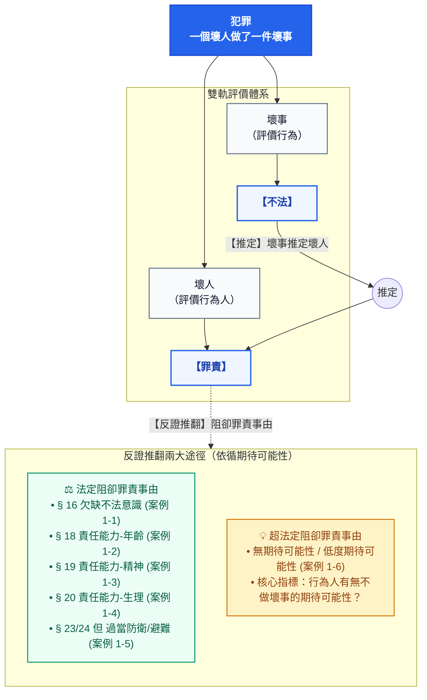
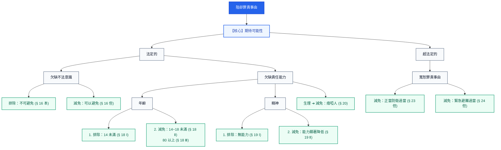
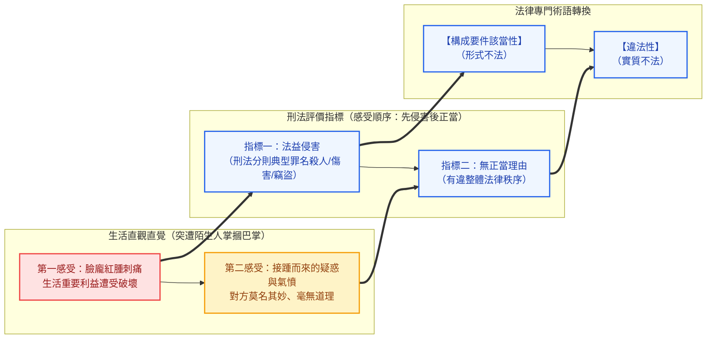
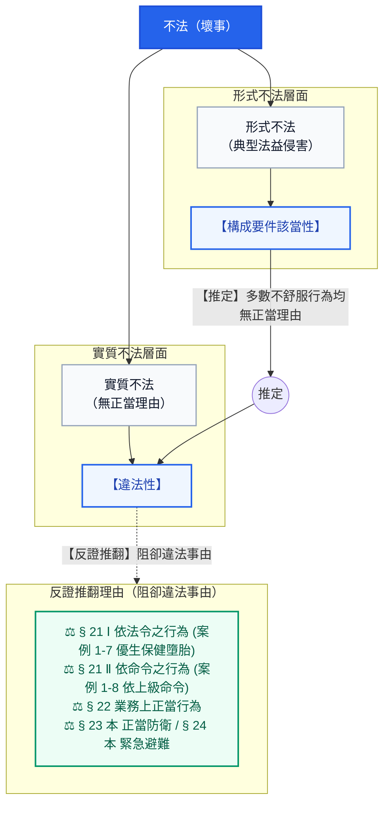

# ⚖️ 【導論】第一章 犯罪的概念・全圖解思維指南
*(教材第 1-1 ～ 1-5 頁 / 導論第一章)*

> **體系定位**：【導論】犯罪概念與論罪結構 ➔ **第一章 犯罪的概念**  
> **核心金句 1（阻卻罪責）**：**「因而雖做壞事，但卻不是壞人。」**（案例 1-1 ～ 1-6）  
> **核心金句 2（阻卻違法）**：**「縱使造成法益侵害，但因有正當理由而並非壞事。」**（案例 1-7 ～ 1-8）

---

## 🧭 【圖解 1-1】不法推定罪責與反證推翻總覽圖
*(教材第 1-1 ～ 1-3 頁)*

---

## 🧭 【圖解 1-2】阻卻罪責事由之體系展開樹狀圖
*(教材第 1-4 頁)*

---

## 🧭 【圖解 1-3】壞事（不法）直觀拆解與巴掌感受認知流程
*(教材第 1-4 頁)*

---

## 🧭 【圖解 1-4】構成要件該當性推定違法性原則
*(教材第 1-5 頁)*

---

## 📊 【案例對照矩陣】教材 8 大案例、抗辯事由與 2026 現行法規查核

| 案例編號 | 階層階段 | 被告關鍵主張 | 法律性質 | 具體抗辯事由與法條 | 核心論證結論 | 2026 現行法規查核狀態與資料來源 |
| :---: | :---: | :--- | :---: | :--- | :--- | :--- |
| **案例 1-1** | 阻卻罪責 | 「這是一件壞事嗎？我以為這是ok的耶，對不起嘛」 | **法定** | **欠缺不法意識**（刑法 § 16） | 不知法律禁止，**因而雖做壞事，但卻不是壞人**。 | **條文無更動（維持現行法）**。 採責任理論，非有正當理由無法避免不免責。 *來源：[全國法規資料庫 § 16](https://law.moj.gov.tw/LawClass/LawSingle.aspx?pcode=C0000001&flno=16)* |
| **案例 1-2** | 阻卻罪責 | 「我年紀小而不懂事，原諒我好不好」 | **法定** | **欠缺責任能力：年齡**（刑法 § 18） | 會做壞事是由於不懂事，**因而雖做壞事，但卻不是壞人**。 | **條文無更動（維持現行法）**。 連動備註：民法成年年齡於 112 年下修至 18 歲，與刑法第 18 條責任界限接軌。 *來源：[全國法規資料庫 § 18](https://law.moj.gov.tw/LawClass/LawSingle.aspx?pcode=C0000001&flno=18)* |
| **案例 1-3** | 阻卻罪責 | 「吾乃伏虎羅漢降世，奉殺九世惡人乃替天行道」 | **法定** | **欠缺責任能力：精神**（刑法 § 19） | 不知或無法控制自己行為，**因而雖做壞事，但卻不是壞人**。 | **條文文字無更動，但受重大憲法裁判拘束**： 1. **113年憲判字第8號**：辨識控制能力顯著減低者**不得科處或執行死刑**。 2. **§ 87 監護處分修正（111年）**：延長處分期間與分級監護。 *來源：[全國法規資料庫 § 19](https://law.moj.gov.tw/LawClass/LawSingle.aspx?pcode=C0000001&flno=19)、[憲法法庭判決](https://cons.judicial.gov.tw/)* |
| **案例 1-4** | 阻卻罪責 | 「（比手畫腳）既聾且啞，知識水平較差，愚行實屬情有可原」 | **法定** | **欠缺責任能力：生理**（刑法 § 20） | 瘖啞人較一般人不知事，**因而雖做壞事，但卻不是壞人**。 | **條文無更動（維持現行法）**。 檢討備註：聯合國 CRPD 委員會建議檢討刪除本條避免標籤化，現行條文仍有效。 *來源：[全國法規資料庫 § 20](https://law.moj.gov.tw/LawClass/LawSingle.aspx?pcode=C0000001&flno=20)* |
| **案例 1-5** | 阻卻罪責 | 「對方先追著我打，情急下手槍斃了他」 | **法定** | **防衛過當／避難過當**（§ 23但、§ 24 1但） | 緊急情況難以控制反擊力道，**因而雖做壞事，但卻不是壞人**。 | **條文無更動（維持現行法）**。 過當仍具違法性，法官得裁量減輕或免除其刑。 *來源：[全國法規資料庫 § 23](https://law.moj.gov.tw/LawClass/LawSingle.aspx?pcode=C0000001&flno=23)、[§ 24](https://law.moj.gov.tw/LawClass/LawSingle.aspx?pcode=C0000001&flno=24)* |
| **案例 1-6** | 阻卻罪責 | 「幼兒墜床血流不止急救，忘拔熨斗插頭」 | **超法定** | **無期待可能性（或低度期待可能性）** | 處境極度艱難，難以期待冷靜拔插頭，**因而雖做壞事，但卻不是壞人**。 | **維持超法定事由**。 刑法總則未明文增列，實務由法官依罪責實質非難核心直接適用。 *來源：最高法院判決要旨* |
| **案例 1-7** | **阻卻違法** | 「我的確有為他人墮胎，但符合優生保健法 § 9」 | **法定** | **依法令之行為**（刑法 § 21 Ⅰ） | 依據法規所允許之行為，縱使侵害法益，**但有正當理由而並非壞事**。 | **條文無更動（維持現行法）**。 優生保健法第 9 條合於法令阻卻違法；現正推動《生育保健法》草案維護婦女身體自主決定權。 *來源：[全國法規資料庫 § 21](https://law.moj.gov.tw/LawClass/LawSingle.aspx?pcode=C0000001&flno=21)、[優生保健法 § 9](https://law.moj.gov.tw/LawClass/LawSingle.aspx?pcode=L0070001&flno=9)* |
| **案例 1-8** | **阻卻違法** | 「我有拿別人的東西，但卻是因為上級的命令」 | **法定** | **依命令之行為**（刑法 § 21 Ⅱ） | 有合法上級公務員命令存在，縱侵害財產法益，**但有正當理由而並非壞事**。 | **條文無更動（維持現行法）**。 採相對服從說；明知命令違法者不在此限（仍具違法性）。 *來源：[全國法規資料庫 § 21](https://law.moj.gov.tw/LawClass/LawSingle.aspx?pcode=C0000001&flno=21)* |
