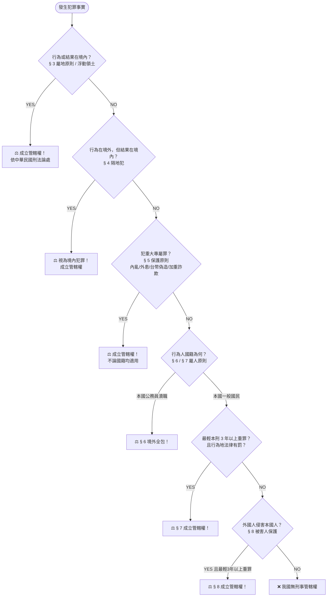
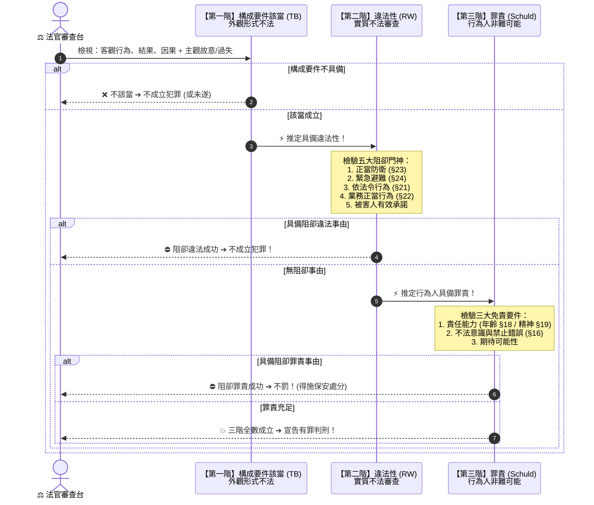
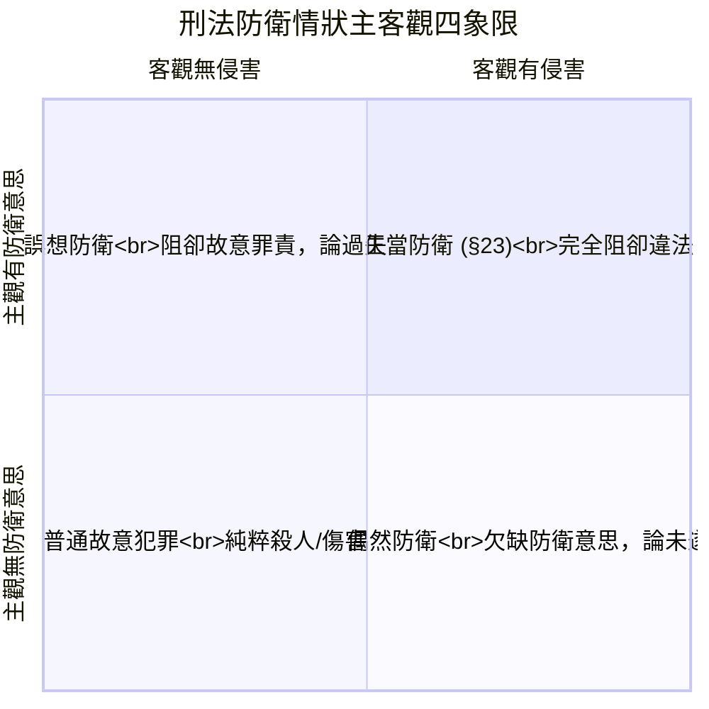
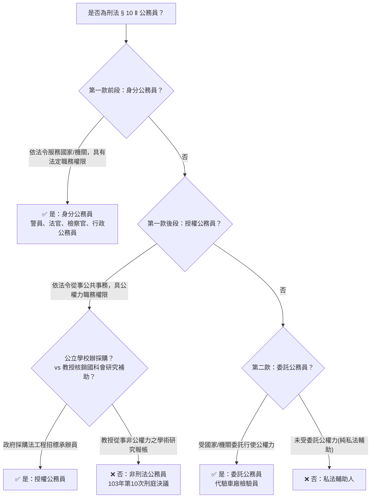
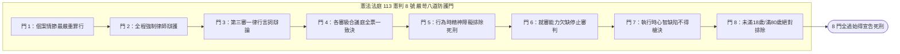

# ⚖️ 刑法總論・全圖解視覺思維指引手冊 (Visual Diagrams Guide)

> **版本資訊**：2026 最新刑法與憲法法庭裁判全面核對版  
> **核心定位**：告別傳統厚重單一文字，以 **Mermaid 流程圖、ASCII 決策樹、象限矩陣與情境卡片** 快速建立刑法總論體系。

---

## 🧭 目錄導覽

1. [【圖解 1】刑罰目的天平與謙抑性三道防線](#1-刑罰目的天平與謙抑性三道防線)
2. [【圖解 2】地之管轄權審查階層決策樹（§ 3 ～ § 8）](#2-地之管轄權審查階層決策樹)
3. [【圖解 3】三階層「壞人做壞事」過濾流水線（TB ➔ RW ➔ Schuld）](#3-三階層壞人做壞事過濾流水線)
4. [【圖解 4】正當防衛 (§23) vs 緊急避難 (§24) 八維度對比雷達](#4-正當防衛-vs-緊急避難-八維度對比雷達)
5. [【圖解 5】主觀責任四象限：故意與過失矩陣](#5-主觀責任四象限故意與過失矩陣)
6. [【圖解 6】原因自由行為（§ 19 Ⅲ）時間軸分解圖](#6-原因自由行為-19-ⅲ-時間軸分解圖)
7. [【圖解 7】主客觀分離：誤想防衛 vs 偶然防衛 對立矩陣](#7-主客觀分離誤想防衛-vs-偶然防衛-對立矩陣)
8. [【圖解 8】公務員三類型判定流程樹（§ 10 Ⅱ）](#8-公務員三類型判定流程樹)
9. [【圖解 9】重傷認定排他性階梯圖（§ 10 Ⅳ）](#9-重傷認定排他性階梯圖)
10. [【圖解 10】113 年憲判字第 8 號：死刑宣告「8 道憲法防護門」](#10-113-年憲判字第-8-號死刑宣告-8-道憲法防護門)
11. [【圖解 11】15 大經典教案視覺化爭點速查卡](#11-15-大經典教案視覺化爭點速查卡)

---

## 1. 刑罰目的天平與謙抑性三道防線

### 1-1. 刑罰目的結合理論天平

```mermaid
graph TD
    subgraph 現代結合理論 (通說折衷)
        Fulcrum((⚖️ 平衡點))
        ScaleLeft["🩸 應報思想 (看向過去)<br>以眼還眼、法益平復<br>「刑罰之天花板：無罪不罰」"]
        ScaleRight["🛡️ 預防思想 (看向未來)<br>一般預防(威嚇大眾) + 特別預防(教化矯治)<br>「刑罰之雙軌：刑罰 + 保安處分」"]
        Fulcrum --- ScaleLeft
        Fulcrum --- ScaleRight
    end
```

### 1-2. 謙抑性原則（最後手段性）三道防線漏斗

```
┌─────────────────────────────────────────────────────────────┐
│ 道德與倫理防線（不孝、說謊、無禮）➔ 社會輿論評價，刑法禁入 │
└──────────────────────────────┬──────────────────────────────┘
                               ▼ (過濾)
┌─────────────────────────────────────────────────────────────┐
│ 民事與行政法防線（違約、侵權、交通違規）➔ 損害賠償、行政罰鍰│
└──────────────────────────────┬──────────────────────────────┘
                               ▼ (過濾)
┌─────────────────────────────────────────────────────────────┐
│ 終極防線：刑法發動（殺人、放火、強盜、詐欺）➔ 剝奪自由與財產│
└─────────────────────────────────────────────────────────────┘
```

---

## 2. 地之管轄權審查階層決策樹

考題審查順序天條（以**廣大興 28 號案**為標準檢驗路徑）：



---

## 3. 三階層「壞人做壞事」過濾流水線



---

## 4. 正當防衛 vs 緊急避難 八維度對比雷達

| 維度指標 | 🛡️ 正當防衛（§ 23） | 🏃 緊急避難（§ 24） |
| :--- | :--- | :--- |
| **本質精神** | 「正對不正」・法無須向不法讓步 | 「正對正」・利益權衡轉嫁無辜 |
| **侵害來源** | 限於**自然人**的不法攻擊侵害 | **人為、天災、猛獸、火災**均可 |
| **起因情狀** | 現時不法之人為侵害 | 自己或他人生命/身體/財產急迫危難 |
| **避退義務** | **原則無須逃跑**（無避退義務） | **能逃必須先逃**（最後手段性極嚴格） |
| **法益衡平要求**| 不要求「保全法益 > 損害法益」 | **保全法益必須「顯著大於」所害法益** |
| **生命法益限制**| 不得權利濫用（🍒 櫻桃案不得殺人） | **絕對不得犧牲他人生命以保全自己生命** |
| **手段適當限制**| 必須以有效且侵害最小之手段為限 | 違背人性尊嚴者不適當（🩸 輸血案） |
| **過當法律效果**| 防衛過當（得減輕或免除其刑） | 避難過當（得減輕或免除其刑） |

---

## 5. 主觀責任四象限：故意與過失矩陣

```
                     積極希望發生 (欲)
                            ▲
                            │
         【第二象限】       │       【第一象限】
          間接故意          │        直接故意
         (§ 13 第 2 項)     │       (§ 13 第 1 項)
     「預見其發生，且發生   │   「明知並有意使其發生」
      亦不違背其本意」      │
                            │
◀───────────────────────────┼───────────────────────────▶ 明知/預見 (知)
                            │
         【第三象限】       │       【第四象限】
         有認識過失         │       無認識過失
         (§ 14 第 2 項)     │       (§ 14 第 1 項)
     「預見其發生，但確信   │   「應注意並能注意，
      其絕對不致發生」      │    而未注意」
                            │
                            ▼
                     確信其不發生 (不欲)
```

---

## 6. 原因自由行為（§ 19 Ⅲ）時間軸分解圖

```
  【T1 前行為階段】                 【T2 犯罪實行階段】             【T3 終局判決】
  完全責任能力清醒狀態               自陷爛醉/心神喪失狀態            刑法 § 19 Ⅲ 排除適用
┌─────────────────────────┐       ┌─────────────────────────┐       ┌────────────────────────┐
│ 行為人蓄意買醉          │ ───➔  │ 失去辨識或控制能力      │ ───➔  │ ❌ 不得主張無責任能力  │
│ 具「買醉」與「醉後行兇」│       │ 手持凶器刺殺仇家        │       │ ⚖️ 仍依故意既遂重判！ │
│ 之【雙重故意】          │       │ (外觀看似符合 §19 Ⅰ)    │       │                        │
└─────────────────────────┘       └─────────────────────────┘       └────────────────────────┘
```

---

## 7. 主客觀分離：誤想防衛 vs 偶然防衛 對立矩陣



---

## 8. 公務員三類型判定流程樹



---

## 9. 重傷認定排他性階梯圖

```
┌─────────────────────────────────────────────────────────────┐
│ 階梯一：刑法第 10 條第 4 項 第 1 款至第 5 款【列舉條款壟斷審查】 │
│ 1. 視能  2. 聽能  3. 語能/味能/嗅能  4. 肢體機能  5. 生殖機能│
│ 檢驗要件：是否達到「毀敗」或「嚴重減損」？                 │
└──────────────────────────────┬──────────────────────────────┘
                               ▼ (列舉器官未達毀敗/重大減損，不得回頭擴張)
┌─────────────────────────────────────────────────────────────┐
│ 階梯二：刑法第 10 條第 4 項 第 6 款【概括條款補充審查】         │
│ 「其他於身體或健康，有重大不治或難治之傷害」                │
│ 適用對象：非 1~5 款列舉器官之其他重大機能（如：切除單顆腎臟）│
└─────────────────────────────────────────────────────────────┘
```

---

## 10. 113 年憲判字第 8 號：死刑宣告「8 道憲法防護門」



---

## 11. 15 大經典教案視覺化爭點速查卡

| 案例編號 | 案例名稱 | 關鍵情境 | 爭議焦點 | 終局判決結論 |
| :--- | :--- | :--- | :--- | :--- |
| **0-1** | ✂️ 長髮剪除案 | 趁被害人熟睡將其及腰秀髮全部剪成光頭 | 頭髮是否屬於身體「傷害」？ | 成立普通傷害罪（破壞生理健康機能） |
| **0-2** | 👛 偷小偷皮夾案 | 小偷扒手剛得手皮夾放口袋，路人甲再竊走 | 竊盜罪是否保護小偷的持有利益？ | 成立竊盜罪（維護事實支配和平狀態） |
| **0-4** | 🍺 早期習慣法處罰案 | 民間習慣認為爛醉打人應處罰 | 習慣法可否直接創設犯罪？ | 違反罪刑法定禁止習慣法原則 |
| **0-5** | 📺 偷接第四台案 | 早期私接電纜第四台類比訊號 | 電視訊號是否能類推適用電能？ | 違反禁止類推適用原則（後增訂 §323 修法） |
| **1-6** | 👶 幼兒墜床燙衣案 | 嬰兒墜床翻落大哭，母親撲救未拔熨斗引發大火 | 驚惶失措之母能否期待其拔熨斗？ | **欠缺期待可能性，超法定阻卻罪責！無罪！** |
| **1-14** | 🍒 櫻桃樹防衛案 | 頑童偷摘樹上櫻桃，果農直接持獵槍將其射殺 | 微小財產權受侵害可否奪人性命？ | **正當防衛權利濫用，成立故意殺人罪！** |
| **1-15** | 🩸 搶救急診輸血案 | 急診無血，醫師強行壓制走廊路人抽血救活病患 | 緊急避難是否可侵犯他人身體人性尊嚴？ | **手段欠缺適當性，避難不成立，成立強制罪！** |
| **1-16** | 🕶️ 凶神惡煞伸手案 | 債主面露凶光伸手掏口袋，甲誤以為要拔槍先打折其手 | 客觀無不法侵害，主觀誤以為有防衛情狀 | **誤想防衛（阻卻故意，僅成立過失傷害）** |
| **1-17** | 🥊 角頭暗巷對決案 | 甲不知乙已瞄準自己，甲出於仇怨拔槍射死乙 | 客觀有防衛情狀，主觀完全無防衛意思 | **偶然防衛（不成立正當防衛，論殺人未遂）** |
| **2-1** | 🍉 西瓜刀劈頭閃過案 | 甲揮西瓜刀劈向仇家頭頂，仇家翻滾閃過僅破衣角 | 已著手但未發生死亡結果 | **成立普通殺人未遂罪（非不能未遂）** |
| **2-2** | 🗡️ 庭院練刀誤殺案 | 甲在庭院蒙眼揮刀練習，未注意鄰居路過誤殺致死 | 能注意而未注意 | **成立過失致死罪** |
| **2-3** | 🍻 醉漢挑唆防衛案 | 甲故意用污言穢語激怒壯漢，待壯漢出拳再趁機打斷其肋骨 | 意圖自招危難可否主張正當防衛？ | **挑唆防衛屬權利濫用，不成立正當防衛！** |
| **2-4** | 🍶 原因自由行為自陷案 | 甲清醒時買醉壯膽，打算趁爛醉失控時刺死情敵 | 犯罪實行時處於心神喪失狀態 | **適用 § 19 Ⅲ 排除免責，仍成立故意殺人既遂！** |
| **2-12**| 🫘 單腎切除受傷案 | 甲重拳打爆被害人右腎致必須手術完全切除 | 體內尚有一顆健康腎臟，是否屬重傷？ | **符合 § 10 Ⅳ 第 6 款重大難治之重傷！** |
| **2-15**| 🎻 小提琴家食指切斷案 | 國際頂級小提琴演奏家右手食指遭斬斷無法演奏 | 依一般客觀標準或依特殊身分認定重傷？ | **客觀標準：食指非一肢全毀，非重傷（普通傷害）** |

---

> 💡 **進一步探索**：  
> - 互動式圖解網頁版本：[visual.html](visual.html)  
> - 完整條文法理註解文檔：[index.html](index.html) 或 [CRIMINAL_LAW_NOTES.md](CRIMINAL_LAW_NOTES.md)
