# ⚖️ 《刑法總則【圖說系列】》第一章 犯罪的概念・全圖解思維指南
*(陳奕廷(易律師) 編著／高點文化出版 / 教材第 1-1 ～ 1-11 頁)*

> **體系定位**：【導論】犯罪概念與論罪結構 ➔ **第一章 犯罪的概念**  
> **核心金句 1（阻卻罪責）**：**「因而雖做壞事，但卻不是壞人。」**（案例 1-1 ～ 1-6）  
> **核心金句 2（阻卻違法）**：**「縱使造成法益侵害，但因有正當理由而並非壞事。」**（案例 1-7 ～ 1-15）  
> **核心金句 3（三階統整）**：**「構成要件該當性（TB）➔ 違法性（R）➔ 罪責（S）」**（教材第 1-8 ～ 1-9 頁）

---

## 🧭 【圖解 1-1】不法推定罪責與反證推翻總覽圖
*(教材第 1-1 ～ 1-3 頁)*

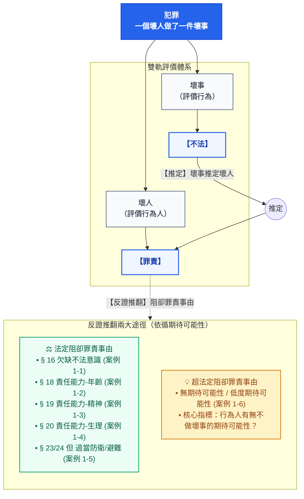
```mermaid
flowchart TD
    classDef titleBox fill:#2563EB,stroke:#1D4ED8,stroke-width:2px,color:#fff,font-weight:bold;
    classDef stepBox fill:#F8FAFC,stroke:#64748B,stroke-width:1.5px,color:#0F172A;
    classDef coreBox fill:#EFF6FF,stroke:#2563EB,stroke-width:2px,color:#1E40AF,font-weight:bold;
    classDef legalBox fill:#ECFDF5,stroke:#059669,stroke-width:1.5px,color:#065F46;
    classDef extraBox fill:#FEF3C7,stroke:#D97706,stroke-width:1.5px,color:#92400E;

    Crime["犯罪<br>一個壞人做了一件壞事"]:::titleBox

    subgraph Evaluation ["雙軌評價體系"]
        BadAct["壞事<br>（評價行為）"]:::stepBox --> Unlawful["【不法】"]:::coreBox
        BadPerson["壞人<br>（評價行為人）"]:::stepBox --> Culpable["【罪責】"]:::coreBox
    end

    Crime --> BadAct
    Crime --> BadPerson

    Unlawful -- "【推定】壞事推定壞人" --> Presume(("推定"))
    Presume --> Culpable

    Culpable -. "【反證推翻】阻卻罪責事由" .-> DefenseTree

    subgraph DefenseTree ["反證推翻兩大途徑（依循期待可能性）"]
        direction TB
        L1["⚖️ 法定阻卻罪責事由<br>• § 16 欠缺不法意識 (案例 1-1)<br>• § 18 責任能力-年齡 (案例 1-2)<br>• § 19 責任能力-精神 (案例 1-3)<br>• § 20 責任能力-生理 (案例 1-4)<br>• § 23/24 但 過當防衛/避難 (案例 1-5)"]:::legalBox
        
        L2["💡 超法定阻卻罪責事由<br>• 無期待可能性 / 低度期待可能性 (案例 1-6)<br>• 核心指標：行為人有無不做壞事的期待可能性？"]:::extraBox
    end
```

---

## 🧭 【圖解 1-2】阻卻罪責事由之體系展開樹狀圖
*(教材第 1-4 頁)*

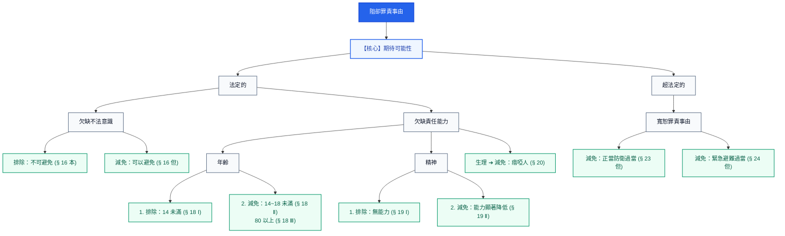
```mermaid
graph TD
    classDef main fill:#2563EB,stroke:#1D4ED8,stroke-width:2px,color:#fff;
    classDef core fill:#EFF6FF,stroke:#2563EB,stroke-width:2px,color:#1E40AF;
    classDef branch fill:#F8FAFC,stroke:#64748B,stroke-width:1.5px,color:#0F172A;
    classDef leaf fill:#ECFDF5,stroke:#059669,stroke-width:1.5px,color:#065F46;

    Root["阻卻罪責事由"]:::main --> Core["【核心】期待可能性"]:::core
    
    Core --> Legal["法定的"]:::branch
    Core --> Extra["超法定的"]:::branch

    Legal --> NoConscious["欠缺不法意識"]:::branch
    NoConscious --> NC1["排除：不可避免 (§ 16 本)"]:::leaf
    NoConscious --> NC2["減免：可以避免 (§ 16 但)"]:::leaf

    Legal --> NoCapacity["欠缺責任能力"]:::branch
    NoCapacity --> Age["年齡"]:::branch
    Age --> Age1["1. 排除：14 未滿 (§ 18 Ⅰ)"]:::leaf
    Age --> Age2["2. 減免：14~18 未滿 (§ 18 Ⅱ)<br>80 以上 (§ 18 Ⅲ)"]:::leaf

    NoCapacity --> Mental["精神"]:::branch
    Mental --> Men1["1. 排除：無能力 (§ 19 Ⅰ)"]:::leaf
    Mental --> Men2["2. 減免：能力顯著降低 (§ 19 Ⅱ)"]:::leaf

    NoCapacity --> Physio["生理 ➔ 減免：瘖啞人 (§ 20)"]:::leaf

    Extra --> Excuse["寬恕罪責事由"]:::branch
    Excuse --> Ex1["減免：正當防衛過當 (§ 23 但)"]:::leaf
    Excuse --> Ex2["減免：緊急避難過當 (§ 24 但)"]:::leaf
```

---

## 🧭 【圖解 1-3】壞事（不法）直觀拆解與巴掌感受認知流程
*(教材第 1-4 頁)*

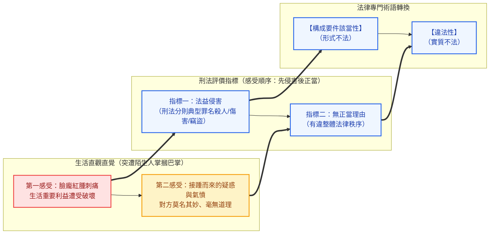
```mermaid
flowchart LR
    classDef step1 fill:#FEE2E2,stroke:#EF4444,stroke-width:2px,color:#991B1B;
    classDef step2 fill:#FEF3C7,stroke:#F59E0B,stroke-width:2px,color:#92400E;
    classDef lawBox fill:#EFF6FF,stroke:#2563EB,stroke-width:2px,color:#1E40AF;

    subgraph Sensory ["生活直觀直覺（突遭陌生人掌摑巴掌）"]
        direction TB
        Feel1["第一感受：臉龐紅腫刺痛<br>生活重要利益遭受破壞"]:::step1
        Feel2["第二感受：接踵而來的疑惑與氣憤<br>對方莫名其妙、毫無道理"]:::step2
        Feel1 --> Feel2
    end

    subgraph LegalConcept ["刑法評價指標（感受順序：先侵害後正當）"]
        direction TB
        Dim1["指標一：法益侵害<br>（刑法分則典型罪名殺人/傷害/竊盜）"]:::lawBox
        Dim2["指標二：無正當理由<br>（有違整體法律秩序）"]:::lawBox
        Dim1 --> Dim2
    end

    subgraph SystemTerms ["法律專門術語轉換"]
        direction TB
        Term1["【構成要件該當性】<br>（形式不法）"]:::lawBox
        Term2["【違法性】<br>（實質不法）"]:::lawBox
        Term1 --> Term2
    end

    Feel1 ==> Dim1 ==> Term1
    Feel2 ==> Dim2 ==> Term2
```

---

## 🧭 【圖解 1-4】構成要件該當性推定違法性原則
*(教材第 1-5 頁)*

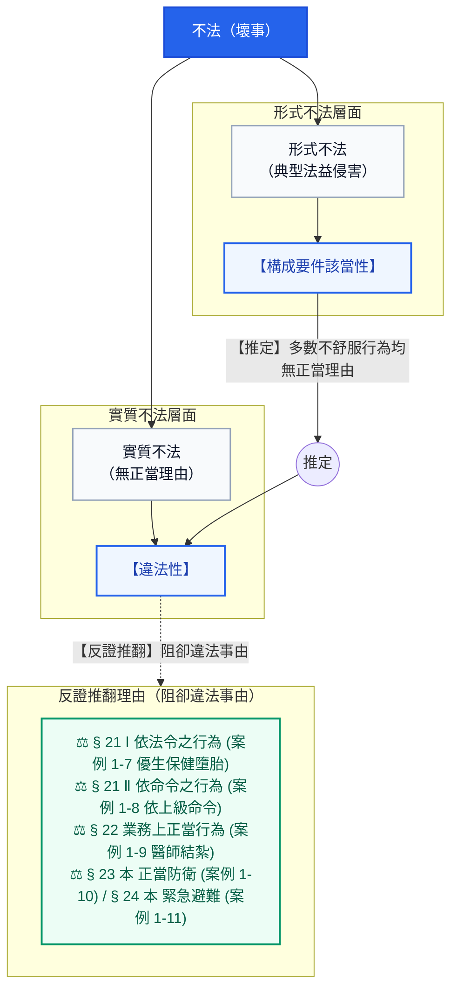
```mermaid
graph TD
    classDef titleBox fill:#2563EB,stroke:#1D4ED8,stroke-width:2px,color:#fff;
    classDef conceptBox fill:#F8FAFC,stroke:#94A3B8,stroke-width:1.5px,color:#0F172A;
    classDef lawBox fill:#EFF6FF,stroke:#2563EB,stroke-width:2px,color:#1E40AF;
    classDef defenseBox fill:#ECFDF5,stroke:#059669,stroke-width:2px,color:#065F46;

    Unlawful["不法（壞事）"]:::titleBox

    subgraph FormalUnlawful ["形式不法層面"]
        Formal["形式不法<br>（典型法益侵害）"]:::conceptBox --> TB["【構成要件該當性】"]:::lawBox
    end

    subgraph MaterialUnlawful ["實質不法層面"]
        Material["實質不法<br>（無正當理由）"]:::conceptBox --> RW["【違法性】"]:::lawBox
    end

    Unlawful --> Formal
    Unlawful --> Material

    TB -- "【推定】多數不舒服行為均無正當理由" --> Presume(("推定"))
    Presume --> RW

    RW -. "【反證推翻】阻卻違法事由" .-> DefenseList

    subgraph DefenseList ["反證推翻理由（阻卻違法事由）"]
        Case17["⚖️ § 21 Ⅰ 依法令之行為 (案例 1-7 優生保健墮胎)<br>⚖️ § 21 Ⅱ 依命令之行為 (案例 1-8 依上級命令)<br>⚖️ § 22 業務上正當行為 (案例 1-9 醫師結紮)<br>⚖️ § 23 本 正當防衛 (案例 1-10) / § 24 本 緊急避難 (案例 1-11)"]:::defenseBox
    end
```

---

## 🧭 【圖解 1-5】超法定阻卻違法與利益衡量雙維度檢驗
*(教材第 1-6 ～ 1-7 頁)*

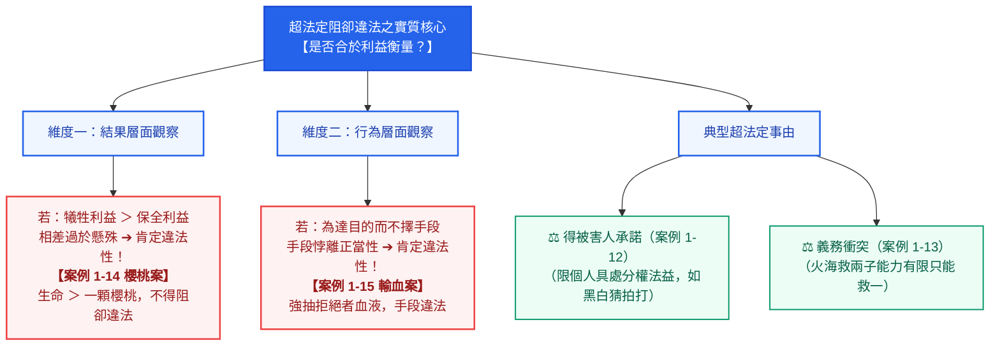
```mermaid
graph TD
    classDef titleBox fill:#2563EB,stroke:#1D4ED8,stroke-width:2px,color:#fff;
    classDef branchBox fill:#EFF6FF,stroke:#2563EB,stroke-width:2px,color:#1E40AF;
    classDef redAlert fill:#FEF2F2,stroke:#EF4444,stroke-width:2px,color:#991B1B;
    classDef greenOk fill:#ECFDF5,stroke:#059669,stroke-width:1.5px,color:#065F46;

    Core["超法定阻卻違法之實質核心<br>【是否合於利益衡量？】"]:::titleBox

    Core --> Res["維度一：結果層面觀察"]:::branchBox
    Core --> Act["維度二：行為層面觀察"]:::branchBox
    Core --> Types["典型超法定事由"]:::branchBox

    Res --> R_Bad["若：犧牲利益 ＞ 保全利益<br>相差過於懸殊 ➔ 肯定違法性！<br><b>【案例 1-14 櫻桃案】</b><br>生命 ＞ 一顆櫻桃，不得阻卻違法"]:::redAlert

    Act --> A_Bad["若：為達目的而不擇手段<br>手段悖離正當性 ➔ 肯定違法性！<br><b>【案例 1-15 輸血案】</b><br>強抽拒絕者血液，手段違法"]:::redAlert

    Types --> T1["⚖️ 得被害人承諾（案例 1-12）<br>（限個人具處分權法益，如黑白猜拍打）"]:::greenOk
    Types --> T2["⚖️ 義務衝突（案例 1-13）<br>（火海救兩子能力有限只能救一）"]:::greenOk
```

---

## 🧭 【圖解 1-6】阻卻違法事由之體系展開樹狀圖
*(教材第 1-8 頁)*

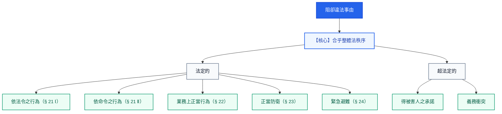
```mermaid
graph TD
    classDef main fill:#2563EB,stroke:#1D4ED8,stroke-width:2px,color:#fff;
    classDef core fill:#EFF6FF,stroke:#2563EB,stroke-width:2px,color:#1E40AF;
    classDef branch fill:#F8FAFC,stroke:#64748B,stroke-width:1.5px,color:#0F172A;
    classDef leaf fill:#ECFDF5,stroke:#059669,stroke-width:1.5px,color:#065F46;

    Root["阻卻違法事由"]:::main --> Core["【核心】合乎整體法秩序"]:::core
    
    Core --> Legal["法定的"]:::branch
    Core --> Extra["超法定的"]:::branch

    Legal --> L1["依法令之行為（§ 21 Ⅰ）"]:::leaf
    Legal --> L2["依命令之行為（§ 21 Ⅱ）"]:::leaf
    Legal --> L3["業務上正當行為（§ 22）"]:::leaf
    Legal --> L4["正當防衛（§ 23）"]:::leaf
    Legal --> L5["緊急避難（§ 24）"]:::leaf

    Extra --> E1["得被害人之承諾"]:::leaf
    Extra --> E2["義務衝突"]:::leaf
```

---

## 🧭 【圖解 1-7】犯罪三階層體系論（雛形）推導與推定模型
*(教材第 1-8 ～ 1-9 頁)*

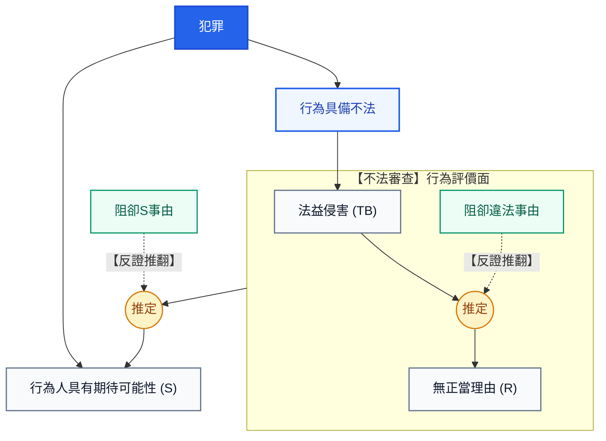
```mermaid
graph TD
    classDef crimeBox fill:#2563EB,stroke:#1D4ED8,stroke-width:2px,color:#fff;
    classDef unlawfulBox fill:#EFF6FF,stroke:#2563EB,stroke-width:2px,color:#1E40AF;
    classDef nodeBox fill:#F8FAFC,stroke:#64748B,stroke-width:1.5px,color:#0F172A;
    classDef presumeBox fill:#FEF3C7,stroke:#D97706,stroke-width:1.5px,color:#92400E;
    classDef defenseBox fill:#ECFDF5,stroke:#059669,stroke-width:1.5px,color:#065F46;

    Crime["犯罪"]:::crimeBox --> UnlawfulTitle["行為具備不法"]:::unlawfulBox

    subgraph UnlawfulArea ["【不法審查】行為評價面"]
        direction TB
        TB_Box["法益侵害 (TB)"]:::nodeBox
        Presume1(("推定")):::presumeBox
        R_Box["無正當理由 (R)"]:::nodeBox
        Def_R["阻卻違法事由"]:::defenseBox

        TB_Box --> Presume1
        Presume1 --> R_Box
        Def_R -. "【反證推翻】" .-> Presume1
    end

    UnlawfulTitle --> TB_Box

    Presume2(("推定")):::presumeBox
    Def_S["阻卻S事由"]:::defenseBox
    S_Box["行為人具有期待可能性 (S)"]:::nodeBox

    UnlawfulArea --> Presume2
    Def_S -. "【反證推翻】" .-> Presume2
    Presume2 --> S_Box

    Crime --> S_Box
```

---

## 🧭 【圖解 1-8】目的犯罪體系客觀／主觀要件矩陣與推定推翻規則
*(教材第 1-9 頁)*

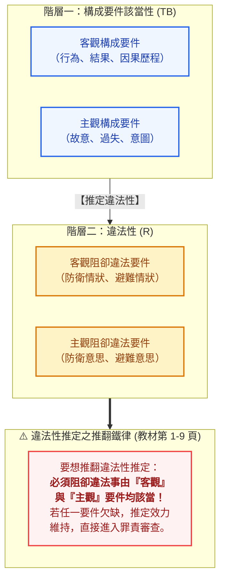
```mermaid
flowchart TD
    classDef tbBox fill:#EFF6FF,stroke:#2563EB,stroke-width:2px,color:#1E40AF;
    classDef rBox fill:#FEF3C7,stroke:#D97706,stroke-width:2px,color:#92400E;
    classDef ruleBox fill:#FEF2F2,stroke:#EF4444,stroke-width:2px,color:#991B1B;

    subgraph TB_Group ["階層一：構成要件該當性 (TB)"]
        direction LR
        TB_Obj["客觀構成要件<br>（行為、結果、因果歷程）"]:::tbBox
        TB_Sub["主觀構成要件<br>（故意、過失、意圖）"]:::tbBox
    end

    subgraph R_Group ["階層二：違法性 (R)"]
        direction LR
        R_Obj["客觀阻卻違法要件<br>（防衛情狀、避難情狀）"]:::rBox
        R_Sub["主觀阻卻違法要件<br>（防衛意思、避難意思）"]:::rBox
    end

    TB_Group -- "【推定違法性】" --> R_Group

    subgraph OverrideRule ["⚠️ 違法性推定之推翻鐵律 (教材第 1-9 頁)"]
        Rule["要想推翻違法性推定：<br><b>必須阻卻違法事由『客觀』與『主觀』要件均該當！</b><br>若任一要件欠缺，推定效力維持，直接進入罪責審查。"]:::ruleBox
    end

    R_Group ==> OverrideRule
```

---

## 🧭 【圖解 1-9】犯罪三階層體系（完整）原文圖解
*(教材第 1-10 頁 原文圖解)*

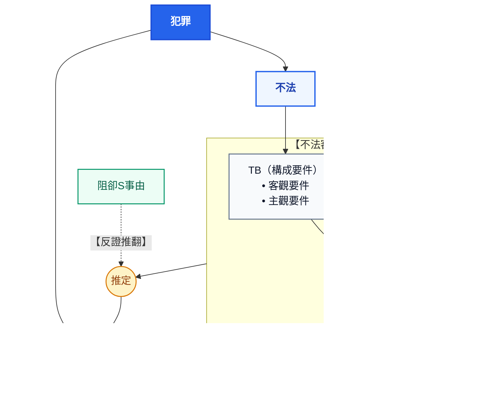
```mermaid
flowchart TD
    classDef crimeBox fill:#2563EB,stroke:#1D4ED8,stroke-width:2px,color:#fff,font-weight:bold;
    classDef unlawfulBox fill:#EFF6FF,stroke:#2563EB,stroke-width:2px,color:#1E40AF,font-weight:bold;
    classDef stageBox fill:#F8FAFC,stroke:#64748B,stroke-width:1.5px,color:#0F172A;
    classDef presumeBox fill:#FEF3C7,stroke:#D97706,stroke-width:1.5px,color:#92400E;
    classDef defenseBox fill:#ECFDF5,stroke:#059669,stroke-width:1.5px,color:#065F46;
    classDef sBox fill:#F1F5F9,stroke:#475569,stroke-width:2px,color:#0F172A,font-weight:bold;

    Crime["犯罪"]:::crimeBox --> Unlawful["不法"]:::unlawfulBox

    subgraph UnlawfulArea ["【不法審查】行為評價面"]
        direction TB
        TB_Box["TB（構成要件）<br>• 客觀要件<br>• 主觀要件"]:::stageBox
        Presume1(("推定")):::presumeBox
        R_Box["R（違法性）<br>• 客觀要件<br>• 主觀要件"]:::stageBox
        Def_R["阻卻R事由"]:::defenseBox

        TB_Box --> Presume1
        Presume1 --> R_Box
        Def_R -. "【反證推翻】" .-> Presume1
    end

    Unlawful --> TB_Box

    Presume2(("推定")):::presumeBox
    Def_S["阻卻S事由"]:::defenseBox
    S_Box["S（罪責 / 行為人期待可能性）"]:::sBox

    UnlawfulArea --> Presume2
    Def_S -. "【反證推翻】" .-> Presume2
    Presume2 --> S_Box

    Crime --> S_Box
```

---

## 🧭 【圖解 1-10】犯罪二階層體系論（二階論）結構圖
*(教材第 1-11 頁 原文圖解)*

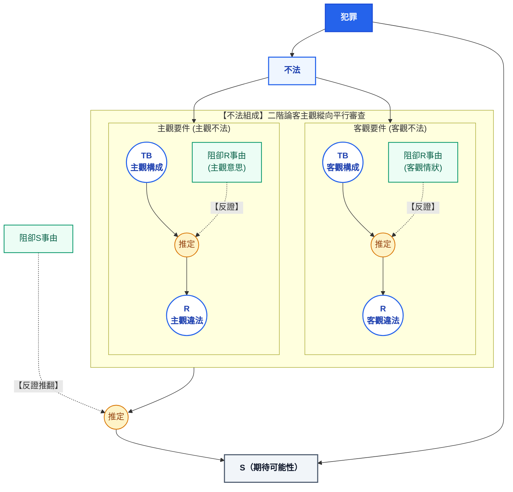
```mermaid
flowchart TD
    classDef crimeBox fill:#2563EB,stroke:#1D4ED8,stroke-width:2px,color:#fff,font-weight:bold;
    classDef unlawfulBox fill:#EFF6FF,stroke:#2563EB,stroke-width:2px,color:#1E40AF,font-weight:bold;
    classDef circleNode fill:#FFFFFF,stroke:#2563EB,stroke-width:2px,color:#1E40AF,font-weight:bold;
    classDef presumeBox fill:#FEF3C7,stroke:#D97706,stroke-width:1.5px,color:#92400E;
    classDef defenseBox fill:#ECFDF5,stroke:#059669,stroke-width:1.5px,color:#065F46;
    classDef sBox fill:#F1F5F9,stroke:#475569,stroke-width:2px,color:#0F172A,font-weight:bold;

    Crime["犯罪"]:::crimeBox --> Unlawful["不法"]:::unlawfulBox

    subgraph UnlawfulSplit ["【不法組成】二階論客主觀縱向平行審查"]
        direction LR

        subgraph ObjBranch ["客觀要件 (客觀不法)"]
            direction TB
            ObjTB(("TB<br>客觀構成")):::circleNode
            ObjPresume(("推定")):::presumeBox
            ObjR(("R<br>客觀違法")):::circleNode
            ObjDef["阻卻R事由<br>(客觀情狀)"]:::defenseBox

            ObjTB --> ObjPresume
            ObjPresume --> ObjR
            ObjDef -. "【反證】" .-> ObjPresume
        end

        subgraph SubBranch ["主觀要件 (主觀不法)"]
            direction TB
            SubTB(("TB<br>主觀構成")):::circleNode
            SubPresume(("推定")):::presumeBox
            SubR(("R<br>主觀違法")):::circleNode
            SubDef["阻卻R事由<br>(主觀意思)"]:::defenseBox

            SubTB --> SubPresume
            SubPresume --> SubR
            SubDef -. "【反證】" .-> SubPresume
        end
    end

    Unlawful --> ObjBranch
    Unlawful --> SubBranch

    PresumeS(("推定")):::presumeBox
    DefS["阻卻S事由"]:::defenseBox
    S_Node["S（期待可能性）"]:::sBox

    UnlawfulSplit --> PresumeS
    DefS -. "【反證推翻】" .-> PresumeS
    PresumeS --> S_Node

    Crime --> S_Node
```

---

## 🧭 【圖解 1-11】四塊拼圖理論組合對照圖（三階論 vs 二階論）
*(教材第 1-11 頁)*

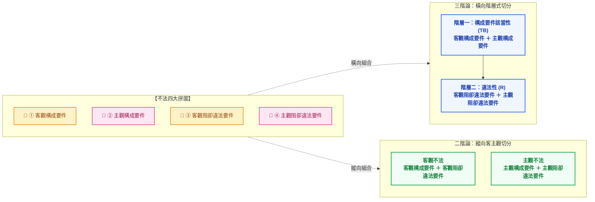
```mermaid
flowchart LR
    classDef threeBox fill:#EFF6FF,stroke:#2563EB,stroke-width:2px,color:#1E40AF,font-weight:bold;
    classDef twoBox fill:#F0FDF4,stroke:#16A34A,stroke-width:2px,color:#15803D,font-weight:bold;
    classDef puzzleObj fill:#FEF3C7,stroke:#D97706,stroke-width:1.5px,color:#92400E;
    classDef puzzleSub fill:#FCE7F3,stroke:#DB2777,stroke-width:1.5px,color:#9D174D;

    subgraph ThreeStage ["三階論：橫向階層式切分"]
        direction TB
        T_TB["階層一：構成要件該當性 (TB)<br>客觀構成要件 ＋ 主觀構成要件"]:::threeBox
        T_R["階層二：違法性 (R)<br>客觀阻卻違法要件 ＋ 主觀阻卻違法要件"]:::threeBox
        T_TB --> T_R
    end

    subgraph TwoStage ["二階論：縱向客主觀切分"]
        direction TB
        Two_Obj["客觀不法<br>客觀構成要件 ＋ 客觀阻卻違法要件"]:::twoBox
        Two_Sub["主觀不法<br>主觀構成要件 ＋ 主觀阻卻違法要件"]:::twoBox
    end

    subgraph Puzzles ["【不法四大拼圖】"]
        direction TB
        P1["🧩 ① 客觀構成要件"]:::puzzleObj
        P2["🧩 ② 主觀構成要件"]:::puzzleSub
        P3["🧩 ③ 客觀阻卻違法要件"]:::puzzleObj
        P4["🧩 ④ 主觀阻卻違法要件"]:::puzzleSub
    end

    Puzzles -. "橫向組合" .-> ThreeStage
    Puzzles -. "縱向組合" .-> TwoStage
```

---

## 📊 【案例對照矩陣】教材 17 大案例、抗辯事由與 2026 現行法規查核

| 案例編號 | 階層階段 | 被告關鍵主張 | 法律性質 | 具體抗辯事由與法條 | 核心論證結論 | 2026 現行法規查核狀態與資料來源 |
| :---: | :---: | :--- | :---: | :--- | :--- | :--- |
| **案例 1-1** | 阻卻罪責 | 「這是一件壞事嗎？我以為這是ok的耶，對不起嘛」 | **法定** | **欠缺不法意識**（刑法 § 16） | 不知法律禁止，**因而雖做壞事，但卻不是壞人**。 | **條文無更動（維持現行法）**。 採責任理論，非有正當理由無法避免不免責。 *來源：[全國法規資料庫 § 16](https://law.moj.gov.tw/LawClass/LawSingle.aspx?pcode=C0000001&flno=16)* |
| **案例 1-2** | 阻卻罪責 | 「我年紀小而不懂事，原諒我好不好」 | **法定** | **欠缺責任能力：年齡**（刑法 § 18） | 會做壞事是由於不懂事，**因而雖做壞事，但卻不是壞人**。 | **條文無更動（維持現行法）**。 連動備註：民法成年年齡於 112 年下修至 18 歲，與刑法第 18 條責任界限接軌。 *來源：[全國法規資料庫 § 18](https://law.moj.gov.tw/LawClass/LawSingle.aspx?pcode=C0000001&flno=18)* |
| **案例 1-3** | 阻卻罪責 | 「吾乃伏虎羅漢降世，奉殺九世惡人乃替天行道」 | **法定** | **欠缺責任能力：精神**（刑法 § 19） | 不知或無法控制自己行為，**因而雖做壞事，但卻不是壞人**。 | **條文文字無更動，但受重大憲法裁判拘束**： 1. **113年憲判字第8號**：辨識控制能力顯著減低者**不得科處或執行死刑**。 2. **§ 87 監護處分修正（111年）**：延長處分期間與分級監護。 *來源：[全國法規資料庫 § 19](https://law.moj.gov.tw/LawClass/LawSingle.aspx?pcode=C0000001&flno=19)、[憲法法庭判決](https://cons.judicial.gov.tw/)* |
| **案例 1-4** | 阻卻罪責 | 「（比手畫腳）既聾且啞，知識水平較差，愚行實屬情有可原」 | **法定** | **欠缺責任能力：生理**（刑法 § 20） | 瘖啞人較一般人不知事，**因而雖做壞事，但卻不是壞人**。 | **條文無更動（維持現行法）**。 檢討備註：聯合國 CRPD 委員會建議檢討刪除本條避免標籤化，現行條文仍有效。 *來源：[全國法規資料庫 § 20](https://law.moj.gov.tw/LawClass/LawSingle.aspx?pcode=C0000001&flno=20)* |
| **案例 1-5** | 阻卻罪責 | 「對方先追著我打，情急下手槍斃了他」 | **法定** | **防衛過當／避難過當**（§ 23但、§ 24 1但） | 緊急情況難以控制反擊力道，**因而雖做壞事，但卻不是壞人**。 | **條文無更動（維持現行法）**。 過當仍具違法性，法官得裁量減輕或免除其刑。 *來源：[全國法規資料庫 § 23](https://law.moj.gov.tw/LawClass/LawSingle.aspx?pcode=C0000001&flno=23)、[§ 24](https://law.moj.gov.tw/LawClass/LawSingle.aspx?pcode=C0000001&flno=24)* |
| **案例 1-6** | 阻卻罪責 | 「幼兒墜床血流不止急救，忘拔熨斗插頭」 | **超法定** | **無期待可能性（或低度期待可能性）** | 處境極度艱難，難以期待冷靜拔插頭，**因而雖做壞事，但卻不是壞人**。 | **維持超法定事由**。 刑法總則未明文增列，實務由法官依罪責實質非難核心直接適用。 *來源：最高法院判決要旨* |
| **案例 1-7** | **阻卻違法** | 「我的確有為他人墮胎，但符合優生保健法 § 9」 | **法定** | **依法令之行為**（刑法 § 21 Ⅰ） | 依據法規所允許之行為，縱使侵害法益，**但有正當理由而並非壞事**。 | **條文無更動（維持現行法）**。 優生保健法第 9 條合於法令阻卻違法；現正推動《生育保健法》草案維護婦女身體自主決定權。 *來源：[全國法規資料庫 § 21](https://law.moj.gov.tw/LawClass/LawSingle.aspx?pcode=C0000001&flno=21)、[優生保健法 § 9](https://law.moj.gov.tw/LawClass/LawSingle.aspx?pcode=L0070001&flno=9)* |
| **案例 1-8** | **阻卻違法** | 「我有拿別人的東西，但卻是因為上級的命令」 | **法定** | **依命令之行為**（刑法 § 21 Ⅱ） | 有合法上級公務員命令存在，縱侵害財產法益，**但有正當理由而並非壞事**。 | **條文無更動（維持現行法）**。 採相對服從說；明知命令違法者不在此限（仍具違法性）。 *來源：[全國法規資料庫 § 21](https://law.moj.gov.tw/LawClass/LawSingle.aspx?pcode=C0000001&flno=21)* |
| **案例 1-9** | **阻卻違法** | 「我幫人結紮縱使該當重傷罪，但我可是醫生耶」 | **法定** | **業務上正當行為**（刑法 § 22） | 正當業務執行乃社會分工所必需，縱侵害身體，**但有正當理由而並非壞事**。 | **條文無更動（維持現行法）**。 醫療法第 63、64 條規範告知同意程序，合乎醫療常規者阻卻違法。 *來源：[全國法規資料庫 § 22](https://law.moj.gov.tw/LawClass/LawSingle.aspx?pcode=C0000001&flno=22)* |
| **案例 1-10** | **阻卻違法** | 「我莫名其妙被人進攻，為保護自己將對方打傷」 | **法定** | **正當防衛**（刑法 § 23 本文） | 本於「正者毋須向不正者低頭」，縱侵害身體，**但有正當理由而並非壞事**。 | **條文無更動（維持現行法）**。 要件：現在不法侵害、防衛意思、手段必要適當；逾越者為過當（罪責減免）。 *來源：[全國法規資料庫 § 23](https://law.moj.gov.tw/LawClass/LawSingle.aspx?pcode=C0000001&flno=23)* |
| **案例 1-11** | **阻卻違法** | 「被野狗追趕，避無可避之下闖入民宅」 | **法定** | **緊急避難**（刑法 § 24 第 1 項） | 本於「社會連帶性原則」危難轉嫁權，縱侵害居住自由，**但有正當理由而並非壞事**。 | **條文無更動（維持現行法）**。 要件：緊急危難、不得已手段、利益衡量（保全利益大於犧牲利益）。 *來源：[全國法規資料庫 § 24](https://law.moj.gov.tw/LawClass/LawSingle.aspx?pcode=C0000001&flno=24)* |
| **案例 1-12** | **阻卻違法** | 「我的確打對方一巴掌，那是因為在玩黑白猜」 | **超法定** | **得被害人承諾** | 被害人自由意志放棄對法益保護，縱侵害身體，**但有正當理由而並非壞事**。 | **維持超法定地位**。 限個人具處分權法益；生命重大健康不得任意處分（§ 275、§ 282 處罰）。 *來源：最高法院裁判實務見解* |
| **案例 1-13** | **阻卻違法** | 「兩小孩深陷火海能力有限只能救一個」 | **超法定** | **義務衝突** | 行為人盡所能履行義務，縱侵害另一生命，**但有正當理由而並非壞事**。 | **維持超法定地位**。 數個同等作為義務客觀不能同時履行，履行其一阻卻違法。 *來源：學者通說與實務法理* |
| **案例 1-14** | **違法性肯定** | 「輪椅主人開槍擊斃偷採櫻桃小學生」 | **法理檢驗** | **利益衡量・結果層面（防衛權濫用）** | **犧牲利益（生命）遠大於保全利益（一顆櫻桃）**，相差懸殊，**無法阻卻違法**！ | **利益衡量之結果審查**。 防衛權受禁止權利濫用限制；生命法益不得以微不足道財產法益犧牲。 *來源：防衛權限制共通法理* |
| **案例 1-15** | **違法性肯定** | 「急救需血強制抽取拒絕之義工血液救活甲」 | **法理檢驗** | **利益衡量・行為層面（手段違反人性尊嚴）** | **手段嚴重違反人性尊嚴（將人當作輸血機）**，非合理手段，**無法阻卻違法**！ | **利益衡量之行為手段審查**。 縱保全生命大於犧牲自由，但強抽拒絕者血液嚴重侵害身體自主權與人性尊嚴，行為層面肯定違法。 *來源：憲法第 22 條身體自主權、人性尊嚴核心* |
| **案例 1-16** | **違法性推定維持** （進入罪責審查） | 「見乙貌兇惡以為不懷好意先發制人打成輕傷」 | **要件檢驗** （誤想防衛） | **正當防衛（§ 23）主客觀檢驗** 傷害罪（§ 277） | **僅滿足主觀防衛意思，欠缺客觀防衛情狀**，不生推翻違法之效力，**肯定具備不法**，必須進入罪責審查。 | **條文無更動（維持現行法）**。 108 年提高罰金刑。實務多數採限制法律效果責任說，罪責故意阻卻，僅論過失或減免。 *來源：[全國法規資料庫 § 277](https://law.moj.gov.tw/LawClass/LawSingle.aspx?pcode=C0000001&flno=277)* |
| **案例 1-17** | **違法性推定維持** （進入罪責審查） | 「見乙掏槍射殺，碰巧乙在口袋亦正掏槍瞄準甲」 | **要件檢驗** （偶然防衛） | **正當防衛（§ 23）主客觀檢驗** 殺人罪（§ 271） | **僅滿足客觀防衛情狀，欠缺主觀防衛意思**，不生推翻違法之效力，**肯定具備不法**，必須進入罪責審查。 | **條文無更動（維持現行法）**。 受 113年憲判字第8號判決拘束（死刑適用極度嚴格）。學說實務多數認不阻卻違法，論以既遂或類推未遂。 *來源：[全國法規資料庫 § 271](https://law.moj.gov.tw/LawClass/LawSingle.aspx?pcode=C0000001&flno=271)、[憲法法庭 113 年憲判字第 8 號](https://cons.judicial.gov.tw/)* |
| **案例 2-1** | **例外擴張處罰** （客觀構成未該當） | 「手持西瓜刀欲砍死乙，不料乙施展凌波微步閃過」 | **法定例外** | **殺人未遂罪** （刑法 § 25 Ⅱ ➔ § 271 Ⅱ） | 客觀結果未發生（非既遂），但**有法律明示依據**且**滿足其他犯罪成立要件（著手＋故意）**，例外擴張處罰論以未遂。 | **條文無更動（維持現行法）**。 1. **§ 25 Ⅱ**：明定未遂犯之處罰以有特別規定者為限。 2. **§ 271 Ⅱ**：明定殺人未遂犯罰之。 受 113年憲判字第8號拘束（未遂依 § 25 Ⅱ 得減輕其刑）。 *來源：[全國法規資料庫 § 25](https://law.moj.gov.tw/LawClass/LawSingle.aspx?pcode=C0000001&flno=25)、[§ 271](https://law.moj.gov.tw/LawClass/LawSingle.aspx?pcode=C0000001&flno=271)* |
| **案例 2-2** | **例外擴張處罰** （主觀構成未該當） | 「手持西瓜刀欲練刀法，不料乙路過竟中刀死亡」 | **法定例外** | **過失致死罪** （刑法 § 12 Ⅱ ➔ § 276 Ⅰ） | 主觀無殺人故意（非故意），但**有法律明示依據**且**滿足其他要件（達既遂＋有預見可能性）**，例外擴張處罰論以過失犯。 | **條文無更動（維持現行法）**。 1. **§ 12 Ⅱ**：過失行為之處罰以有特別規定者為限。 2. **§ 276 Ⅰ**：108 年廢除業務過失，統一適用第 1 項處 5 年以下有期徒刑。 *來源：[全國法規資料庫 § 12](https://law.moj.gov.tw/LawClass/LawSingle.aspx?pcode=C0000001&flno=12)、[§ 276](https://law.moj.gov.tw/LawClass/LawSingle.aspx?pcode=C0000001&flno=276)* |
| **案例 2-3** | **違法性推定維持** （阻卻違法例外排除） | 「故意言語挑釁乙出拳，順手持雨傘猛擊致乙瘀傷」 | **權利濫用例外** | **意圖式挑唆防衛** （刑法 § 277 普通傷害罪） | 設局挑釁在先，侵害意圖明顯，乃「權利濫用」，**例外不得主張正當防衛（無法阻卻違法）**，成立傷害罪。 | **條文無更動（維持現行法）**。 108 年提高罰金刑。正當防衛（§ 23）受禁止權利濫用原則限制。 *來源：[全國法規資料庫 § 277](https://law.moj.gov.tw/LawClass/LawSingle.aspx?pcode=C0000001&flno=277)* |
| **案例 2-4** | **罪責推定維持** （阻卻罪責例外排除） | 「想殺乙不敢下手，吃蛇膽灌醉自己於無責任能力下殺乙」 | **法定例外排除** | **原因自由行為** （刑法 § 19 Ⅲ ➔ § 271 Ⅰ） | 故意自陷無責任能力狀態在先，**例外排除 § 19 Ⅰ、Ⅱ 免責或減刑利益**，直接論以殺人既遂罪。 | **條文無更動（維持現行法）**。 § 19 第 3 項明文排除因故意或過失自行招致者之阻卻或減輕罪責。 *來源：[全國法規資料庫 § 19](https://law.moj.gov.tw/LawClass/LawSingle.aspx?pcode=C0000001&flno=19)* |

---

## 🏛️ 第二章 刑法的論罪結構 視覺化圖解指南
*(教材第 1-13 ～ 1-15 頁)*

### 圖 2-1：刑法處罰原則與擴張光譜圖（故意＋既遂 vs 例外擴張）

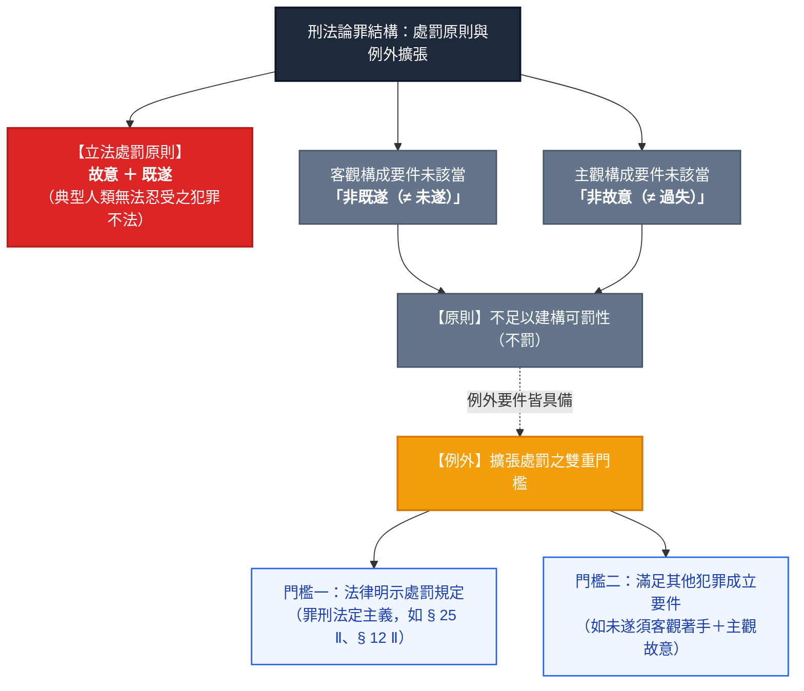
```mermaid
graph TD
    classDef title fill:#1E293B,stroke:#0F172A,stroke-width:2px,color:#fff;
    classDef core fill:#DC2626,stroke:#B91C1C,stroke-width:2px,color:#fff;
    classDef unmeet fill:#64748B,stroke:#475569,stroke-width:1.5px,color:#fff;
    classDef exp fill:#F59E0B,stroke:#D97706,stroke-width:2px,color:#fff;
    classDef rule fill:#EFF6FF,stroke:#2563EB,stroke-width:1.5px,color:#1E40AF;

    Title["刑法論罪結構：處罰原則與例外擴張"]:::title

    Core["【立法處罰原則】<br><b>故意 ＋ 既遂</b><br>（典型人類無法忍受之犯罪不法）"]:::core

    ObjNo["客觀構成要件未該當<br><b>「非既遂（≠ 未遂）」</b>"]:::unmeet
    SubNo["主觀構成要件未該當<br><b>「非故意（≠ 過失）」</b>"]:::unmeet

    NoPunish["【原則】不足以建構可罰性（不罰）"]:::unmeet

    Exp["【例外】擴張處罰之雙重門檻"]:::exp
    Req1["門檻一：法律明示處罰規定<br>（罪刑法定主義，如 § 25 Ⅱ、§ 12 Ⅱ）"]:::rule
    Req2["門檻二：滿足其他犯罪成立要件<br>（如未遂須客觀著手＋主觀故意）"]:::rule

    Title --> Core
    Title --> ObjNo
    Title --> SubNo

    ObjNo --> NoPunish
    SubNo --> NoPunish

    NoPunish -. "例外要件皆具備" .-> Exp
    Exp --> Req1
    Exp --> Req2
```

---

### 圖 2-2：案例 2-1 殺人未遂論罪路徑圖（西瓜刀砍人案）

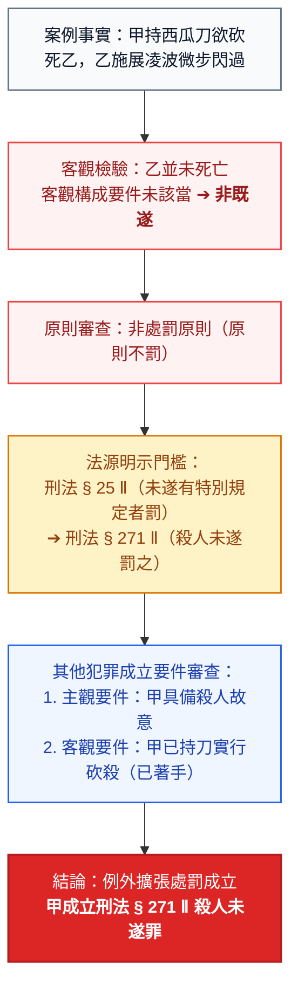
```mermaid
graph TD
    classDef fact fill:#F8FAFC,stroke:#64748B,stroke-width:1.5px,color:#0F172A;
    classDef red fill:#FEF2F2,stroke:#EF4444,stroke-width:1.5px,color:#991B1B;
    classDef law fill:#FEF3C7,stroke:#D97706,stroke-width:1.5px,color:#92400E;
    classDef blue fill:#EFF6FF,stroke:#2563EB,stroke-width:1.5px,color:#1E40AF;
    classDef concl fill:#DC2626,stroke:#B91C1C,stroke-width:2px,color:#fff;

    F["案例事實：甲持西瓜刀欲砍死乙，乙施展凌波微步閃過"]:::fact

    R1["客觀檢驗：乙並未死亡<br>客觀構成要件未該當 ➔ <b>非既遂</b>"]:::red
    R2["原則審查：非處罰原則（原則不罰）"]:::red

    Law["法源明示門檻：<br>刑法 § 25 Ⅱ（未遂有特別規定者罰）<br>➔ 刑法 § 271 Ⅱ（殺人未遂罰之）"]:::law

    SubObj["其他犯罪成立要件審查：<br>1. 主觀要件：甲具備殺人故意<br>2. 客觀要件：甲已持刀實行砍殺（已著手）"]:::blue

    End["結論：例外擴張處罰成立<br><b>甲成立刑法 § 271 Ⅱ 殺人未遂罪</b>"]:::concl

    F --> R1
    R1 --> R2
    R2 --> Law
    Law --> SubObj
    SubObj --> End
```

---

### 圖 2-3：案例 2-2 過失致死論罪路徑圖（西瓜刀練刀案）

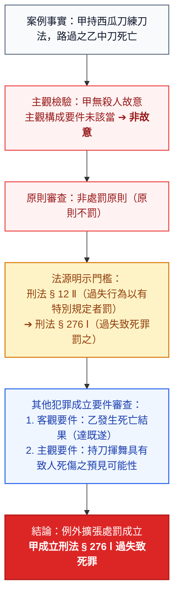
```mermaid
graph TD
    classDef fact fill:#F8FAFC,stroke:#64748B,stroke-width:1.5px,color:#0F172A;
    classDef red fill:#FEF2F2,stroke:#EF4444,stroke-width:1.5px,color:#991B1B;
    classDef law fill:#FEF3C7,stroke:#D97706,stroke-width:1.5px,color:#92400E;
    classDef blue fill:#EFF6FF,stroke:#2563EB,stroke-width:1.5px,color:#1E40AF;
    classDef concl fill:#DC2626,stroke:#B91C1C,stroke-width:2px,color:#fff;

    F["案例事實：甲持西瓜刀練刀法，路過之乙中刀死亡"]:::fact

    R1["主觀檢驗：甲無殺人故意<br>主觀構成要件未該當 ➔ <b>非故意</b>"]:::red
    R2["原則審查：非處罰原則（原則不罰）"]:::red

    Law["法源明示門檻：<br>刑法 § 12 Ⅱ（過失行為以有特別規定者罰）<br>➔ 刑法 § 276 Ⅰ（過失致死罪罰之）"]:::law

    SubObj["其他犯罪成立要件審查：<br>1. 客觀要件：乙發生死亡結果（達既遂）<br>2. 主觀要件：持刀揮舞具有致人死傷之預見可能性"]:::blue

    End["結論：例外擴張處罰成立<br><b>甲成立刑法 § 276 Ⅰ 過失致死罪</b>"]:::concl

    F --> R1
    R1 --> R2
    R2 --> Law
    Law --> SubObj
    SubObj --> End
```

---

### 圖 2-4：刑法處罰原則與分則藍本矩陣圖（故意既遂 vs 未遂/過失例外）

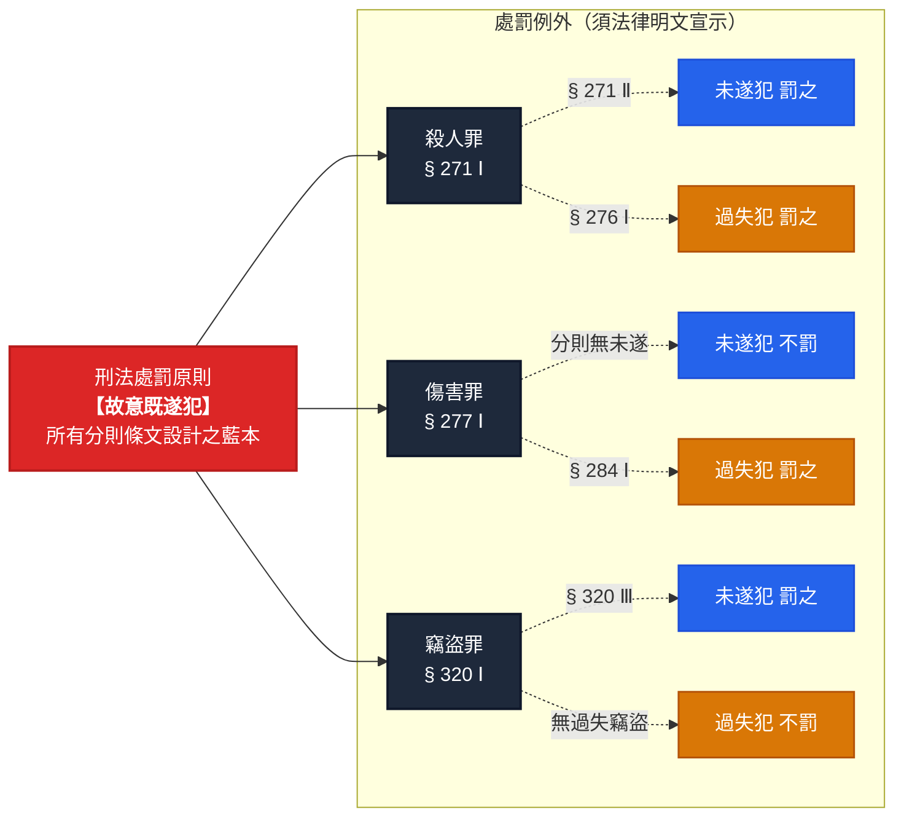
```mermaid
graph LR
    classDef base fill:#1E293B,stroke:#0F172A,stroke-width:2px,color:#fff;
    classDef core fill:#DC2626,stroke:#B91C1C,stroke-width:2px,color:#fff;
    classDef ex1 fill:#2563EB,stroke:#1D4ED8,stroke-width:1.5px,color:#fff;
    classDef ex2 fill:#D97706,stroke:#B45309,stroke-width:1.5px,color:#fff;

    Rule["刑法處罰原則<br><b>【故意既遂犯】</b><br>所有分則條文設計之藍本"]:::core

    Rule --> K["殺人罪<br>§ 271 Ⅰ"]:::base
    Rule --> H["傷害罪<br>§ 277 Ⅰ"]:::base
    Rule --> T["竊盜罪<br>§ 320 Ⅰ"]:::base

    subgraph Exceptions ["處罰例外（須法律明文宣示）"]
        direction TB
        K -. "§ 271 Ⅱ" .-> K_Att["未遂犯 罰之"]:::ex1
        K -. "§ 276 Ⅰ" .-> K_Neg["過失犯 罰之"]:::ex2

        H -. "分則無未遂" .-> H_Att["未遂犯 不罰"]:::ex1
        H -. "§ 284 Ⅰ" .-> H_Neg["過失犯 罰之"]:::ex2

        T -. "§ 320 Ⅲ" .-> T_Att["未遂犯 罰之"]:::ex1
        T -. "無過失竊盜" .-> T_Neg["過失犯 不罰"]:::ex2
    end
```

---

### 圖 2-5：阻卻事由之例外排除總覽圖（無法發生推翻效力之特殊情況）

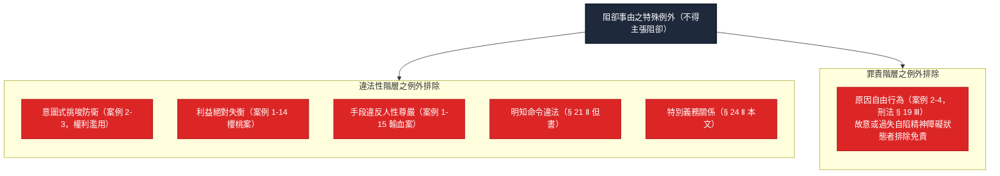
```mermaid
graph TD
    classDef main fill:#1E293B,stroke:#0F172A,stroke-width:2px,color:#fff;
    classDef rbox fill:#EFF6FF,stroke:#2563EB,stroke-width:2px,color:#1E40AF;
    classDef sbox fill:#FEF3C7,stroke:#D97706,stroke-width:2px,color:#92400E;
    classDef no fill:#DC2626,stroke:#B91C1C,stroke-width:1.5px,color:#fff;

    Title["阻卻事由之特殊例外（不得主張阻卻）"]:::main

    subgraph R_Ex ["違法性階層之例外排除"]
        direction TB
        R1["意圖式挑唆防衛（案例 2-3，權利濫用）"]:::no
        R2["利益絕對失衡（案例 1-14 櫻桃案）"]:::no
        R3["手段違反人性尊嚴（案例 1-15 輸血案）"]:::no
        R4["明知命令違法（§ 21 Ⅱ 但書）"]:::no
        R5["特別義務關係（§ 24 Ⅱ 本文）"]:::no
    end

    subgraph S_Ex ["罪責階層之例外排除"]
        direction TB
        S1["原因自由行為（案例 2-4，刑法 § 19 Ⅲ）<br>故意或過失自陷精神障礙狀態者排除免責"]:::no
    end

    Title --> R_Ex
    Title --> S_Ex
```

---

### 圖 2-6：犯罪成立後之「其他刑罰要件」體系圖

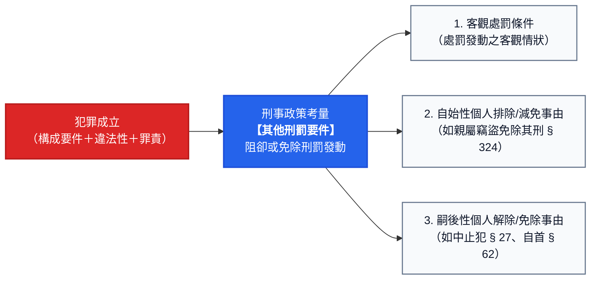
```mermaid
graph LR
    classDef crime fill:#DC2626,stroke:#B91C1C,stroke-width:2px,color:#fff;
    classDef policy fill:#2563EB,stroke:#1D4ED8,stroke-width:2px,color:#fff;
    classDef item fill:#F8FAFC,stroke:#64748B,stroke-width:1.5px,color:#0F172A;

    Crime["犯罪成立<br>（構成要件＋違法性＋罪責）"]:::crime
    Policy["刑事政策考量<br><b>【其他刑罰要件】</b><br>阻卻或免除刑罰發動"]:::policy

    Crime --> Policy

    Policy --> C1["1. 客觀處罰條件<br>（處罰發動之客觀情狀）"]:::item
    Policy --> C2["2. 自始性個人排除/減免事由<br>（如親屬竊盜免除其刑 § 324）"]:::item
    Policy --> C3["3. 嗣後性個人解除/免除事由<br>（如中止犯 § 27、自首 § 62）"]:::item
```

---

### 圖 2-7：犯罪基本審查流程總體系圖（教材第 1-16 頁 原文體系圖解）

> **免刑事由、（嗣後性的）個人解除或減免刑罰事由均屬之。我們可以用下圖表達犯罪的基本審查流程。**

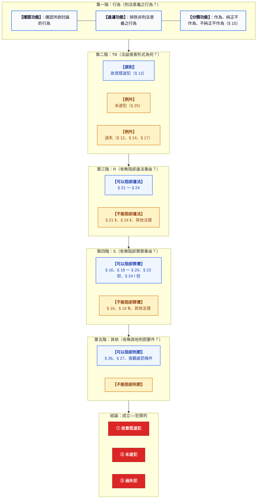
```mermaid
graph TD
    classDef stepHeader fill:#1E293B,stroke:#0F172A,stroke-width:2px,color:#fff;
    classDef boxMain fill:#F8FAFC,stroke:#3B82F6,stroke-width:2px,color:#0F172A;
    classDef ruleBox fill:#EFF6FF,stroke:#2563EB,stroke-width:1.5px,color:#1E40AF;
    classDef expBox fill:#FEF3C7,stroke:#D97706,stroke-width:1.5px,color:#92400E;
    classDef conclBox fill:#DC2626,stroke:#B91C1C,stroke-width:2px,color:#fff;

    subgraph Step1 ["第一階：行為（刑法意義之行為？）"]
        A1["<b>【確認功能】</b>：確認所欲討論的行為"]:::boxMain
        A2["<b>【過濾功能】</b>：排除非刑法意義之行為"]:::boxMain
        A3["<b>【分類功能】</b>：作為、純正不作為、不純正不作為（§ 15）"]:::boxMain
        A1 --- A2 --- A3
    end

    subgraph Step2 ["第二階：TB（法益侵害形式為何？）"]
        TB_Principle["<b>【原則】</b><br>故意既遂犯（§ 13）"]:::ruleBox
        TB_Exp1["<b>【例外】</b><br>未遂犯（§ 25）"]:::expBox
        TB_Exp2["<b>【例外】</b><br>過失（§ 12、§ 14、§ 17）"]:::expBox
    end

    subgraph Step3 ["第三階：R（有無阻卻違法事由？）"]
        R_Can["<b>【可以阻卻違法】</b><br>§ 21 ～ § 24"]:::ruleBox
        R_Cannot["<b>【不能阻卻違法】</b><br>§ 21 Ⅱ、§ 24 Ⅱ、其他法理"]:::expBox
    end

    subgraph Step4 ["第四階：S（有無阻卻罪責事由？）"]
        S_Can["<b>【可以阻卻罪責】</b><br>§ 16、§ 18 ～ § 20、§ 23 但、§ 24 Ⅰ 但"]:::ruleBox
        S_Cannot["<b>【不能阻卻罪責】</b><br>§ 16、§ 19 Ⅲ、其他法理"]:::expBox
    end

    subgraph Step5 ["第五階：其他（有無其他刑罰要件？）"]
        Other_Can["<b>【可以阻卻刑罰】</b><br>§ 26、§ 27、客觀處罰條件"]:::ruleBox
        Other_Cannot["<b>【不能阻卻刑罰】</b>"]:::expBox
    end

    subgraph Step6 ["結論：成立○○犯罪的"]
        C_Direct["<b>① 故意既遂犯</b>"]:::conclBox
        C_Attempt["<b>② 未遂犯</b>"]:::conclBox
        C_Negligent["<b>③ 過失犯</b>"]:::conclBox
    end

    Step1 --> Step2
    Step2 --> Step3
    Step3 --> Step4
    Step4 --> Step5
    Step5 --> Step6
```

---

# ⚖️ 第零篇 刑法的運作、操作原理與法律效果・全圖解架構總覽

> **體系定位**：母目錄（Part 0）  
> **核心金句**：**「筆者挪移到本篇提前整理，旨在提醒大家『謹思慎刑』的核心理念，也與刑法最後手段性原則接軌。」**（教材第 0-1 頁）

---

## 🧭 【圖解 0-1】第零篇 導讀全景思維架構圖（四大支柱、前理解與謹思慎刑）
*(教材第 0-1 頁)*

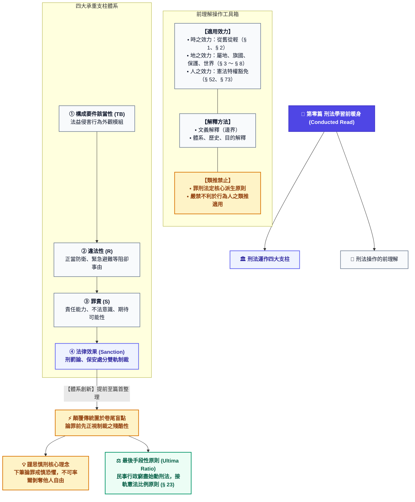
```mermaid
flowchart TD
    classDef titleBox fill:#4F46E5,stroke:#4338CA,stroke-width:2px,color:#fff,font-weight:bold;
    classDef stepBox fill:#F8FAFC,stroke:#64748B,stroke-width:1.5px,color:#0F172A;
    classDef coreBox fill:#EEF2FF,stroke:#6366F1,stroke-width:2px,color:#3730A3,font-weight:bold;
    classDef alertBox fill:#FEF3C7,stroke:#D97706,stroke-width:2px,color:#92400E,font-weight:bold;
    classDef finalBox fill:#ECFDF5,stroke:#059669,stroke-width:2px,color:#065F46,font-weight:bold;

    Head["🏁 第零篇 刑法學習前暖身 (Conducted Read)"]:::titleBox

    Head --> PillarBlock["🏛️ 刑法運作四大支柱"]:::coreBox
    Head --> PreBlock["🧭 刑法操作的前理解"]:::stepBox

    subgraph PreUnderstand ["前理解操作工具箱"]
        direction TB
        P_Scope["<b>【適用效力】</b><br>• 時之效力：從舊從輕（§ 1、§ 2）<br>• 地之效力：屬地、旗國、保護、世界（§ 3 ～ § 8）<br>• 人之效力：憲法特權豁免（§ 52、§ 73）"]:::stepBox
        P_Method["<b>【解釋方法】</b><br>• 文義解釋（邊界）<br>• 體系、歷史、目的解釋"]:::stepBox
        P_Analogy["<b>【類推禁止】</b><br>• 罪刑法定核心派生原則<br>• 嚴禁不利於行為人之類推適用"]:::alertBox
        P_Scope --- P_Method --- P_Analogy
    end

    subgraph FourPillars ["四大承重支柱體系"]
        direction TB
        TB_Node["<b>① 構成要件該當性 (TB)</b><br>法益侵害行為外觀模組"]:::stepBox
        R_Node["<b>② 違法性 (R)</b><br>正當防衛、緊急避難等阻卻事由"]:::stepBox
        S_Node["<b>③ 罪責 (S)</b><br>責任能力、不法意識、期待可能性"]:::stepBox
        RF_Node["<b>④ 法律效果 (Sanction)</b><br>刑罰論、保安處分雙軌制裁"]:::coreBox
        TB_Node --> R_Node --> S_Node --> RF_Node
    end

    RF_Node -- "【體系創新】提前至篇首整理" --> Innovation["⚡ 顛覆傳統置於卷尾盲點<br>論罪前先正視制裁之殘酷性"]:::alertBox

    Innovation --> Mindset1["💡 謹思慎刑核心理念<br>下筆論罪戒慎恐懼，不可率爾剝奪他人自由"]:::alertBox
    Innovation --> Mindset2["⚖️ 最後手段性原則 (Ultima Ratio)<br>民事行政窮盡始動刑法，接軌憲法比例原則 (§ 23)"]:::finalBox
```

---

## 🧭 【圖解 0-1】刑法的運作原理——兩大目的思想、四大支柱推導與法益概念
*(第零篇 第一章 / 教材第 2-1 頁)*

> **篇章定位**：第零篇 刑法的運作、操作原理與法律效果 ➔ **第一章 刑法的運作原理**  
> **核心金句 1（終極目的）**：**「刑法的最終目的都是保護『人類極為重要生活利益』，簡稱法益保護。」**  
> **核心金句 2（手段節制）**：**「刑罰施加必須與目的追求成正比，若不慎得動用刑罰便應節制（最後手段性原則）。」**  
> **核心金句 3（四大支柱）**：**「一切的刑法問題看似棘手了，也必須終歸於這四大支柱。」**  
> **核心金句 4（法益定義）**：**「凡是以法律手段而加以保護之重要生活利益，即稱為法益。」**

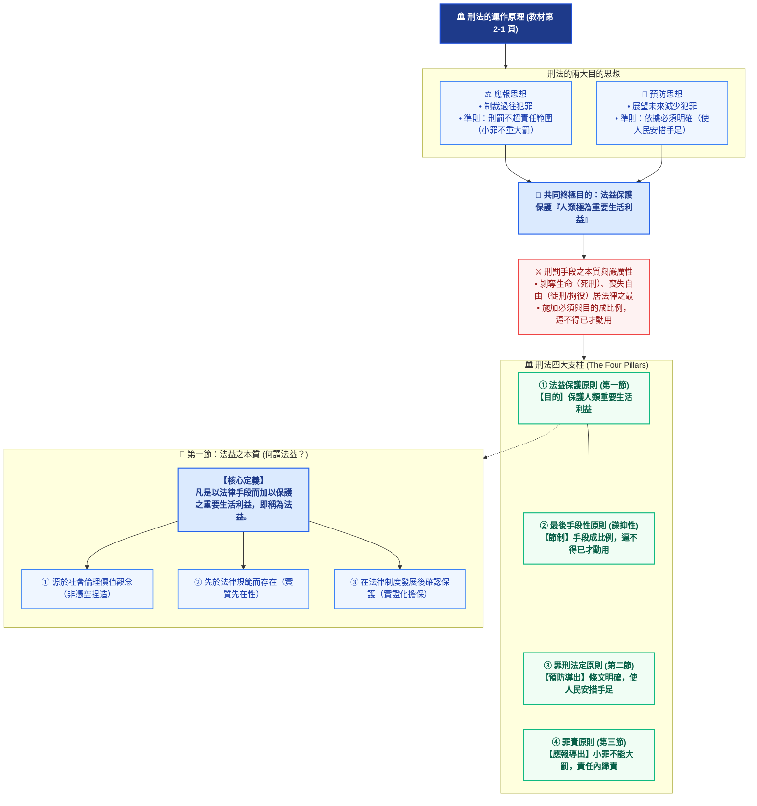
```mermaid
flowchart TD
    classDef titleBox fill:#1E3A8A,stroke:#1D4ED8,stroke-width:2px,color:#fff,font-weight:bold;
    classDef thoughtBox fill:#EFF6FF,stroke:#3B82F6,stroke-width:1.5px,color:#1E40AF;
    classDef aimBox fill:#DBEAFE,stroke:#2563EB,stroke-width:2px,color:#1E3A8A,font-weight:bold;
    classDef penaltyBox fill:#FEF2F2,stroke:#EF4444,stroke-width:1.5px,color:#991B1B;
    classDef pillarBox fill:#F0FDF4,stroke:#10B981,stroke-width:2px,color:#065F46,font-weight:bold;

    Title["🏛️ 刑法的運作原理 (教材第 2-1 頁)"]:::titleBox

    subgraph DualThoughts ["刑法的兩大目的思想"]
        T_Ret["⚖️ 應報思想<br>• 制裁過往犯罪<br>• 準則：刑罰不超責任範圍（小罪不重大罰）"]:::thoughtBox
        T_Prev["🔮 預防思想<br>• 展望未來減少犯罪<br>• 準則：依據必須明確（使人民安措手足）"]:::thoughtBox
    end

    Title --> DualThoughts
    T_Ret --> Goal["🎯 共同終極目的：法益保護<br>保護『人類極為重要生活利益』"]:::aimBox
    T_Prev --> Goal

    Goal --> Means["⚔️ 刑罰手段之本質與嚴厲性<br>• 剝奪生命（死刑）、喪失自由（徒刑/拘役）居法律之最<br>• 施加必須與目的成比例，逼不得已才動用"]:::penaltyBox

    Means --> FourPillars

    subgraph FourPillars ["🏛️ 刑法四大支柱 (The Four Pillars)"]
        direction TB
        P1["① 法益保護原則 (第一節)<br>【目的】保護人類重要生活利益"]:::pillarBox
        P2["② 最後手段性原則 (謙抑性)<br>【節制】手段成比例，逼不得已才動用"]:::pillarBox
        P3["③ 罪刑法定原則 (第二節)<br>【預防導出】條文明確，使人民安措手足"]:::pillarBox
        P4["④ 罪責原則 (第三節)<br>【應報導出】小罪不能大罰，責任內歸責"]:::pillarBox
        P1 --- P2 --- P3 --- P4
    end

    subgraph LegalInterest ["💎 第一節：法益之本質 (何謂法益？)"]
        direction TB
        Def["<b>【核心定義】</b><br>凡是以法律手段而加以保護之重要生活利益，即稱為法益。"]:::aimBox
        F1["① 源於社會倫理價值觀念（非憑空捏造）"]:::thoughtBox
        F2["② 先於法律規範而存在（實質先在性）"]:::thoughtBox
        F3["③ 在法律制度發展後確認保護（實證化擔保）"]:::thoughtBox
        Def --> F1
        Def --> F2
        Def --> F3
    end

    P1 -.-> LegalInterest
```

